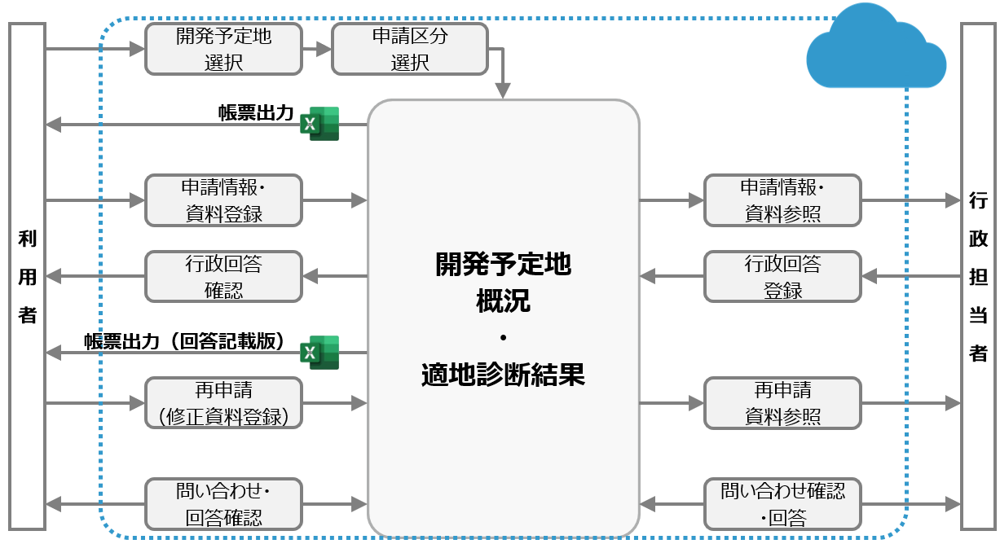

# 開発許可申請管理システム


## 更新履歴
| 更新日時 | リリース | 更新内容 |
| :--- | :--- | :--- |
|2024/3/29 | **2nd Release** <br> 前面道路判定機能を追加<br>コミュニケーション機能を追加 | 開発許可申請管理システム v2.0 |
|2023/3/27 | **1st Release** <br>①地番図を用いた検索機能<br>②概況診断結果のレポート出力機能<br>③行政担当者への申請機能<br>④行政担当者の申請情報検索及び回答確認機能<br>を実装| 開発許可申請管理システム v1.0 |

## **1.概要**

本リポジトリでは、2023年度のProject PLATEAUで開発した「開発許可申請管理システム v2」のソースコードを公開しています。  
「開発許可申請管理システム」は、都市計画法に基づく開発許可手続（市区町村に対する「事前相談」を含む）をオンライン化し、申請の自動判定機能を提供するものです。  
本システムは3D都市モデルをはじめとする空間情報をPostGISとGeoServerを組み合わせたリレーショナルデータベースで管理し、空間解析機能等のバックエンド機能を備えるウェブシステムとなっています。また、CesiumJS及びTerriaJSをフロントエンドで利用しています。

本システムの使い方は下記の操作マニュアルを参照ください。  
[開発許可申請管理システム　操作マニュアル](https://project-plateau.github.io/development-permission/manual/user_manual.html)

本システムの構築方法については下記の環境構築手順書を参照ください。  
[環境構築手順書](https://project-plateau.github.io/development-permission/manual/environment.html)

## **2．「開発許可申請管理システム v2」について**

市街地等において一定規模以上の開発を行う場合、都市計画法に基づく開発許可が必要となり、令和元年では2万件以上の許可が全国で行われています。  
開発許可制度は、申請のあった開発行為が対象エリアの土地利用の計画や災害リスク等の状況と適合しているかの審査を行うものですが、審査に必要な、関連資料の収集や関係者との協議等が多岐にわたるため、審査側の行政と申請側の民間の双方で多大な事務負担となっています。  
このため、「開発許可申請管理システム v2」以下の機能を提供します。  

--v1で実装  
①地番図を用いた検索機能
②概況診断結果のレポート出力機能
③行政担当者への申請機能
④行政担当者の申請情報検索及び回答確認機能

--v2で実装  
⑤前面道路判定機能
⑥コミュニケーション機能

詳細につきましては、[技術検証レポート](https://www.mlit.go.jp/plateau/file/libraries/doc/plateau_tech_doc_0076_ver01.pdf)を参照ください。

## **3.利用手順**
### **インストール**

* 本システムで必要となるソフトウェアを下表に示します。
[環境構築手順書](https://project-plateau.github.io/development-permission/manual/environment.html)を参照の上、ソフトウェアのインストール及びセットアップを完了させてください。

    |ソフトウェア|プロジェクトフォルダ|
    | - | - |
    |1.GeoServer|-|
    |2.API|[/SRC/api](./SRC/api/)|
    |3.3dviewer|[/SRC/3dview](./SRC/3dview/)|
    |4.PDF.js|[/SRC/pdfjs](./SRC/pdfjs/)|

    ※データベースの構築及びミドルウェアのセットアップも合わせて必要となります。
* 構築時に必要となる環境設定ファイルを下表に示します。

    |ファイル|プロジェクトフォルダ|備考|
    | - | - | - |
    |1.環境設定ファイル一式|[/Settings/environmant_settings](Settings/environment_settings/)|各ファイルについては[環境構築手順書](https://project-plateau.github.io/development-permission/manual/environment.html)を参照してください。

### **使い方**
#### **利用できる動作環境**

最新のデスクトップ版　Chrome、Edge上<br>
最小システム要件　CPU：2GHｚデュアルコア以上、システムメモリ（RAM）：4GB以上

#### **操作マニュアル**<!-- 納品時リンク変更 -->

本システムの使い方は下記の操作マニュアルを参照ください。<br>
[開発許可申請管理システム　操作マニュアル](https://project-plateau.github.io/development-permission/manual/user_manual.html)

## **4.システム概要**



空間情報を三次元表示可能なCesiumJS及びTerriaJSをフロントエンドで利用するとともに、PostGIS（空間情報を管理するOSSのデータベース拡張機能）と
GeoServer（空間情報を共有するOSSのGISサーバ）を組み合わせ、空間解析機能及びリレーショナルデータベースをバックエンドで統合したウェブシステムを開発しました。
V2では前面道路判定機能、コミュニケーション機能を追加しました。前面道路判定機能により開発許可申請に係る前面道路に関する判定が可能になり、コミュニケーション機能を使い事業者がウェブシステム上で、担当者とコミュニケーションを取ることが可能となりました。<br>
詳細は技術検証レポートを参照してください。

## **5.利用技術**

|名称|説明|
| --- | --- |
|[Apache HTTP Server](https://httpd.apache.org/)|Webアプリで配信を行うためのWebサーバソフトウェア|
|[TerriaJS](https://terria.io/)|UIの提供及びUIを介してCesiumJSの描画機能を制御するためのライブラリ|
|[CesiumJS](https://cesium.com/platform/cesiumjs/)|3Dビューワ上にデータを描画するためのライブラリ|
|[React.js](https://ja.react.dev/)|JavaScriptのフレームワーク内で機能するUIを構築するためのライブラリ|
|[marker.js](https://markerjs.com/demos/all-defaults/)|画像データへの図形や文字情報の書き込みをブラウザ上で行うライブラリ|
|[tiff.js](https://github.com/seikichi/tiff.js)|Tiffファイルをブラウザで閲覧・編集可能なPNG形式に変換するライブラリ|
|[PDF.js](https://mozilla.github.io/pdf.js/)|PDFファイルをプレビューするライブラリ|
|[Node.js](https://nodejs.org/en)|3Dビューワの実行環境|
|[GeoServer](https://geoserver.org/)|各種データをWMS及びWFSなどで配信するためのGISサーバ|
|[Apache POI](https://poi.apache.org/)|帳票出力にて、Excel出力を行うライブラリ|
|[PDFBox](https://pdfbox.apache.org/)|PDF文章を扱うライブラリで、PDFファイルの画像ファイル変換に利用|
|[Apache Tomcat](https://tomcat.apache.org/)|GeoServer、カスタムアプリを起動するJ2EEのSDK|
|[Spring Boot](https://spring.io/projects/spring-boot/)|Javaで利用可能なWebアプリのフレームワーク|
|[PostgreSQL](https://www.postgresql.org/)|各種配信するデータを格納するリレーショナルデータベース|
|[PostGIS](https://postgis.net/)|PostgreSQLで位置情報を扱うことを可能とする拡張機能|


## **6.動作環境**
最新のデスクトップ版　Chrome、Safari、Edge上

最小システム要件　CPU：2 GHz 4コア以上、システムメモリ（RAM）：4GB以上

## **7.本リポジトリのフォルダ構成**
```Text
/
│
├─SampleData
│    ├─f_district
│    ├─f_lot_number
│    ├─judgement_layers
│    │   ├─agricultural_land
│    │   ├─buried_cultural_property
│    │   ├─city_planning
│    │   ├─flood_assumption
│    │   └─use_districts
│    ├─landmark
│    └─road_layers
│        ├─f_road_center_line
│        ├─f_road_lod2
│        └─f_split_line
├─Settings
│  └─environment_settings
│       └─road_judge
│
└─SRC
    ├─3dview
    ├─api
    └─pdfjs
```
|対象フォルダ|説明|
| --- | --- |
|[/Settings/environment_settings/](./Settings/environment_settings/)|環境設定ファイル一式|
|[/SampleData/](./SampleData/)|サンプルデータ一式|
|[/SRC/3dview](./SRC/3dview/)|フロント側のソースコード一式|
|[/SRC/api](./SRC/api/)|API側のソースコード一式|
|[/SRC/pdfjs/](./SRC/pdfjs/)|PDFビューワ（PDF.js）スタイルシート|

## **8.ライセンス**
* ソースコードおよび関連ドキュメントの著作権は国土交通省に帰属します。
* 本ドキュメントは[Project PLATEAUのサイトポリシー](https://www.mlit.go.jp/plateau/site-policy/)（CCBY4.0および政府標準利用規約2.0）に従い提供されています。

## **9.注意事項**

* 本レポジトリは参考資料として提供しているものです。動作保証は行っておりません。
* 予告なく変更・削除する可能性があります。
* 本レポジトリの利用により生じた損失及び損害等について、国土交通省はいかなる責任も負わないものとします。

## **10.参考資料**
* GitHubPages：https://Project-PLATEAU.github.io/development-permission/
* 対外情報発信：https://www.mlit.go.jp/plateau/use-case/uc23-06/
* 開発許可のDXv2 技術検証レポート：https://www.mlit.go.jp/plateau/file/libraries/doc/plateau_tech_doc_0076_ver01.pdf
* 開発許可のDXv1 技術検証レポート：https://www.mlit.go.jp/plateau/file/libraries/doc/plateau_tech_doc_0024_ver01.pdf
* PLATEAU Webサイト Use caseページ「開発許可のDX」: https://www.mlit.go.jp/plateau/use-case/uc23-06/
* Project-PLATEAU PLATEAU-VIEW:https://github.com/Project-PLATEAU/PLATEAU-VIEW
* Project-PLATEAU terriajs:https://github.com/Project-PLATEAU/terriajs
* GeoServer:https://geoserver.org/
