<style>
img {
	border: 1px #dddddd solid;
	margin-top: 0.1in;
	margin-bottom: 0.1in;
}
table td {
	word-break : break-all;
}
</style>

# 稼動環境構築手順書

# 1 本書について

本書では、開発許可申請管理システム（以下本システム）の稼働環境を構築する手順について記載します。

# 2 システム構成

本システム稼働環境の構成は以下になります。

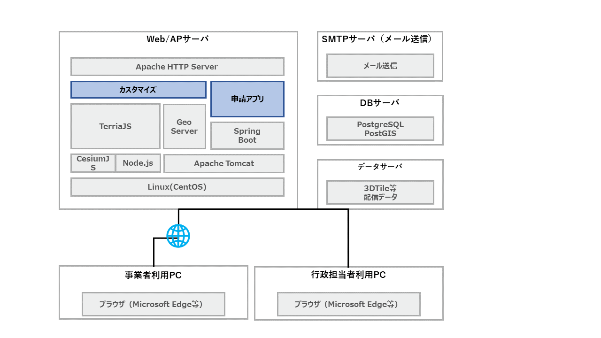

Web/APサーバとSMTPサーバ/DBサーバ/ファイルサーバは同一のサーバでも稼働可能です。

以下では、上記稼働環境の前提で稼働環境構築手順を記載します。

なおSMTPサーバの構築については、本書の記載範囲外とします。

以下、本システムで利用するOS,SW,MWの一覧です。

<table>
<colgroup>
<col style="width: 7%" />
<col style="width: 12%" />
<col style="width: 17%" />
<col style="width: 21%" />
<col style="width: 40%" />
</colgroup>
<thead>
<tr class="header">
<th>#</th>
<th>サーバ</th>
<th>大機能</th>
<th>ライセンス</th>
<th>説明</th>
</tr>
</thead>
<tbody>
<tr class="odd">
<td>1</td>
<td rowspan="18">Web/APサーバ</td>
<td>CentOS Stream 9</td>
<td>GNU General Public License</td>
<td>Web/APサーバを稼働させるOS</td>
</tr>
<tr class="even">
<td>2</td>
<td>Apache</td>
<td>Apache License 2.0</td>
<td>Webアプリで配信を行うためのWebサーバ</td>
</tr>
<tr class="odd">
<td>3</td>
<td>React.js</td>
<td>MIT License</td>
<td>JavaScriptのフレームワーク内で機能するUIを構築するためのライブラリ</td>
</tr>
<tr class="even">
<td>4</td>
<td>PLATEAU VIEW</td>
<td>Apache License 2.0</td>
<td>3D都市モデルビューワ</td>
</tr>
<tr class="odd">
<td>5</td>
<td>Terria</td>
<td>Apache License 2.0</td>
<td><p>UI（ユーザーインターフェイス）の提供及びUIを介してCesium</p>
<p>の描画機能を制御するためのライブラリ</p></td>
</tr>
<tr class="even">
<td>6</td>
<td>Cesium</td>
<td>Apache License 2.0</td>
<td>3Dビューワ上にデータを描画するためのライブラリ</td>
</tr>
<tr class="odd">
<td>7</td>
<td>Leaflet</td>
<td>2-clause BSD License</td>
<td>2Dビューワ上にデータを描画するためのライブラリ</td>
</tr>
<tr class="even">
<td>8</td>
<td>marker.js</td>
<td>marker.js 2 Linkware License</td>
<td>画像データへの図形や文字情報の書き込みをブラウザ上で行うライブラリ</td>
</tr>
<tr class="odd">
<td>9</td>
<td>tiff.js</td>
<td>tiff.js License</td>
<td>Tiffファイルをブラウザで閲覧・編集可能なPNG形式に変換するライブラリ</td>
</tr>
<tr class="even">
<td>10</td>
<td>PDF.js</td>
<td>Apache License 2.0</td>
<td>PDFファイルをプレビューするライブラリ</td>
</tr>
<tr class="odd">
<td>11</td>
<td>PDFBox</td>
<td>Apache License 2.0</td>
<td>PDF文章を扱うライブラリで、PDFファイルの画像ファイル変換に利用</td>
</tr>
<tr class="even">
<td>12</td>
<td>Node.js</td>
<td>MIT License</td>
<td>3Dビューワの実行環境</td>
</tr>
<tr class="odd">
<td>13</td>
<td>Java1.8</td>
<td>GPL v2 with Classpath Exception</td>
<td>GeoServer、カスタムアプリを稼働させるためのプラットフォーム</td>
</tr>
<tr class="even">
<td>14</td>
<td>Tomcat</td>
<td>Apache License 2.0</td>
<td>GeoServer、カスタムアプリを実行するためのJava Servletコンテナ</td>
</tr>
<tr class="odd">
<td>15</td>
<td>GeoServer</td>
<td>GNU GENERAL PUBLIC LICENSE Version 2</td>
<td>各種データをWMS及びWFSなどで配信するためのGISサーバ</td>
</tr>
<tr class="even">
<td>16</td>
<td>Apache POI</td>
<td>Apache License 2.0</td>
<td>帳票出力にて、Excel出力を行うライブラリ</td>
</tr>
<tr class="odd">
<td>17</td>
<td>Spring boot</td>
<td>Apache License 2.0</td>
<td>Javaで利用可能なWebアプリのフレームワーク</td>
</tr>
<tr class="even">
<td>18</td>
<td>Selenium WebDriver</td>
<td>Apache License 2.0</td>
<td>仮想ブラウザでの操作をシミュレートするためのライブラリ</td>
</tr>
<tr class="odd">
<td>19</td>
<td rowspan="2">DBサーバ</td>
<td>PostgresSQL</td>
<td>PostgreSQL License</td>
<td>各種配信するデータを格納するデータベース</td>
</tr>
<tr class="even">
<td>20</td>
<td>PostGIS</td>
<td>GNU General Public License</td>
<td>PostgreSQLで位置情報を扱うことを可能とする拡張機能</td>
</tr>
<tr class="odd">
<td>21</td>
<td>ファイルサーバ</td>
<td colspan="2">3DTile等配信データ</td>
<td>データベース以外で配信する3Dデータ等</td>
</tr>
</tbody>
</table>

稼働環境は以下になります。

【クライアント環境】

-   動作環境：Windows10または11、Core i3以上、メモリ 4GB以上

-   必要なソフトウェア：Edge（最新版、IEモードは検証しない）

-   ネットワーク環境：必須（10Mbps以上、高速な回線を推奨）

【WEB/APサーバ環境】

-   動作環境：CentOS Stream 9

-   必要なソフトウェア：

	-   Apache Version 2.4

	-   Java Version 1.8.0\_392 (OpenJDK 64-Bit Server VM)

	-   Apache Tomcat Version 9.0.65

	-   GeoServer Version 2.20.4

【DBサーバ環境】

-   PostgreSQL Version 14.3

-   PostGIS Version 3.1

# 3 準備物一覧

以下、本システムを構築する際に必要となる準備物一覧になります。

アプリケーションとデータはGitHubリポジトリより取得してください。

GitHubリポジトリのフォルダ構成は下図の通りです。

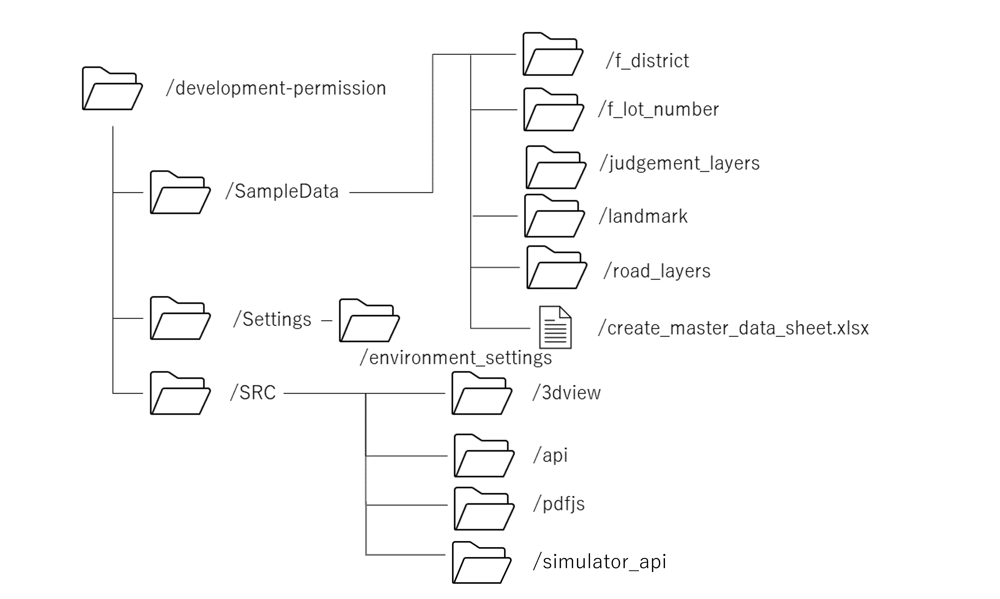

【稼働環境】

CentOS Stream 9

【セットアップ環境】

-	稼働環境と80,8080,5432ポートでTCP通信可能であること

-	Windows10または11

【アプリケーション】

-	申請画面（3DViewer）ソースコード（**/SRC/3dview**）

-	申請API（Springboot）ソースコード（**/SRC/api**）

-	PDFビューワ（PDF.js）スタイルシート（**/SRC/pdfjs**）

-	シミュレータAPI（Springboot）ソースコード（**/SRC/simulator_api**）

【環境構築ファイル】

（**/Settings/environment\_settings 以下一式**）

-	テーブル作成（**/create\_table.sql**）

-	テーブルシーケンス作成（**/sequence.sql**）

-	マスタデータ作成（**/create\_master\_data\_sheet.xlsx**）

-	ランドマーク表示作成ツール（**/generate\_landmark\_billboard.py**）

-	レイヤスタイルファイル（**/layer\_style\_xxxxxx.sld**）

-	レイヤSQLビュー定義ファイル（**/layer\_sql\_xxxxxx.txt**）

※ 道路判定で使用するレイヤスタイルファイルとレイヤSQLビュー定義ファイルは **/road\_layers** 以下に格納されています。

【サンプルデータ】

（**/SampleData 以下一式**）

-	大字（**/f\_district 以下一式**）

-	地番（**/f\_lot\_number 以下一式**）

-	判定レイヤ（**/judgement\_layers 以下一式**）

-	道路判定関連レイヤ（**/road_layers 以下一式**）

-	ランドマーク（**/landmark 以下一式**）

-	マスタデータ作成（**/create\_master\_data\_sheet.xlsx**）

【セットアップ用SW】

-	GISソフト（本書ではQGISを利用）

	https://qgis.org/ja/site/forusers/download.html

-	SQLクライアントソフト（本書ではA5:SQL Mk-2を利用）

	https://a5m2.mmatsubara.com/

※そのほか構築の際に必須となるSWのインストールは手順の中に含めています。

# 4 稼働環境構築（事前準備）

アプリケーション及びデータベースの実行に必要なサーバ環境をご準備ください。

本書ではCentOS Stream 9で行います。

※セキュリティに関する設定は含まれておりませんので、公開前には必ず適切なセキュリティ対策を講じることを強く推奨します。

<a id="sec401"></a>

# 5 稼働環境構築（MW,SW）

検証済みサーバ環境：CentOS Stream 9

構築対象；Web/APサーバ DBサーバ

<a id="sec501"></a>

## 5-1.Apache2.4のインストール

1.  Apache httpd 2.4 をインストールします。

	```Text
	sudo dnf install httpd
	```

2.  インストール後バージョンを確認します。

	```Text
	httpd -version
	```

3.  自動起動の設定を行います。

	```Text
	sudo systemctl enable httpd.service
	```

	※起動

	「http://&lt;サーバマシンのIPアドレス&gt;/」でアクセスできることを確認してください。

	```Text
	sudo systemctl start httpd
	```

	※再起動

	```Text
	sudo systemctl restart httpd
	```

	※停止

	```Text
	sudo systemctl stop httpd
	```

	※必要な場合、ファイアーウォールの設定を行います。

	```Text
	sudo firewall-cmd --zone=public --add-service=http --permanent

	sudo firewall-cmd --zone=public --add-service=https --permanent
	
	sudo firewall-cmd --reload
	```

<a id="sec502"></a>

## 5-2.OpenJDK java 1.8 のインストール

1.  java-1.8.0-openjdkをインストールします。

	```Text
	sudo dnf install java-1.8.0-openjdk
	```

2.  インストール後バージョンを確認します。

	```Text
	java -version
	```

3.  Java Pathの確認

	```Text
	dirname $(readlink $(readlink $(which java)))
	```

4.  環境変数を設定します。

	```Text
	sudo vi /etc/profile
	```

	最終行に以下の内容を追記し保存します。（/usr/lib/jvm以降は適宜バージョンを確認）

	```Text
	export JAVA_HOME=/usr/lib/jvm/java-1.8.0-openjdk-1.8.0.362.b09-4.el9.x86_64

	export PATH=$PATH:$JAVA_HOME/bin

	export CLASSPATH=.:$JAVA_HOME/jre/lib:$JAVA_HOME/lib:$JAVA_HOME/lib/tools.jar
	```

5.  環境変数の設定を反映します。

	```Text
	source /etc/profile
	```

6.  環境変数の値を出力します。

	```Text
	echo $JAVA_HOME
	```

7.  デフォルトのJDK設定を確認します。

	```Text
	alternatives --config java
	```

<a id="sec503"></a>

## 5-3.Tomcat 9のインストール

1.  ユーザーを作成します。

	```Text
	sudo useradd -r -m -U -d /opt/tomcat -s /bin/false tomcat
	```

2.  homeなどに移動し、tomcatのダウンロードを行います。(適宜tomcatのversionを確認) 

	```Text
	cd /home/

	sudo curl -O http://ftp.yz.yamagata-u.ac.jp/pub/network/apache/tomcat/tomcat-9/v9.0.97/bin/apache-tomcat-9.0.97.tar.gz
	```
3.  展開及びファイル移動を行います。

	```Text
	sudo tar xvzf apache-tomcat-9.0.97.tar.gz -C /opt

	sudo ln -s /opt/apache-tomcat-9.0.97 /opt/apache-tomcat

	sudo chown -R tomcat. /opt/apache-tomcat-9.0.97
	```

4.  パスを通します。

	```Text
	echo "export CATALINA_HOME=/opt/apache-tomcat" | sudo tee /etc/profile.d/tomcat.sh

	source /etc/profile
	```

5.  サービス定義ファイルを作成します。

	```Text
	sudo vi /etc/systemd/system/tomcat.service
	```

	以下全て入力して保存します。

	```Text
	[Unit]
	Description=Apache Tomcat 9
	After=network.target

	[Service]
	User=tomcat
	Group=tomcat
	Type=forking

	ExecStart=/opt/apache-tomcat/bin/startup.sh
	ExecStop=/opt/apache-tomcat/bin/shutdown.sh
	ExecReload=/opt/apache-tomcat/bin/shutdown.sh && /opt/apache-tomcat/bin/startup.sh

	[Install]
	WantedBy=multi-user.target
	```

6.  権限を付与します。

	```Text
	sudo chmod 755 /etc/systemd/system/tomcat.service
	```

7.  自動起動の設定を行います。

	```Text
	sudo systemctl enable tomcat
	```

8.  タイムゾーンの設定とHttpHeaderサイズの設定を行います。

	環境設定ファイルを新規で作成してください。

	```Text
	sudo vi /opt/apache-tomcat/bin/setenv.sh
	```

	下記を入力後、保存してください。内容は必要に応じて変更してください。

	```Text
	#!/bin/sh
	export JAVA_OPTS="-Djava.security.egd=file:/dev/./urandom"
	export CATALINA_OPTS="-server -Xmx1536m -Xms512m -XX:MaxMetaspaceSize=1536m -DALLOW_ENV_PARAMETRIZATION=true -Duser.timezone=Asia/Tokyo"
	export CATALINA_HOME=/opt/apache-tomcat
	export CATALINA_BASE=/opt/apache-tomcat
	```

	次にserver.xmlを編集します。

	```Text
	sudo vi /opt/apache-tomcat/conf/server.xml
	```

	下記をConnectorタグに追加後、保存してください。

	```Text
	maxHttpHeaderSize="2097152"
	```

	修正箇所
	```Text
	<Connector port="8080" maxHttpHeaderSize="2097152" protocol="HTTP/1.1" connectionTimeout="20000" redirectPort="8443">
	```

	設定を反映させるため、再起動します。

	```Text
	sudo systemctl restart tomcat
	```


	※起動

	「http://&lt;サーバマシンのIPアドレス&gt;:8080/」でアクセスできることを確認してください。

	```Text
	sudo systemctl start tomcat
	```

	※再起動

	```Text
	sudo systemctl restart tomcat
	```

	※停止

	```Text
	sudo systemctl stop tomcat
	```

	※必要な場合、ファイアーウォールの設定を行います。

	```Text
	sudo firewall-cmd --permanent --add-port=8080/tcp
	sudo firewall-cmd --reload
	```

<a id="sec504"></a>

## 5-4.GeoServer2.20.4のインストール

1.  SOURCE FORGEで配信されているため、

	ブラウザから「https://geoserver.org/release/2.20.4/」にアクセス後、Web Archiveからwarのダウンロード及び解凍を行います。

2.  解凍したwarをtomcatに配備します。

	```Text
	cd "warが置いてある場所"

	sudo mv geoserver.war /opt/apache-tomcat/webapps/
	```

3.  展開後、「http://&lt;サーバマシンのIPアドレス&gt;:8080/geoserver/」でアクセスできることを確認してください。

<a id="sec505"></a>

## 5-5.PostgreSQL14のインストール

※本書では、Web/APサーバとDBサーバを同一のサーバ上に構築する手順で記載しております。<span style="color: red; ">両サーバを別環境で構築する場合、本章の以下手順はDBサーバ上で実施してください。</span>

1.  PostgreSQLのリポジトリRPMのインストールを行います。

	```Text
	sudo dnf install -y https://download.postgresql.org/pub/repos/yum/reporpms/EL-9-x86_64/pgdg-redhat-repo-latest.noarch.rpm
	```

2.  組み込みPostgreSQLモジュールを無効化します。

	```Text
	sudo dnf -qy module disable postgresql
	```

3.  PostgreSQL 14をインストールします。

	```Text
	sudo dnf install -y postgresql14 postgresql14-server
	```

4.  manコマンドでマニュアル参照を行えるように設定します。

	```Text
	sudo vi /etc/man_db.conf
	```

	以下を追加して保存してください。

	```Text
	MANDATORY_MANPATH /usr/pgsql-14/share/man/
	```

5.  データベースの初期化（データベースクラスタの作成）を行います。

	```Text
	sudo PGSETUP_INITDB_OPTIONS='--encoding=UTF-8 --no-locale' /usr/pgsql-14/bin/postgresql-14-setup initdb
	```

6.  自動起動の設定を行います。

	```Text
	sudo systemctl enable --now postgresql-14
	```

	※起動

	```Text
	sudo systemctl start postgresql-14
	```


	※停止

	```Text
	sudo systemctl stop postgresql-14
	```

	※postgresユーザーへ切り替え

	```Text
	sudo su - postgres
	```

	※終了

	```Text
	exit
	```

	※PostgreSQL の接続

	```Text
	psql
	```

	※終了

	```Text
	exit
	```

	※必要な場合、ファイアーウォールの設定を行います。

	```Text
	sudo firewall-cmd --add-service=postgresql --permanent
	sudo firewall-cmd --reload
	```

	※外部からPostgreSQL14への接続を許可する際は下記の設定を変更してください

	postgresql.confの修正

	```Text
	sudo vi /var/lib/pgsql/14/data/postgresql.conf
	```

	listen_addressesとportのコメントアウトを外す(セキュリティに留意して見直してください)

	```Text
	listen_addresses = '*'

	port = 5432
	```

	pg\_hba.confの修正

	```Text
	sudo vi /var/lib/pgsql/14/data/pg_hba.conf
	```

	IPv4の「METHOD」を「password」にし、「ADDRESS」に許可するIPアドレスを指定(セキュリティに留意して見直してください)

<a id="sec506"></a>

## 5-6.PostGIS3のインストール(※同環境にpostgresを入れる場合のみ)

1.	EPEL,crbリポジトリを有効にします。

	```Text
	sudo dnf install -y epel-release
	sudo dnf config-manager --set-enabled crb
	```

2.  PostGISをインストールします。

	```Text
	sudo dnf install -y postgis31_14 postgis31_14-client
	```

<a id="sec507"></a>

## 5-7.DBの作成

1.  ロールの作成は必要に応じて行ってください。

	postgresユーザへ切り替え後、PostgreSQL に接続します。

	```Text
	sudo su - postgres

	psql
	```

	ロールを作成します。(queryは必要に応じて変更してください)

	```Text
	CREATE ROLE devps WITH

	SUPERUSER

	CREATEDB

	CREATEROLE

	INHERIT

	LOGIN

	REPLICATION

	BYPASSRLS

	ENCRYPTED PASSWORD 'password';
	```

	その他オプション

	```Text
	CREATE ROLE name [ [ WITH ] option [ ... ] ]

	option:

	SUPERUSER | NOSUPERUSER

	| CREATEDB | NOCREATEDB

	| CREATEROLE | NOCREATEROLE

	| INHERIT | NOINHERIT

	| LOGIN | NOLOGIN

	| REPLICATION | NOREPLICATION

	| BYPASSRLS | NOBYPASSRLS

	| CONNECTION LIMIT connlimit

	| [ ENCRYPTED ] PASSWORD 'password'

	| VALID UNTIL 'timestamp'

	| IN ROLE role_name [, ...]

	| IN GROUP role_name [, ...]

	| ROLE role_name [, ...]

	| ADMIN role_name [, ...]

	| USER role_name [, ...]

	| SYSID uid
	```

	PostgreSQLを切断

	```Text
	\q
	```

	postgresユーザをログアウト

	```Text
	exit
	```

2.	postgresユーザーへ切り替え後、DB作成前にテーブルスペース用のディレクトリを作成します。

	postgresユーザへ切り替えます。

	```Text
	sudo su - postgres
	```

	テーブルスペース用のディレクトリを作成します。

	```Text
	mkdir /var/lib/pgsql/14/data/devps_tbs
	```

	作成したディレクトリが一覧に表示されていることを確認してください。

	```Text
	ls -l /var/lib/pgsql/14/data/
	```

3.  テーブルスペースとデータベースの作成

	PostgreSQL に接続します。

	```Text
	psql
	```

	テーブルスペースを作成します。(queryは必要に応じて変更してください)

	```Text
	CREATE TABLESPACE devps_tbs

	OWNER devps

	LOCATION '/var/lib/pgsql/14/data/devps_tbs';

	COMMENT ON TABLESPACE devps_tbs IS '稼働環境用テーブルスペース';

	GRANT CREATE ON TABLESPACE devps_tbs TO devps;

	```

	作成したテーブルスペースが一覧に表示されていることを確認してください。

	```Text
	\db
	```

	データベースを作成します。(queryは必要に応じて変更してください)

	```Text
	CREATE DATABASE devps_db

	WITH

	OWNER = devps

	TEMPLATE template0 

	ENCODING = 'UTF8'

	LC_COLLATE = 'ja_JP.UTF-8'

	LC_CTYPE = 'ja_JP.UTF-8'

	TABLESPACE = devps_tbs

	ALLOW_CONNECTIONS = true

	CONNECTION LIMIT = -1;

	COMMENT ON DATABASE devps_db IS '稼働環境用データベース';

	```

	作成したデータベースが一覧に表示されていることを確認してください。

	```Text
	\l
	```

	PostgreSQLを切断

	```Text
	\q
	```

	postgresユーザをログアウト

	```Text
	exit
	```

<a id="sec508"></a>

## 5-8.PostGISの有効化

1.	postgresユーザへ切り替え後、DB に接続します。

	```Text
	sudo su - postgres

	psql -h localhost -p 5432 -U devps -d devps_db
	```

2.  PostGISの有効化を行います。

	```Text
	CREATE EXTENSION postgis;
	```

3.  正常に有効化されているかバージョン確認を行います。

	```Text
	SELECT PostGIS_version();
	```

<a id="sec600"></a>

# 6 テーブル作成（PostgreSQL）

[前章](#sec507)で作成したデータベース上に、テーブルを作成します。

本章はセットアップ環境からデータベースに接続できる前提になります。

セットアップ環境でDBクライアントツールを立ち上げ、データベースに接続します。

※本書ではA5:SQL Mk-2を使用した手順を記載します。

1.	A5:SQL Mk-2を開き、サイドメニューの「データベース」を右クリックし、表示されるメニューから「データベースの追加と削除」をクリックします。

	

	

2.  「追加」をクリックします。

	

3.  「PostgreSQL（直接接続）」をクリックします。

	

4.  [前章](#sec507)で設定したデータベースの接続情報を入力し、「OK」をクリックします。

	

5.  サイドメニューの「データベース」の下に、登録したデータベースが表示されます。

	

6.  データベースの折り畳みボタンをクリックすると、以下のダイアログが表示されます。認証情報を入力し、「接続」を押下します。

	

7.  トップメニューバーから、「ファイル」「新規」をクリックします。

	

8.  「SQL」を選択します。

	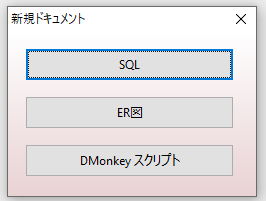

9.  タブが新しく開きます。

	※データベースに接続した状態の場合、タブ上部のデータベース名の欄がハイライトされます。

	

10. **/Settings/environment\_settings/create\_table.sql**を取得します。テキストエディタで開き、9.で開いたタブにコピーします。

	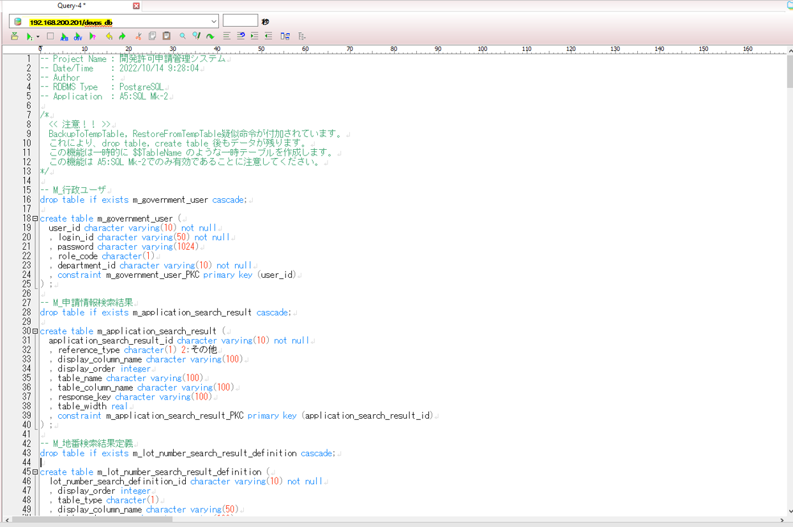

11.	「実行」ボタンを押下します。

	

12.	サイドメニューのデータベースからメニューを開き、「public」スキーマの中にテーブルが追加されていることを確認します。

	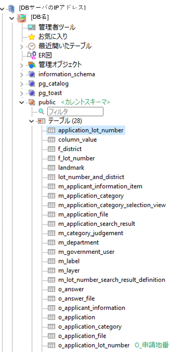

13.	**/Settings/environment\_settings/sequence.sql**を取得し、ファイルを開き、同様に実行します。

	

# 7 マスタデータ取込

本システムで用いるマスタデータを取り込みます。

取込対象となるマスタデータは以下になります。

サンプルデータを使用される場合は、

**/SampleData/create\_master\_data\_sheet.xlsx**

を使用してください。

独自にマスタデータを作成する場合は、

**/Settings/create\_master\_data\_sheet.xlsx**

を使用してください。

<table>
<colgroup>
<col style="width: 37%" />
<col style="width: 29%" />
<col style="width: 33%" />
</colgroup>
<thead>
<tr class="header">
<th>テーブル名（論理名/物理名）</th>
<th>説明</th>
<th>備考</th>
</tr>
</thead>
<tbody>
<tr class="odd">
<td><p>M_申請区分選択画面</p>
<p>m_application_category_</p>
<p>selection_view</p></td>
<td><p>申請区分の種類</p>
<p>最大10種類まで設定可能</p></td>
<td></td>
</tr>
<tr class="even">
<td><p>M_申請区分</p>
<p>m_application_category</p></td>
<td>各申請区分の選択肢</td>
<td></td>
</tr>
<tr class="odd">
<td><p>M_レイヤ</p>
<p>m_layer</p></td>
<td>判定で使用するレイヤ</td>
<td></td>
</tr>
<tr class="even">
<td><p>M_部署</p>
<p>m_department</p></td>
<td>部署一覧</td>
<td></td>
</tr>
<tr class="odd">
<td><p>M_区分判定</p>
<p>m_category_judgemnt</p></td>
<td>判定項目</td>
<td></td>
</tr>
<tr class="even">
<td><p>M_申請ファイル</p>
<p>m_application_file</p></td>
<td>申請ファイル一覧</td>
<td></td>
</tr>
<tr class="odd">
<td><p>M_ラベル</p>
<p>m_label</p></td>
<td>各画面表示内容の定義</td>
<td></td>
</tr>
<tr class="even">
<td><p>M_地番検索定義</p>
<p>m_lot_number_search_result_</p>
<p>definition</p></td>
<td>地番検索結果テーブルの表示項目</td>
<td></td>
</tr>
<tr class="odd">
<td><p>M_申請情報検索結果</p>
<p>m_application_sarch_result</p></td>
<td>申請者情報検索結果テーブルの表示項目</td>
<td></td>
</tr>
<tr class="even">
<td><p>M_申請者情報項目</p>
<p>m_applicant_information_item</p></td>
<td>申請登録時に入力する申請者情報項目</td>
<td></td>
</tr>
<tr class="odd">
<td><p>M_行政ユーザ</p>
<p>m_government_user</p></td>
<td>行政ユーザ一覧</td>
<td></td>
</tr>
<tr class="even">
<td><p>M_回答テンプレート</p>
<p>m_answer_template</p></td>
<td>行政担当者が入力する回答内容のテンプレート一覧</td>
<td></td>
</tr>
<tr class="odd">
<td><p>M_道路判定ラベル</p>
<p>m_road_judge_label</p></td>
<td>道路判定結果の案内文言一覧</td>
<td>道路判定を有効にしない場合本テーブルは不要。</td>
</tr>
<tr class="even">
<td><p>M_カレンダー</p>
<p>m_calendar</p></td>
<td></td>
<td></td>
</tr>
<tr class="odd">
<td><p>M_権限</p>
<p>m_authority</p></td>
<td></td>
<td></td>
</tr>
<tr class="even">
<td><p>M_判定結果</p>
<p>m_judgement_result</p></td>
<td></td>
<td></td>
</tr>
<tr class="odd">
<td><p>M_申請区分_区分判定</p>
<p>m_application_category_judgement</p></td>
<td></td>
<td></td>
</tr>
<tr class="even">
<td><p>M_申請情報項目選択肢</p>
<p>m_applicant_information_item_option</p></td>
<td></td>
<td></td>
</tr>
<tr class="odd">
<td><p>M_申請種類</p>
<p>m_application_type</p></td>
<td></td>
<td></td>
</tr>
<tr class="even">
<td><p>M_申請段階</p>
<p>m_application_step</p></td>
<td></td>
<td></td>
</tr>
<tr class="odd">
<td><p>M_帳票ラベル</p>
<p>m_ledger_label</p></td>
<td></td>
<td></td>
</tr>
<tr class="even">
<td><p>M_帳票</p>
<p>m_ledger</p></td>
<td></td>
<td></td>
</tr>
<tr class="odd">
<td><p>M_開発登録簿</p>
<p>m_development_document</p></td>
<td></td>
<td></td>
</tr>
<tr class="even">
<td><p>M_区分判定_権限</p>
<p>m_judgement_authority</p></td>
<td></td>
<td></td>
</tr>
</tbody>
</table>

本システムのER図を以下に記載します。

本章におけるセットアップ対象のマスタデータは青色のテーブルになります。

<span style="color: red;">
赤字のテーブルおよびカラムは令和6年度実証において追加された内容です。
</span>

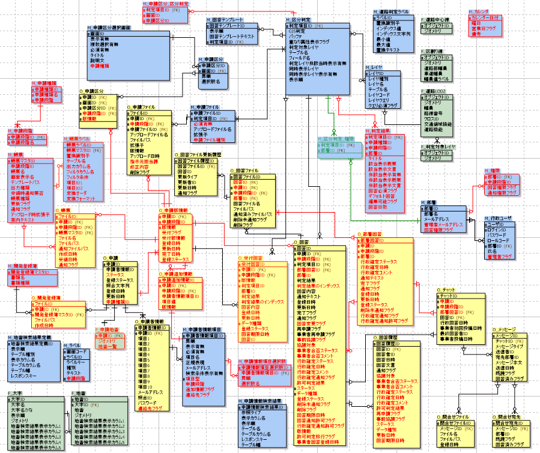

各テーブル共通の手順は以下になります。

1.	「create\_master\_data\_sheet.xlsx」を編集します。各テーブルに対応するシートの項目を埋め、マスタデータを作成します。シートの各列の設定内容は次節以降の各テーブルの記載を参照してください。

	※サンプルデータ（**/SampleData/create\_master\_data\_sheet.xlsx**）をそのまま使用される場合は編集不要です。

	※独自にマスタデータを作成する場合は、

	**/Settings/** **create\_master\_data\_sheet.xlsx**の各シートに参考のサンプルデータを記載しておりますので、変更してください。

	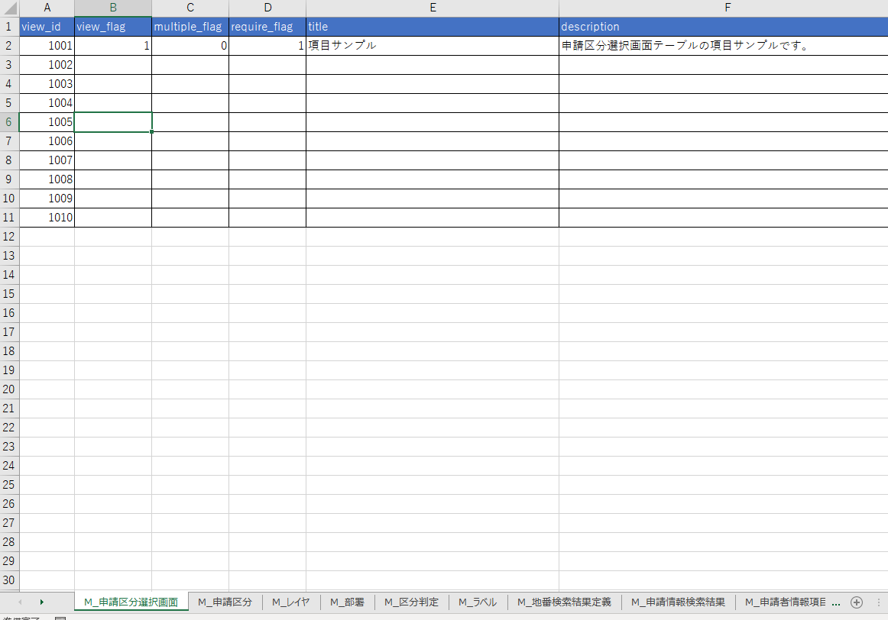

	

2.	マスタデータの各シートをCSVにエクスポートします。

	

3.	Excelを閉じ、エクスポートされたCSVファイルをメモ帳やテキストエディタ等で開きます。空白行がエクスポートされている場合削除します。

	

	

	※削除しなかった場合取込時に以下のようなエラーメッセージが表示されます。

	

4.	SQLクライアントツールからエクスポートしたCSVファイルを取り込みます。

	以下ではA5M2での取込手順を記載します。

5.	取り込みを行うテーブルをダブルクリックして開きます。

	

6.	CSV取込ボタンを押下します。

	

7.	CSVのカラム名とデータセットのカラム名が対応していることと文字コードを確認し、「インポート」を押下します。

	

8.	インポートに成功すると以下のダイアログが表示されます。

	

9.  データが正しく取り込めているか確認してください。

	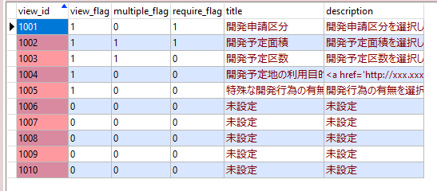

	<span style="color: red; ">

	※エクスポートしたCSVファイルをExcelで閉じていない場合取込ができません。

	※カンマを文字列内に含んでいる場合CSVを取り込めないことがあります。CSVファイルをテキストエディタやメモ帳等で開き、文字列がダブルクオーテーションで囲まれているか確認してください。


	※0埋めした数字をIDで設定していた場合、Excelで正しくエクスポートされない場合があるのでご注意ください。


	※ID等をカンマ区切りでExcelに入力した場合、桁区切りと認識されます。冒頭に「’」を入力して文字列として認識させてください。

	　例）「’1001,1002,1003」

	</span>

	テーブル間でIDを外部キーとして共有しているため、以下手順に示す順番でマスタデータのシートを作成してください。データベースに取り込む順番は任意で構いません。

<a id="sec701"></a>

## 7-1. M\_申請区分選択画面（m\_application\_category\_selection\_view）

create\_master\_data\_sheet.xlsxで作成するカラムは以下の通りです。

<span style="color: red; ">

※view\_idは「1001」～「1010」まで固定で必ず設定してください。

※表示に使用しない画面（申請区分）はview\_flagを0に設定してください。

</span>

独自にデータをカスタマイズする場合、シート上のサンプルデータは削除してください。

<table>
<colgroup>
<col style="width: 9%" />
<col style="width: 23%" />
<col style="width: 21%" />
<col style="width: 9%" />
<col style="width: 35%" />
</colgroup>
<thead>
<tr class="header">
<th>列番号</th>
<th>カラム名</th>
<th>エイリアス</th>
<th>必須</th>
<th>説明</th>
</tr>
</thead>
<tbody>
<tr class="odd">
<td>A</td>
<td>view_id</td>
<td>画面ID</td>
<td>○</td>
<td>「1001」～「1010」まで固定で設定すること</td>
</tr>
<tr class="even">
<td>B</td>
<td>view_flag</td>
<td>表示有無</td>
<td>○</td>
<td>1=表示,0=非表示 のいずれかで設定</td>
</tr>
<tr class="odd">
<td>C</td>
<td>multiple_flag</td>
<td>複数選択有無</td>
<td>○</td>
<td>1=単体選択,0=複数選択 のいずれかで設定</td>
</tr>
<tr class="even">
<td>D</td>
<td>require_flag</td>
<td>必須有無</td>
<td>○</td>
<td>1=選択必須, 0=選択任意 のいずれかで設定</td>
</tr>
<tr class="odd">
<td>E</td>
<td>title</td>
<td>タイトル</td>
<td>○</td>
<td><p>申請区分選択画面で表示するタイトル。</p>
<p>帳票や申請情報検索・詳細等の各画面で表示する申請区分項目名としても使用</p></td>
</tr>
<tr class="even">
<td>F</td>
<td>description</td>
<td>説明文</td>
<td>○</td>
<td><p>申請区分選択画面に表示する説明文</p>
<p>HTMLで記載可能</p></td>
</tr>
<tr class="odd">
<td>G</td>
<td>judgement_type</td>
<td>申請種類</td>
<td>○</td>
<td><p>申請区分選択画面で申請種類選択後に表示する申請区分の切替フラグ。</p>
<p>カンマ区切りで表示対象の申請種類のコードを格納する。</p></td>
</tr>
</tbody>
</table>

<a id="sec702"></a>

## 7-2. M\_申請区分（m\_application\_category）

create\_master\_data\_sheet.xlsxで作成するカラムは以下の通りです。

必要な申請区分数の行を作成してください。

独自にデータをカスタマイズする場合、シート上のサンプルデータは削除してください。

<table>
<colgroup>
<col style="width: 9%" />
<col style="width: 23%" />
<col style="width: 21%" />
<col style="width: 9%" />
<col style="width: 35%" />
</colgroup>
<thead>
<tr class="header">
<th>列番号</th>
<th>カラム名</th>
<th>エイリアス</th>
<th>必須</th>
<th>説明</th>
</tr>
</thead>
<tbody>
<tr class="odd">
<td>A</td>
<td>category_id</td>
<td>申請区分ID</td>
<td>○</td>
<td><p>10桁以内でレコードごとに一意のIDを設定すること</p>
<p>例：2001,2002,2003,・・・</p></td>
</tr>
<tr class="even">
<td>B</td>
<td>view_id</td>
<td>画面ID</td>
<td>○</td>
<td><p>申請区分がどの画面に対応しているかを設定</p>
<p>M_申請区分選択画面で設定したview_idの値と対応させること</p></td>
</tr>
<tr class="odd">
<td>C</td>
<td>order</td>
<td>昇順</td>
<td>○</td>
<td><p>申請区分選択画面での選択肢表示順を設定</p>
<p>正の整数で設定すること</p></td>
</tr>
<tr class="even">
<td>D</td>
<td>label_name</td>
<td>選択肢名</td>
<td>○</td>
<td><p>申請区分選択画面の選択肢として表示する選択肢名を設定</p>
<p>帳票や申請情報検索・詳細等の各画面で表示する申請区分名としても使用</p></td>
</tr>
</tbody>
</table>

<a id="sec703"></a>

## 7-3. M\_レイヤ（m\_layer）

create\_master\_data\_sheet.xlsxで作成するカラムは以下の通りです。

必要なレイヤ数の行を作成してください。

独自にデータをカスタマイズする場合、シート上のサンプルデータは削除してください。

<span style="color: red; ">

※table\_nameは[9 判定レイヤ取込](#sec900)、layer\_codeとlayer\_queryは[14 GeoServerレイヤ作成](#sec1400)実施後に設定してください。


※ [7-5. M_区分判定](#sec705)を設定する際にレイヤIDが必要となります。

</span>

<table>
<colgroup>
<col style="width: 9%" />
<col style="width: 27%" />
<col style="width: 20%" />
<col style="width: 8%" />
<col style="width: 32%" />
</colgroup>
<thead>
<tr class="header">
<th>列番号</th>
<th>カラム名</th>
<th>エイリアス</th>
<th>必須</th>
<th>説明</th>
</tr>
</thead>
<tbody>
<tr class="odd">
<td>A</td>
<td>layer_id</td>
<td>レイヤID</td>
<td>○</td>
<td><p>10桁以内でレコードごとに一意のIDを設定すること</p>
<p>例：2001,2002,2003,・・・</p></td>
</tr>
<tr class="even">
<td>B</td>
<td>layer_type</td>
<td>レイヤ種別</td>
<td>○</td>
<td><p>1=判定対象レイヤ,0=関連レイヤ のいずれかで設定</p>
<p>※判定対象レイヤ・・・概況診断のGIS判定で使用するレイヤ</p>
<p>※関連レイヤ・・・概況診断のGIS判定では使用せず、概況診断結果表示時に判定対象レイヤと合わせて表示するレイヤ（使用例：バッファ判定のバッファ径を表示）</p></td>
</tr>
<tr class="odd">
<td>C</td>
<td>layer_name</td>
<td>レイヤ名</td>
<td>○</td>
<td>概況診断結果表示時に表示するレイヤ名</td>
</tr>
<tr class="even">
<td>D</td>
<td>table_name</td>
<td>テーブル名</td>
<td>○</td>
<td>概況診断で使用する判定対象テーブルのテーブル名</td>
</tr>
<tr class="odd">
<td>E</td>
<td>layer_code</td>
<td>レイヤコード</td>
<td>○</td>
<td><p>GeoServerで設定したレイヤ名</p>
<p>「ワークスペース名:レイヤ名」のフォーマット</p></td>
</tr>
<tr class="even">
<td>F</td>
<td>layer_query</td>
<td>レイヤクエリ</td>
<td></td>
<td><p>GeoServerのSQLビューでSQLビューパラメータを設定しているレイヤに問い合わせる際に使用するクエリ「パラメータ1:値;パラメータ2:値;パラメータ3:値」のフォーマット。</p>
<p>判定レイヤの属性情報を使ってフィルタ条件を設定する場合、「値」の箇所に「@1」のように<span style="color: red; ">「@」+「M_区分判定.フィールド名でカンマ区切り指定したフィールド名の順番」</span>を記載。</p>
<p>また、道路判定で使用する各レイヤの表示設定については<a href="#sec140401">14-4. 道路判定レイヤを作成</a>するを参照。</p>
<p>使用していない場合空欄で可</p></td>
</tr>
<tr class="odd">
<td>G</td>
<td>query_require_flag</td>
<td>クエリ必須フラグ</td>
<td>○</td>
<td><p>layer_queryを使用するかどうか</p>
<p>1=必要,0=不要のいずれかで設定</p></td>
</tr>
</tbody>
</table>

<a id="sec704"></a>

## 7-4. M\_部署（m\_department）

create\_master\_data\_sheet.xlsxで作成するカラムは以下の通りです。

必要な部署数の行を作成してください。

独自にデータをカスタマイズする場合、シート上のサンプルデータは削除してください。

<span style="color: red; ">
※ <a href="#sec705">7-5. M_区分判定</a>を設定する際に部署IDが必要となります。
</span>

<table>
<colgroup>
<col style="width: 9%" />
<col style="width: 28%" />
<col style="width: 20%" />
<col style="width: 8%" />
<col style="width: 32%" />
</colgroup>
<thead>
<tr class="header">
<th>列番号</th>
<th>カラム名</th>
<th>エイリアス</th>
<th>必須</th>
<th>説明</th>
</tr>
</thead>
<tbody>
<tr class="odd">
<td>A</td>
<td>department_id</td>
<td>部署ID</td>
<td>○</td>
<td><p>10桁以内でレコードごとに一意のIDを設定すること</p>
<p>例：2001,2002,2003,・・・</p></td>
</tr>
<tr class="even">
<td>B</td>
<td>department_name</td>
<td>部署名</td>
<td>○</td>
<td>部署の名称</td>
</tr>
<tr class="odd">
<td>C</td>
<td>mail_address</td>
<td>メールアドレス</td>
<td>○</td>
<td><p>部署宛にメール通知を行うメールアドレス</p>
<p>カンマ区切りで複数指定可</p>
<p></p>
<p><span style="color: red; ">※設定したメールアドレスに通知が飛ばされるため、テスト時はテスト用のメールアドレスで設定し、本番運用時に実運用のメールアドレスに変更することを推奨</span></p></td>
</tr>
<tr class="even">
<td>D</td>
<td>admin_mail_address</td>
<td>管理者メールアドレス</td>
<td>○</td>
<td><p>該当部署の管理者の通知先のメールアドレス</p>
<p>カンマ区切りで複数指定可</p>
</td>
</tr>
<tr class="odd">
<td>E</td>
<td>answer_authority_flag</td>
<td>回答権限フラグ</td>
<td>○</td>
<td><p>該当部署が統括部署であるかを設定すること</p>
<p>1=統括部署,0=統括部署以外 のいずれかで設定</p></td>
</tr>
</tbody>
</table>

<a id="sec705"></a>

## 7-5. M\_区分判定（m\_category\_judgement）

create\_master\_data\_sheet.xlsxで作成するカラムは以下の通りです。

必要な区分判定分の行を作成してください。

独自にデータをカスタマイズする場合、シート上のサンプルデータは削除してください。

道路判定を使用しない場合、シート上の道路判定の行（gis_judgementが5）は削除してください。

<span style="color: red; ">

※ <a href="#sec706">7-6. M\_申請ファイル</a>を設定する際に判定項目IDが必要となります。

</span>

<table>
<colgroup>
<col style="width: 7%" />
<col style="width: 43%" />
<col style="width: 12%" />
<col style="width: 6%" />
<col style="width: 29%" />
</colgroup>
<thead>
<tr class="header">
<th>列番号</th>
<th>カラム名</th>
<th>エイリアス</th>
<th>必須</th>
<th>説明</th>
</tr>
</thead>
<tbody>
<tr class="odd">
<td>A</td>
<td>judgement_item_id</td>
<td>判定項目ID</td>
<td>○</td>
<td><p>10桁以内でレコードごとに一意のIDを設定すること</p>
<p>例：3001,3002,3003,・・・</p></td>
</tr>
<tr class="even">
<td>B</td>
<td>gis_judgement</td>
<td>GIS判定</td>
<td>○</td>
<td><p>GIS判定を行うか否かと、GIS判定方式を設定</p>
<p>0=GIS判定なし,</p>
<p>1=重なり判定,</p>
<p>2=非重なり判定,</p>
<p>3=バッファ重なり判定,</p>
<p>4=バッファ非重なり判定</p>
<p>5=道路判定</p>
<p>のいずれかで設定</p></td>
</tr>
<tr class="odd">
<td>C</td>
<td>buffer</td>
<td>バッファ</td>
<td>○</td>
<td><p>バッファ判定時のバッファ半径(m,小数可)</p>
<p>バッファ判定を使用しない場合0とすること</p></td>
</tr>
<tr class="even">
<td>D</td>
<td>display_attribute_flag</td>
<td>重なり属性表示フラグ</td>
<td>○</td>
<td><p>GIS重なり属性表示を行うか否かと、属性表示方法を設定</p>
<p>0=属性表示しない</p>
<p>1=区切り文字で区切って属性表示</p>
<p>2=改行して属性表示</p>
<p>3=概況診断結果一覧テーブルで行を分けて属性表示</p>
<p></p>
<p><span style="color: red; ">※属性表示する場合、table_nameとfield_nameを設定すること</span></p>
<p><span style="color: red; ">※区切り文字はapplication.propertiesで設定。</span></p></td>
</tr>
<tr class="odd">
<td>E</td>
<td>judgement_layer</td>
<td>判定対象レイヤ</td>
<td></td>
<td><p>GIS判定で使用するレイヤのレイヤID。</p>
<p>カンマ区切りで複数指定可</p>
<p></p>
<p><span style="color: red; ">※M_レイヤで設定したIDを使用すること</span></p>
<p><span style="color: red; ">※GIS判定では必須、GIS判定以外では不要</span></p>
<p><span style="color: red; ">※図形重なり属性表示を行う場合複数指定不可</span></p></td>
</tr>
<tr class="even">
<td>F</td>
<td>table_name</td>
<td>テーブル名</td>
<td></td>
<td><p>属性表示するテーブル名</p>
<p>※judgement_layerで指定した判定レイヤのテーブル名を指定すること</p></td>
</tr>
<tr class="odd">
<td>G</td>
<td>field_name</td>
<td>フィールド名</td>
<td></td>
<td><p>属性表示するフィールド名</p>
<p>カンマ区切りで複数設定可能</p>
<p>※【W】で指定したテーブルのフィールド名(カラム名)を指定すること</p></td>
</tr>
<tr class="even">
<td>H</td>
<td>non_applicable_layer_display_flag</td>
<td>判定レイヤ非該当時表示有無</td>
<td>○</td>
<td><p>非該当時も判定レイヤを画面表示するか否か</p>
<p>※該当時はレイヤを設定している場合必ず表示</p>
<p>1=表示,0=非表示 のいずれかで設定</p></td>
</tr>
<tr class="odd">
<td>I</td>
<td>simultaneous_display_layer</td>
<td>同時表示レイヤ</td>
<td></td>
<td>概況診断結果一覧画面で判定対象レイヤと同時に表示する関連レイヤのID（カンマ区切り）</td>
</tr>
<tr class="even">
<td>J</td>
<td>simultaneous_display_layer_flag</td>
<td>同時表示レイヤ表示有無</td>
<td>○</td>
<td><p>概況診断結果一覧画面で判定対象レイヤと同時に関連レイヤを表示するか否か</p>
<p>1=表示, 0=非表示 のいずれかで設定</p></td>
</tr>
<tr class="odd">
<td>K</td>
<td>disp_order</td>
<td>表示順</td>
<td>○</td>
<td><p>概況診断結果一覧画面および帳票における表示順</p>
<p>小数で設定する</p></td>
</tr>
</tbody>
</table>

<a id="sec706"></a>

## 7-6. M\_申請ファイル（m\_application\_file）

create\_master\_data\_sheet.xlsxで作成するカラムは以下の通りです。

必要な申請ファイル分の行を作成してください。

独自にデータをカスタマイズする場合、シート上のサンプルデータは削除してください。

<span style="color: red; ">

※概況診断結果レポートは区分判定IDごとに設定が必要になります。サンプルデータの内容をコピーして区分判定IDのみ変更して設定してください。概況診断結果レポートは申請ファイルIDを「9999」に設定する必要があります。

</span>

<table>
<colgroup>
<col style="width: 9%" />
<col style="width: 28%" />
<col style="width: 20%" />
<col style="width: 8%" />
<col style="width: 32%" />
</colgroup>
<thead>
<tr class="header">
<th>列番号</th>
<th>カラム名</th>
<th>エイリアス</th>
<th>必須</th>
<th>説明</th>
</tr>
</thead>
<tbody>
<tr class="odd">
<td>A</td>
<td>application_file_id</td>
<td>申請ファイルID</td>
<td>○</td>
<td><p>申請ファイルを識別する10桁以内のID</p>
<p>同じ申請ファイルを複数の判定項目に紐づけたい場合、同じ申請ファイルIDで異なる判定項目IDのレコードを作成すること</p></td>
</tr>
<tr class="even">
<td>B</td>
<td>judgement_item_id</td>
<td>判定項目ID</td>
<td>○</td>
<td><p>申請ファイルと紐づける判定項目ID</p>
<p><a href="#sec705">M_区分判定</a>で設定した判定項目IDを設定すること</p></td>
</tr>
<tr class="odd">
<td>C</td>
<td>require_flag</td>
<td>必須有無</td>
<td>○</td>
<td><p>申請登録時にファイルのアップロードが必須か否か</p>
<p>2=任意(注意文言あり), 必須=1, 任意=0 のいずれかで設定</p></td>
</tr>
<tr class="even">
<td>D</td>
<td>upload_file_name</td>
<td>アップロードファイル名</td>
<td>○</td>
<td>申請登録画面や申請情報詳細画面等で表示する申請ファイル名称</td>
</tr>
<tr class="odd">
<td>E</td>
<td>extension</td>
<td>拡張子</td>
<td>○</td>
<td><p>利用可能な拡張子をカンマ区切りで設定</p>
</tr>
<tr class="even">
<td>F</td>
<td>application_file_type</td>
<td>申請ファイル種別</td>
<td>○</td>
<td><p>1=開発登録簿に含める , 0=開発登録簿に含めない</p></td>
</tr>
</tbody>
</table>

<a id="sec707"></a>

## 7-7. M\_ラベル（m\_label）

create\_master\_data\_sheet.xlsxで作成するカラムは以下の通りです。

本テーブルは画面表示内容の設定で使用するため、必要に応じてカスタマイズしてください。

<table>
<colgroup>
<col style="width: 9%" />
<col style="width: 28%" />
<col style="width: 20%" />
<col style="width: 8%" />
<col style="width: 32%" />
</colgroup>
<thead>
<tr class="header">
<th>列番号</th>
<th>カラム名</th>
<th>エイリアス</th>
<th>必須</th>
<th>説明</th>
</tr>
</thead>
<tbody>
<tr class="odd">
<td>A</td>
<td>view_code</td>
<td>画面コード</td>
<td>○</td>
<td><p></p>
<p><span style="color: red; ">プログラム上で使用するためマスタデータ作成シートの内容を変更しないこと</span></p></td>
</tr>
<tr class="even">
<td>B</td>
<td>label_id</td>
<td>ラベルID</td>
<td>○</td>
<td><p></p>
<p><span style="color: red; ">プログラム上で使用するためマスタデータ作成シートの内容を変更しないこと</span></p></td>
</tr>
<tr class="odd">
<td>C</td>
<td>label_ley</td>
<td>ラベルキー</td>
<td>○</td>
<td><p></p>
<p><span style="color: red; ">プログラム上で使用するためマスタデータ作成シートの内容を変更しないこと</span></p></td>
</tr>
<tr class="even">
<td>D</td>
<td>label_type</td>
<td>種別</td>
<td>○</td>
<td><p>0=事業者行政とも使用</p>
<p>1=事業者のみ使用</p>
<p>2=行政のみ使用</p>
<p><span style="color: red; ">プログラム上で使用するためマスタデータ作成シートの内容を変更しないこと</span></p></td>
</tr>
<tr class="odd">
<td>E</td>
<td>label_text</td>
<td>テキスト</td>
<td>○</td>
<td><p>画面表示で使用するラベルの文言</p>
<p>HTML埋め込み可能</p>
<p>必要に応じてマスタデータ作成シートの内容から変更</p></td>
</tr>
<tr class="even">
<td>F</td>
<td>application_step</td>
<td>申請段階</td>
<td>○</td>
<td><p>申請段階IDを指定</p>
<p>カンマ区切りで複数設定可能</p>
<p>申請段階IDを問わず、常に表示する場合、「all」で書く</p>
</td>
</tr>
</tbody>
</table>

画面コード、ラベルIDと使用箇所の対応は下記の通りです。

<table>
<colgroup>
<col style="width: 13%" />
<col style="width: 14%" />
<col style="width: 40%" />
<col style="width: 31%" />
</colgroup>
<thead>
<tr class="header">
<th>view_code</th>
<th>label_id</th>
<th>使用箇所</th>
<th>備考</th>
</tr>
</thead>
<tbody>
<tr class="odd">
<td>1000</td>
<td>1</td>
<td>利用者規約画面タイトル</td>
<td></td>
</tr>
<tr class="even">
<td>1000</td>
<td>2</td>
<td>利用者規約画面説明文</td>
<td></td>
</tr>
<tr class="odd">
<td>1000</td>
<td>3</td>
<td>利用者規約画面同意ボタン</td>
<td></td>
</tr>
<tr class="even">
<td>1000</td>
<td>4</td>
<td>利用者規約画面ヘッダタイトル</td>
<td></td>
</tr>
<tr class="odd">
<td>1000</td>
<td>5</td>
<td>利用者規約画面利用目的選択説明文</td>
<td></td>
</tr>
<tr class="even">
<td>1000</td>
<td>6</td>
<td>利用者規約画面アンケート説明文</td>
<td></td>
</tr>
<tr class="odd">
<td>1000</td>
<td>7</td>
<td>利用者規約画面TOPボタン</td>
<td></td>
</tr>
<tr class="even">
<td>1001</td>
<td>1</td>
<td>申請完了画面タイトル</td>
<td></td>
</tr>
<tr class="odd">
<td>1001</td>
<td>2</td>
<td>申請完了画面説明文</td>
<td>回答日数を表示したい場合、埋め込み表示する箇所に「${回答日数}」を設定する</td>
</tr>
<tr class="even">
<td>1001</td>
<td>3</td>
<td>申請完了画面アンケート説明文</td>
<td></td>
</tr>
<tr class="odd">
<td>1002</td>
<td>1</td>
<td>回答完了画面タイトル</td>
<td></td>
</tr>
<tr class="even">
<td>1002</td>
<td>2</td>
<td>回答完了画面説明文</td>
<td></td>
</tr>
<tr class="odd">
<td>1003</td>
<td>1</td>
<td>回答通知完了画面タイトル</td>
<td></td>
</tr>
<tr class="even">
<td>1003</td>
<td>2</td>
<td>回答通知完了画面説明文</td>
<td></td>
</tr>
<tr class="odd">
<td>1003</td>
<td>3</td>
<td>申請差戻通知完了画面説明文</td>
<td></td>
</tr>
<tr class="even">
<td>1003</td>
<td>4</td>
<td>申請受付通知完了画面説明文</td>
<td></td>
</tr>
<tr class="odd">
<td>1003</td>
<td>5</td>
<td>回答許可通知完了画面説明文</td>
<td></td>
</tr>
<tr class="even">
<td>1003</td>
<td>6</td>
<td>行政確定登録許可通知完了画面説明文</td>
<td></td>
</tr>
<tr class="odd">
<td>1004</td>
<td>1</td>
<td>行政ログイン画面ヘッダ</td>
<td>○○市の部分を使用される自治体名に変更すること</td>
</tr>
<tr class="even">
<td>1004</td>
<td>2</td>
<td>行政ログイン画面アンケートリンク文言</td>
<td></td>
</tr>
<tr class="odd">
<td>1004</td>
<td>3</td>
<td>行政ログイン画面アンケートリンクのリンク先URL</td>
<td></td>
</tr>
<tr class="even">
<td>1005</td>
<td>1</td>
<td>概況診断結果画面説明文</td>
<td></td>
</tr>
<tr class="odd">
<td>1006</td>
<td>1</td>
<td>申請ファイルアップロード画面 アップロード説明文</td>
<td>1ファイル当たり容量上限を埋め込み表示する箇所にそれぞれ「${maxFileSize}」」を設定する</td>
</tr>
<tr class="even">
<td>1006</td>
<td>2</td>
<td>申請ファイルアップロード画面 任意ファイル不足時の注意文言</td>
<td></td>
</tr>
<tr class="odd">
<td>1007</td>
<td>1</td>
<td>申請者情報入力画面の申請者情報の説明文</td>
<td></td>
</tr>
<tr class="even">
<td>1007</td>
<td>2</td>
<td>申請者情報入力画面の連絡先の説明文</td>
<td></td>
</tr>
<tr class="odd">
<td>2000</td>
<td>1</td>
<td>申請地番選択画面の相談ボタン</td>
<td></td>
</tr>
</tbody>
</table>

<a id="sec708"></a>

## 7-8. M\_地番検索結果定義（m\_lot\_number\_search\_result\_definition）

create\_master\_data\_sheet.xlsxで作成するカラムは以下の通りです。

本テーブルは画面表示内容の設定で使用するため、必要に応じてカスタマイズしてください。

<table>
<colgroup>
<col style="width: 8%" />
<col style="width: 40%" />
<col style="width: 14%" />
<col style="width: 7%" />
<col style="width: 28%" />
</colgroup>
<thead>
<tr class="header">
<th>列番号</th>
<th>カラム名</th>
<th>エイリアス</th>
<th>必須</th>
<th>説明</th>
</tr>
</thead>
<tbody>
<tr class="odd">
<td>A</td>
<td>lot_number_search_definition_id</td>
<td>地番検索結果定義ID</td>
<td>○</td>
<td>10桁以内の一意のID</td>
</tr>
<tr class="even">
<td>B</td>
<td>display_order</td>
<td>表示順</td>
<td>○</td>
<td><p>地番検索結果テーブル上の列表示順（左始まり）</p>
<p>正の整数で設定</p></td>
</tr>
<tr class="odd">
<td>C</td>
<td>table_type</td>
<td>テーブル種別</td>
<td>○</td>
<td><p>表示するデータを取得するテーブル</p>
<p>1=F_地番テーブル, 0=F_大字テーブルの いずれかで設定</p></td>
</tr>
<tr class="even">
<td>D</td>
<td>display_column_name</td>
<td>表示カラム名</td>
<td>○</td>
<td>テーブルヘッダとして表示する名称</td>
</tr>
<tr class="odd">
<td>E</td>
<td>table_column_name</td>
<td>テーブルカラム名</td>
<td>○</td>
<td><p>データを取得するときに参照するDB上のカラム名</p>
<p></p>
<p><span style="color: red; ">result_column1～result_column5のいずれかを設定すること</span></p></td>
</tr>
<tr class="even">
<td>F</td>
<td>table_width</td>
<td>テーブル幅</td>
<td>○</td>
<td><p>テーブル幅を%指定で表示</p>
<p></p>
<p><span style="color: red; ">全レコードの値の合計が60になること。</span></p></td>
</tr>
<tr class="odd">
<td>G</td>
<td>response_key</td>
<td>レスポンスキー</td>
<td>○</td>
<td><p>プログラム上で使用するキー</p>
<p>任意の英小文字</p></td>
</tr>
</tbody>
</table>

<a id="sec709"></a>

## 7-9. M\_申請情報検索結果（m\_application\_search\_result）

create\_master\_data\_sheet.xlsxで作成するカラムは以下の通りです。

本テーブルは画面表示内容の設定で使用するため、必要に応じてカスタマイズしてください。

<table>
<colgroup>
<col style="width: 8%" />
<col style="width: 37%" />
<col style="width: 15%" />
<col style="width: 7%" />
<col style="width: 30%" />
</colgroup>
<thead>
<tr class="header">
<th>列番号</th>
<th>カラム名</th>
<th>エイリアス</th>
<th>必須</th>
<th>説明</th>
</tr>
</thead>
<tbody>
<tr class="odd">
<td>A</td>
<td>application_search_result_id</td>
<td>申請情報検索結果ID</td>
<td>○</td>
<td>10桁以内の一意のID</td>
</tr>
<tr class="even">
<td>B</td>
<td>reference_type</td>
<td>参照タイプ</td>
<td>○</td>
<td><p>0=申請区分</p>
<p>1=申請者情報</p>
<p>2=その他</p>
<p>のいずれかで設定</p></td>
</tr>
<tr class="odd">
<td>C</td>
<td>display_column_name</td>
<td>表示カラム名</td>
<td>○</td>
<td>テーブルヘッダとして表示する名称</td>
</tr>
<tr class="even">
<td>D</td>
<td>display_order</td>
<td>表示順</td>
<td>○</td>
<td><p>申請情報検索結果テーブル上の列表示順（左始まり）</p>
<p>正の整数で設定</p></td>
</tr>
<tr class="odd">
<td>E</td>
<td>table_name</td>
<td>テーブル名</td>
<td>○</td>
<td><p>データを取得するときに参照するDB上のテーブル名</p>
<p>以下から設定可能</p>
<p>m_department</p>
<p>o_applicant_information</p>
<p>m_application_category</p>
<p>o_application</p>
<p>o_answer</p>
<p>m_category_judgement</p></td>
</tr>
<tr class="even">
<td>F</td>
<td>table_column_name</td>
<td>テーブルカラム名</td>
<td>○</td>
<td><p>データを取得するときに参照するDB上のカラム名。</p>
<p>table_nameで</p>
<p>m_application_category（M_申請区分）を指定していた場合、画面IDを設定する</p></td>
</tr>
<tr class="odd">
<td>G</td>
<td>response_key</td>
<td>レスポンスキー</td>
<td>○</td>
<td><p>プログラム上で使用するキー</p>
<p>任意の英小文字</p></td>
</tr>
<tr class="even">
<td>H</td>
<td>table_width</td>
<td>テーブル幅</td>
<td>○</td>
<td><p>テーブル幅を%指定で表示</p>
<p></p>
<p><span style="color: red; ">全レコードの値の合計が100になること。</span></p></td>
</tr>
</tbody>
</table>

<a id="sec7010"></a>

## 7-10. M\_申請者情報項目（m\_applicant\_information\_item）

create\_master\_data\_sheet.xlsxで作成するカラムは以下の通りです。

本テーブルは画面表示内容の設定で使用するため、必要に応じてカスタマイズしてください。

※最大10レコードまで作成できます。

<table>
<colgroup>
<col style="width: 8%" />
<col style="width: 38%" />
<col style="width: 17%" />
<col style="width: 8%" />
<col style="width: 27%" />
</colgroup>
<thead>
<tr class="header">
<th>列番号</th>
<th>カラム名</th>
<th>エイリアス</th>
<th>必須</th>
<th>説明</th>
</tr>
</thead>
<tbody>
<tr class="odd">
<td>A</td>
<td>applicant_information_item_id</td>
<td>申請者情報項目ID</td>
<td>○</td>
<td><p>一意のID</p>
<p></p>
<p><span style="color: red; ">「1001」から「1010」の範囲で設定すること</span></p></td>
</tr>
<tr class="even">
<td>B</td>
<td>display_order</td>
<td>昇順</td>
<td>○</td>
<td><p>申請情報入力画面の上からの表示順</p>
<p>正の整数で設定</p></td>
</tr>
<tr class="odd">
<td>C</td>
<td>display_flag</td>
<td>表示有無</td>
<td>○</td>
<td><p>表示を行うか否か</p>
<p>1=表示, 0=非表示 のいずれかで設定</p></td>
</tr>
<tr class="even">
<td>D</td>
<td>require_flag</td>
<td>必須有無</td>
<td>○</td>
<td><p>入力の必須有無</p>
<p>1=必須, 0=任意 のいずれかで設定</p></td>
</tr>
<tr class="odd">
<td>E</td>
<td>item_name</td>
<td>項目名</td>
<td>○</td>
<td>画面表示に使用する項目名</td>
</tr>
<tr class="even">
<td>F</td>
<td>regex</td>
<td>正規表現</td>
<td></td>
<td><p>正規表現チェックで使用する正規表現</p>
<p>空の場合正規表現チェックは行わない</p></td>
</tr>
<tr class="odd">
<td>G</td>
<td>mail_address</td>
<td>メールアドレス</td>
<td>○</td>
<td><p>通知に使用するメールアドレスか否か</p>
<p>1=メールアドレス,</p>
<p>0=非メールアドレス</p>
<p>のいずれかで設定すること</p>
<p></p>
<p><span style="color: red; ">必ず1つだけ値が「1」のレコードを作成すること。</span></p></td>
</tr>
<tr class="even">
<td>H</td>
<td>search_condition_flag</td>
<td>検索条件表示有無</td>
<td>○</td>
<td><p>申請情報検索画面の検索条件として表示するか否か</p>
<p>1=表示, 0=非表示 のいずれかで設定</p></td>
</tr>
<tr class="odd">
<td>I</td>
<td>item_type</td>
<td>項目型</td>
<td>○</td>
<td><p>0:1行のみの入力欄で表示</p>
<p>1:複数行の入力欄で表示</p>
<p>2:日付（カレンダー）</p>
<p>3:数値</p>
<p>4:ドロップダウン単一選択</p>
<p>5:ドロップダウン複数選択</p></td>
</tr>
<tr class="even">
<td>J</td>
<td>application_step</td>
<td>申請段階</td>
<td></td>
<td><p>申請段階IDを指定</p>
<p>カンマ区切りで複数設定可能</p></td>
</tr>
<tr class="odd">
<td>K</td>
<td>add_information_item_flag</td>
<td>追加情報フラグ</td>
<td>○</td>
<td><p>申請者情報項目（初回申請）か申請追加情報項目（再申請）かを指定</p>
<p>0=申請者情報項目, 1=申請追加情報項目</p></td>
</tr>
<tr class="even">
<td>L</td>
<td>contact_address_flag</td>
<td>連絡先フラグ</td>
<td>○</td>
<td><p>0=連絡先として表示しない, 1=連絡先として表示</p>
</td>
</tr>
</tbody>
</table>

<a id="sec7011"></a>

## 7-11. M\_行政ユーザ（m\_government\_user）

create\_master\_data\_sheet.xlsxで作成するカラムは以下の通りです。

必要な行政ユーザ分のデータを作成してください。

独自にデータをカスタマイズする場合、シート上のサンプルデータは削除してください。

サンプルデータのパスワードは「superStrongP@ssword」で設定しています。セキュリティの観点から後述の手順でパスワードのハッシュを生成し、修正してください。

<table>
<colgroup>
<col style="width: 9%" />
<col style="width: 28%" />
<col style="width: 20%" />
<col style="width: 8%" />
<col style="width: 32%" />
</colgroup>
<thead>
<tr class="header">
<th>列番号</th>
<th>カラム名</th>
<th>エイリアス</th>
<th>必須</th>
<th>説明</th>
</tr>
</thead>
<tbody>
<tr class="odd">
<td>A</td>
<td>user_id</td>
<td>ユーザID</td>
<td>○</td>
<td>10桁以内の一意のID</td>
</tr>
<tr class="even">
<td>B</td>
<td>login_id</td>
<td>ログインID</td>
<td>○</td>
<td>ログイン時に入力するID</td>
</tr>
<tr class="odd">
<td>C</td>
<td>password</td>
<td>パスワード</td>
<td>○</td>
<td><p>ログイン時に入力するパスワード</p>
<p></p>
<p><span style="color: red; ">※元のパスワード文字列をハッシュ化して登録すること。ハッシュ作成手順は後述</span></p></td>
</tr>
<tr class="even">
<td>D</td>
<td>role_code</td>
<td>ロールコード</td>
<td>○</td>
<td><p>1=事業者, 2=行政 のいずれかで設定</p>
<p>※事業者のユーザは作成不要です</p></td>
</tr>
<tr class="odd">
<td>E</td>
<td>department_id</td>
<td>部署ID</td>
<td>○</td>
<td><p>ユーザの所属部署ID</p>
<p><a href="#sec704">7-4. M_部署</a>で設定したIDを設定すること</p></td>
</tr>
<tr class="even">
<td>F</td>
<td>user_name</td>
<td>氏名</td>
<td></td>
<td></td>
</tr>
<tr class="odd">
<td>G</td>
<td>admin_flag</td>
<td>管理者フラグ</td>
<td>○</td>
<td><p>0=一般ユーザ, 1=管理者</p></td>
</tr>
</tbody>
</table>

パスワード用のハッシュは以下の手順で作成してください。

<span style="color: red; ">

※ハッシュの生成は[16.アプリケーションデプロイ（Spring Boot） ](#sec1600)が完了してから可能です。

</span>

1.	Spring Tool Suite 4を開き、プロジェクトを開きます。

	

2.	developmentpermission.util.AuthUtil.javaを開きます。

	

3.	AuthUtil.javaの末尾、public class AuthUtil { }を閉じている中括弧の直前に以下のコードを追記します。
	```Text
	/\*\*
	\* ハッシュ生成確認用
	\*
	\* @param args 引数(使用しない)
	\*/

	public static void main(String\[\] args) {
		System.out.println(AuthUtil.createHash("superStrongP@ssword"));
	}
	```

4.	「superStrongP@ssword」の部分をパスワードにしたい文字列に置換します。

5.	「developpermissionapi」を右クリックし、「実行」&gt;「Spring Boot アプリケーション」を押下します。

	

6.	「Javaアプリケーションを選択」で「AuthUtil」を選択し、「OK」を押下します。

	

7.  「コンソール」に実行結果のハッシュ文字列が出力されるので、コピーして「create\_master\_data\_sheet.xlsx」の「M\_行政ユーザ」シートの「password」列のパスワードを設定したいユーザの行に貼り付けます。

	

	


8.	4.	でパスワード文字列を入力した部分を変更して、作成する行政ユーザ分のパスワードを作成します。

9.	すべてのパスワードを作成し終えたら、4. で追記したコードを削除します。

<a id="sec7012"></a>

## 7-12. M\_回答テンプレート（m\_answer\_template）

create\_master\_data\_sheet.xlsxで作成するカラムは以下の通りです。

テンプレートの設定が区分判定ごとに、必要数の行を作成してください。

<table>
<colgroup>
<col style="width: 9%" />
<col style="width: 28%" />
<col style="width: 20%" />
<col style="width: 8%" />
<col style="width: 32%" />
</colgroup>
<thead>
<tr class="header">
<th>列番号</th>
<th>カラム名</th>
<th>エイリアス</th>
<th>必須</th>
<th>説明</th>
</tr>
</thead>
<tbody>
<tr class="odd">
<td>A</td>
<td>answer_template_id</td>
<td>回答テンプレートID</td>
<td>○</td>
<td><p></p>
<p><span style="color: red; ">一意の正の整数にすること</span></p></td>
</tr>
<tr class="even">
<td>B</td>
<td>disp_order</td>
<td>表示順</td>
<td>○</td>
<td>
<p>回答テンプレート選択時の表示順を設定</p></td>
</tr>
<tr class="odd">
<td>C</td>
<td>answer_template_text</td>
<td>回答テンプレートテキスト</td>
<td>○</td>
<td>
<p>回答テンプレート文言を設定</p></td>
</tr>
<tr class="even">
<td>D</td>
<td>judgement_item_id</td>
<td>判定項目ID</td>
<td>○</td>
<td>
<p>回答テンプレート設定対象の区分判定IDを設定すること（<a href="#sec705">7-5. M_区分判定</a>参照）</p></td>
</tr>
</tbody>
</table>

<a id="sec7013"></a>

## 7-13. M\_道路判定ラベル（m\_road\_judge\_label）

create\_master\_data\_sheet.xlsxで作成するカラムは以下の通りです。

道路判定を使用しない場合本テーブルの作成は不要です。

<table>
<colgroup>
<col style="width: 9%" />
<col style="width: 28%" />
<col style="width: 20%" />
<col style="width: 8%" />
<col style="width: 32%" />
</colgroup>
<thead>
<tr class="header">
<th>列番号</th>
<th>カラム名</th>
<th>エイリアス</th>
<th>必須</th>
<th>説明</th>
</tr>
</thead>
<tbody>
<tr class="odd">
<td>A</td>
<td>label_id</td>
<td>ラベルID</td>
<td>○</td>
<td><p></p>
<p><span style="color: red; ">一意の正の整数を設定。</span></p></td>
</tr>
<tr class="even">
<td>B</td>
<td>replace_identify</td>
<td>置換識別子</td>
<td>○</td>
<td>
<p>M_区分判定の該当表示文言に設定した識別子。識別子は<a href="#sec1701">application.properties</a>の設定値にしたがう。</p></td>
</tr>
<tr class="odd">
<td>C</td>
<td>index_value</td>
<td>インデックス値</td>
<td></td>
<td>
<p>同じ置換識別子を判定結果により案内文言を変更するために使用するインデックス値。道路判定結果総括、区割り線取得結果、隣接歩道判定結果、最大幅員判定結果、最小幅員判定結果で使用。インデックス値は<a href="#sec1701">application.properties</a>の設定値にしたがう。</p></td>
</tr>
<tr class="even">
<td>D</td>
<td>index_text</td>
<td>インデックス文字列</td>
<td>
<p></p></td>
<td>
<p>同じ置換識別子を判定結果により案内文言を変更するために使用するインデックス文字列。道路種別判定結果で使用。対象のインデックス文字列は<a href="#sec1701">application.properties</a>の設定値にしたがう。</p></td>
</tr>
<tr class="odd">
<td>E</td>
<td>min_value</td>
<td>最小値</td>
<td></td>
<td>
<p>幅員値の判定結果により案内文言を変更するために使用する。最小値以上最大値未満の時該当レコードの文言を案内する。</p></td>
</tr>
<tr class="even">
<td>F</td>
<td>max_value</td>
<td>最大値</td>
<td></td>
<td>
<p>幅員値の判定結果により案内文言を変更するために使用する。最小値以上最大値未満の時該当レコードの文言を案内する。</p>
</td>
</tr>
<tr class="odd">
<td>G</td>
<td>replace_text</td>
<td>置換テキスト</td>
<td></td>
<td>
<p>置換後のテキストを設定。</p>
<p>&lt;a&gt;&lt;/a&gt;で囲んだ範囲の文字列をリンクとして表示</p>
<p>&lt;span&gt;&lt;/span&gt;で囲んだ範囲の文字列はstyle属性でスタイル設定可能</p>
</td>
</tr>
</tbody>
</table>

本テーブルの設定値は下表の通り設定してください。

replace_identifyの文字列とindex_valueの定義値は[application.properties](#sec1701)で設定変更可能です。

<table>
<colgroup>
  <col style="width: 15%" />
  <col style="width: 15%" />
  <col style="width: 20%" />
  <col style="width: 20%" />
  <col style="width: 40%" />
</colgroup>
	<thead>
	<tr class="header">
		<th>判定対象</th>
	<th><p>replace_identify設定値</p>
	<p>※M_区分判定の該当表示文言にも設定</p>
	</th>
		<th>判定結果</th>
		<th>設定値（カラム=値）</th>
		<th>備考</th>
	</tr>
	</thead>
  <tbody>
	<tr>
		<td rowspan="2">道路判定結果総括</td>
	<td  rowspan="2">{width_text_area}</td>
		<td>正常に判定終了</td>
		<td>index_value=0</td>
		<td></td>
	</tr>
	<tr>
		<td>幅員値に不明箇所がある</td>
		<td>index_value=9999</td>
		<td></td>
	</tr>
	<tr>
		<td rowspan="4">区割り線取得結果</td>
	<td rowspan="4">{split_line_result_area}</td>
		<td>両方向で区割り線取得</td>
		<td>index_value=2</td>
		<td></td>
	</tr>
	<tr>
		<td>片方向で区割り線取得</td>
		<td>index_value=1</td>
		<td></td>
	</tr>
	<tr>
		<td>両方向とも区割り線取得できず</td>
		<td>index_value=0</td>
		<td></td>
	</tr>
	<tr>
		<td>区割り線取得時エラー</td>
		<td>index_value=-1</td>
		<td></td>
	</tr>
	<tr>
		<td rowspan="2">隣接歩道判定結果</td>
	<td rowspan="2">{walkway_result_area}</td>
		<td>隣接歩道あり</td>
		<td>index_value=1</td>
		<td></td>
	</tr>
	<tr>
		<td>隣接歩道なし</td>
		<td>index_value=0</td>
		<td></td>
	</tr>
	<tr>
		<td>最大幅員判定結果</td>
		<td>{max_width_text_area}</td>
		<td></td>
		<td>index_value=0</td>
		<td><p>replace_text内の道路部最大幅員値を表示したい箇所に{road_max_width}を埋め込む。</p>
		<p>replace_text内の車道最大幅員値を表示したい箇所に{roadway_max_width}を埋め込む。</p>
		<p>識別子はapplication.proprtiesで変更可能</p>
		</td>
	</tr>
	<tr>
		<td>最小幅員判定結果</td>
		<td>{min_width_text_area}</td>
	<td></td>
		<td>index_value=0</td>
		<td><p>replace_text内の道路部最小幅員値を表示したい箇所に{road_min_width}を埋め込む。</p>
		<p>replace_text内の車道最小幅員値を表示したい箇所に{roadway_min_width}を埋め込む。</p>
		<p>識別子はapplication.proprtiesで変更可能</p>
		</td>
	</tr>
	<tr>
		<td>幅員値による案内文言</td>
		<td>{display_by_width_area}</td>
	<td></td>
		<td>min_value=[最小値],max_value=[最大値]</td>
		<td><p>[最小値]m以上[最大値]m未満で、文言を変えたい範囲毎に行を作成する。</p>
	<p>以上、未満の片方を使用する場合もう一方は空とする。</p>
	</td>
	</tr>
	<tr>
		<td>道路種別による案内文言</td>
		<td>{road_type_result_area}</td>
		<td>道路種別取得時</td>
		<td>index_text=[道路種別識別コード]</td>
		<td>道路種別コード値ごとに行を作成する。</td>
	</tr>
	<tr>
		<td></td>
	</tr>
  </tbody>
</table>

<a id="sec7014"></a>

## 7-14. M\_カレンダー（m\_calendar）

create\_master\_data\_sheet.xlsxで作成するカラムは以下の通りです。

システムが稼働する間の営業日分作成してください。

<table>
<colgroup>
<col style="width: 9%" />
<col style="width: 28%" />
<col style="width: 20%" />
<col style="width: 8%" />
<col style="width: 32%" />
</colgroup>
<thead>
<tr class="header">
<th>列番号</th>
<th>カラム名</th>
<th>エイリアス</th>
<th>必須</th>
<th>説明</th>
</tr>
</thead>
<tbody>
<tr class="odd">
<td>A</td>
<td>cal_date</td>
<td>カレンダー日付</td>
<td>○</td>
<td>
<p>yyyy/MM/dd形式</p>
</td>
</tr>
<tr class="even">
<td>B</td>
<td>week_day</td>
<td>曜日</td>
<td>○</td>
<td>
<p>1=日曜日, 2=月曜日, 3=火曜日, 4=水曜日, 5=木曜日, 6=金曜日, 7=土曜日</p>
</td>
</tr>
<tr class="odd">
<td>C</td>
<td>biz_day_flag</td>
<td>営業日フラグ</td>
<td>○</td>
<td>
<p>0=非営業日,1=営業日</p>
</td>
</tr>
<tr class="even">
<td>D</td>
<td>comment</td>
<td>備考</td>
<td></td>
<td>
<p></p>
</td>
</tr>
</tbody>
</table>

<a id="sec7015"></a>

## 7-15. M\_権限（m\_authority）

create\_master\_data\_sheet.xlsxで作成するカラムは以下の通りです。

部署及び申請段階毎に回答、通知権限を作成してください。

回答権限は各申請段階の回答入力時の権限制御で使用されます。

通知権限は各申請段階の回答通知時の権限制御で使用されます。

<table>
<colgroup>
<col style="width: 9%" />
<col style="width: 28%" />
<col style="width: 20%" />
<col style="width: 8%" />
<col style="width: 32%" />
</colgroup>
<thead>
<tr class="header">
<th>列番号</th>
<th>カラム名</th>
<th>エイリアス</th>
<th>必須</th>
<th>説明</th>
</tr>
</thead>
<tbody>
<tr class="odd">
<td>A</td>
<td>department_id</td>
<td>部署ID</td>
<td>○</td>
<td>
<p></p>
</td>
</tr>
<tr class="even">
<td>B</td>
<td>application_step_id</td>
<td>申請段階ID</td>
<td>○</td>
<td>
<p></p>
</td>
</tr>
<tr class="odd">
<td>C</td>
<td>answer_authority_flag</td>
<td>回答権限フラグ</td>
<td>○</td>
<td>
<p>0=権限なし, 1:=権限あり（所属部署のみ操作可）, 2=権限あり（他部署も操作可）</p>
</td>
</tr>
<tr class="even">
<td>D</td>
<td>notification_authority_flag</td>
<td>通知権限フラグ</td>
<td>○</td>
<td>
<p>0=権限なし, 1:=権限あり（所属部署のみ操作可）, 2=権限あり（他部署も操作可）</p>
</td>
</tr>
</tbody>
</table>

<a id="sec7016"></a>

## 7-16. M\_判定結果（m\_judgement\_result）

create\_master\_data\_sheet.xlsxで作成するカラムは以下の通りです。

M_区分判定に対応する判定項目結果を申請種類、申請段階、部署ごとに作成してください。

概況診断結果表示及び回答生成で使用されます。

<table>
<colgroup>
<col style="width: 9%" />
<col style="width: 28%" />
<col style="width: 20%" />
<col style="width: 8%" />
<col style="width: 32%" />
</colgroup>
<thead>
<tr class="header">
<th>列番号</th>
<th>カラム名</th>
<th>エイリアス</th>
<th>必須</th>
<th>説明</th>
</tr>
</thead>
<tbody>
<tr class="odd">
<td>A</td>
<td>judgement_item_id</td>
<td>判定項目ID</td>
<td>○</td>
<td>
<p>M_区分判定テーブルの判定項目IDを指定</p>
</td>
</tr>
<tr class="even">
<td>B</td>
<td>application_type_id</td>
<td>申請種類ID</td>
<td>○</td>
<td>
<p>M_申請種類テーブルの申請種類IDを指定</p>
</td>
</tr>
<tr class="odd">
<td>C</td>
<td>application_step_id</td>
<td>申請段階ID</td>
<td>○</td>
<td>
<p>M_申請段階テーブルの申請段階IDを指定</p>
</td>
</tr>
<tr class="even">
<td>D</td>
<td>department_id</td>
<td>部署ID</td>
<td>○</td>
<td>
<p>M_部署テーブルの部署IDを指定</p>
</td>
</tr>
<tr class="odd">
<td>E</td>
<td>title</td>
<td>タイトル</td>
<td>○</td>
<td>
<p>
概況診断結果一覧と回答一覧の「対象」列に表示する内容

改行可
</p>
</td>
</tr>
<tr class="even">
<td>F</td>
<td>applicable_summary</td>
<td>該当表示概要</td>
<td>○</td>
<td>
<p>
該当時に帳票の概要に出力する文字列

改行可
</p>
</td>
</tr>
<tr class="odd">
<td>G</td>
<td>applicable_description</td>
<td>該当表示文言</td>
<td>○</td>
<td><p>該当時に概況診断結果一覧のツールチップと帳票の詳細に表示・出力する文字列</p>
<p>改行可</p>
<p>&lt;a&gt;&lt;/a&gt;で囲んだ範囲の文字列をリンクとして表示</p>
<p>&lt;span&gt;&lt;/span&gt;で囲んだ範囲の文字列はstyle属性でスタイル設定可能</p>
<p>道路判定(gis_judgement=5)の場合、判定結果による文言変更箇所に置換文字列を設定する。置換文字列の設定内容については、<a href="#sec7013">7-13. M_道路判定ラベル</a>を参照のこと</p>
</td>
</tr>
<tr class="odd">
<td>H</td>
<td>non_applicable_display_flag</td>
<td>非該当表示有無</td>
<td>○</td>
<td>
<p>
非該当時に概況診断結果一覧に表示するか否かを設定

1=表示, 0=非表示 のいずれかで設定
</p>
</td>
</tr>
<tr class="even">
<td>I</td>
<td>non_applicable_summary</td>
<td>非該当表示概要</td>
<td></td>
<td>
<p>
非該当時に帳票の概要に出力する文字列

改行可
</p>
</td>
</tr>
<tr class="odd">
<td>J</td>
<td>non_applicable_description</td>
<td>非該当表示文言</td>
<td></td>
<td>
<p>非該当時に概況診断結果一覧のツールチップと帳票の詳細に表示・出力する文字列</p>
<p>改行可</p>
<p>&lt;a&gt;&lt;/a&gt;で囲んだ範囲の文字列をリンクとして表示</p>
</td>
</tr>
<tr class="even">
<td>K</td>
<td>answer_require_flag</td>
<td>回答必須フラグ</td>
<td>○</td>
<td>
<p>
区分判定に行政による回答が必須か否か

任意の場合、申請受付時にデフォルト回答を回答として登録・通知する。

1=必須, 0=任意 のいずれかで設定
</p>
</td>
</tr>
<tr class="odd">
<td>L</td>
<td>default_answer</td>
<td>デフォルト回答</td>
<td></td>
<td>
<p>
申請受付時に自動で設定する回答文言
</p>
</td>
</tr>
<tr class="odd">
<td>M</td>
<td>answer_editable_flag</td>
<td>編集可能フラグ </td>
<td>○</td>
<td>
<p>回答の編集を可能とするか否か</p>
<p>1=編集可能, 0=編集不可</p>
<p></p>
<p><span style="color: red; ">※answer_require_flagが1かつanswer_editable_flagが0のケースは指定できません</span></p>
</td>
</tr>
<tr class="even">
<td>N</td>
<td>answer_days</td>
<td>回答日数</td>
<td>○</td>
<td>
<p>
申請登録日から起算した回答期日までの日数
</p>
</td>
</tr>
</tbody>
</table>

<a id="sec7017"></a>

## 7-17. M\_申請区分\_区分判定（m\_application\_category\_judgement）

create\_master\_data\_sheet.xlsxで作成するカラムは以下の通りです。

M_申請区分と区分判定の対応付けを設定してください。

概況診断の区分判定で使用されます。

<table>
<colgroup>
<col style="width: 9%" />
<col style="width: 28%" />
<col style="width: 20%" />
<col style="width: 8%" />
<col style="width: 32%" />
</colgroup>
<thead>
<tr class="header">
<th>列番号</th>
<th>カラム名</th>
<th>エイリアス</th>
<th>必須</th>
<th>説明</th>
</tr>
</thead>
<tbody>
<tr class="odd">
<td>A</td>
<td>judgement_item_id</td>
<td>判定項目ID</td>
<td>○</td>
<td>
<p>M_区分判定テーブルの判定項目IDを指定</p>
</td>
</tr>
<tr class="even">
<td>B</td>
<td>view_id</td>
<td>画面ID</td>
<td>○</td>
<td>
<p>M_申請区分テーブルの画面IDを指定</p>
</td>
</tr>
<tr class="odd">
<td>C</td>
<td>category_id</td>
<td>申請区分ID</td>
<td>○</td>
<td>
<p>M_申請区分テーブルの申請区分IDを指定</p>
</td>
</tr>
</tbody>
</table>

<a id="sec7018"></a>

## 7-18. M\_申請情報項目選択肢（m\_applicant\_information\_item\_option）

create\_master\_data\_sheet.xlsxで作成するカラムは以下の通りです。

M_申請者情報項目の項目型が4(単一選択)または5(複数選択)の項目選択肢を設定してください。

<table>
<colgroup>
<col style="width: 9%" />
<col style="width: 28%" />
<col style="width: 20%" />
<col style="width: 8%" />
<col style="width: 32%" />
</colgroup>
<thead>
<tr class="header">
<th>列番号</th>
<th>カラム名</th>
<th>エイリアス</th>
<th>必須</th>
<th>説明</th>
</tr>
</thead>
<tbody>
<tr class="odd">
<td>A</td>
<td>applicant_information_item_option_id</td>
<td>申請情報項目選択肢ID</td>
<td>○</td>
<td>
<p>一意のIDを指定</p>
</td>
</tr>
<tr class="even">
<td>B</td>
<td>applicant_information_item_id</td>
<td>申請者情報項目ID</td>
<td>○</td>
<td>
<p>M_申請者情報項目の申請者情報項目IDを指定</p>
</td>
</tr>
<tr class="odd">
<td>C</td>
<td>display_order</td>
<td>昇順</td>
<td>○</td>
<td>
<p>一覧で表示される並び順を昇順で設定</p>
</td>
</tr>
<tr class="even">
<td>D</td>
<td>applicant_information_item_option_name</td>
<td>選択肢名</td>
<td>○</td>
<td>
<p>選択肢名を設定</p>
</td>
</tr>
</tbody>
</table>

<a id="sec7019"></a>

## 7-19. M\_申請種類（m\_application_type）

create\_master\_data\_sheet.xlsxで作成するカラムは以下の通りです。

本テーブルは申請全体の設定で使用されます。

区分判定に影響があるため変更時は整合性の確認が必要となります。

<table>
<colgroup>
<col style="width: 9%" />
<col style="width: 28%" />
<col style="width: 20%" />
<col style="width: 8%" />
<col style="width: 32%" />
</colgroup>
<thead>
<tr class="header">
<th>列番号</th>
<th>カラム名</th>
<th>エイリアス</th>
<th>必須</th>
<th>説明</th>
</tr>
</thead>
<tbody>
<tr class="odd">
<td>A</td>
<td>application_type_id</td>
<td>申請種類ID</td>
<td>○</td>
<td>
<p>一意のIDを指定</p>
</td>
</tr>
<tr class="even">
<td>B</td>
<td>application_type_name</td>
<td>申請種類名</td>
<td>○</td>
<td>
<p>申請種類名を設定</p>
</td>
</tr>
<tr class="odd">
<td>C</td>
<td>application_step</td>
<td>申請段階</td>
<td>○</td>
<td>
<p>
M_申請段階テーブルの申請段階IDを実施順でカンマ区切りで指定

例） 開発許可:「1:事前相談」⇒「2:事前協議」⇒「3:許可判定」

「1,2,3」で格納

</p>
</td>
</tr>
</tbody>
</table>

<a id="sec7020"></a>

## 7-20. M\_申請段階（m\_application\_step）

create\_master\_data\_sheet.xlsxから取り込む内容は以下の通りです。

本テーブルはシステム固有の設定です。

<table>
<colgroup>
<col style="width: 9%" />
<col style="width: 28%" />
<col style="width: 20%" />
<col style="width: 8%" />
<col style="width: 32%" />
</colgroup>
<thead>
<tr class="header">
<th>列番号</th>
<th>カラム名</th>
<th>エイリアス</th>
<th>必須</th>
<th>説明</th>
</tr>
</thead>
<tbody>
<tr class="odd">
<td>A</td>
<td>application_step_id</td>
<td>申請段階ID</td>
<td>○</td>
<td>
<p>一意のIDを指定</p>
</td>
</tr>
<tr class="even">
<td>B</td>
<td>application_step_name</td>
<td>申請段階名</td>
<td>○</td>
<td>
<p>申請段階名を設定</p>
</td>
</tr>
</tbody>
</table>

<a id="sec7021"></a>

## 7-21. M\_帳票ラベル（m\_ledger\_label）

create\_master\_data\_sheet.xlsxで作成するカラムは以下の通りです。

帳票で動的な項目値を使用して置き換える必要がある場合設定してください。※xlsx形式のみ対応

<table>
<colgroup>
<col style="width: 9%" />
<col style="width: 28%" />
<col style="width: 20%" />
<col style="width: 8%" />
<col style="width: 32%" />
</colgroup>
<thead>
<tr class="header">
<th>列番号</th>
<th>カラム名</th>
<th>エイリアス</th>
<th>必須</th>
<th>説明</th>
</tr>
</thead>
<tbody>
<tr class="odd">
<td>A</td>
<td>ledger_label_id</td>
<td>帳票ラベルID</td>
<td>○</td>
<td>
<p>一意のIDを指定</p>
</td>
</tr>
<tr class="even">
<td>B</td>
<td>ledger_id</td>
<td>帳票マスタID</td>
<td>○</td>
<td>
<p>M_帳票テーブルの帳票マスタIDを指定</p>
</td>
</tr>
<tr class="odd">
<td>C</td>
<td>replace_identify</td>
<td>置換識別子</td>
<td>○</td>
<td>
<p>帳票テンプレートに埋め込む置換識別子を指定</p>
</td>
</tr>
<tr class="even">
<td>D</td>
<td>table_name</td>
<td>テーブル名</td>
<td>○</td>
<td>
<p>
出力に使用するテーブル名<br/><br/>

指定可能なテーブルは以下<br/><br/>

・O_申請<br/>
o_application<br/>
・O_申請区分<br/>
o_application_category<br/>
・O_申請版情報<br/>
o_application_version_information<br/>
・O_申請追加情報<br/>
o_applicant_information_add<br/>
・O_申請者情報<br/>
o_applicant_information<br/>
・F_申請地番<br/>
f_application_lot_number<br/>

</p>
</td>
</tr>
<tr class="odd">
<td>E</td>
<td>export_column_name</td>
<td>出力カラム名</td>
<td></td>
<td>
<p>
出力に使用するカラム名<br/><br/>

指定可能なカラム名は以下<br/><br/>

・F_申請地番<br/>
lot_numbers<br/>
・O_申請版情報<br/>
complete_datetime<br/>
・O_申請<br/>
register_datetime<br/>
</p>
</td>
</tr>
<tr class="even">
<td>F</td>
<td>filter_column_name</td>
<td>フィルタカラム名（未使用）</td>
<td></td>
<td>
<p>将来的な使用を想定</p>
</td>
</tr>
<tr class="odd">
<td>G</td>
<td>filter_condition</td>
<td>フィルタ条件（未使用）</td>
<td></td>
<td>
<p>将来的な使用を想定</p>
</td>
</tr>
<tr class="even">
<td>H</td>
<td>item_id_1</td>
<td>項目ID1</td>
<td></td>
<td>
<p>
テーブルに対応するマスタのID、フラグ値を指定<br/><br/>

指定可能な項目値は以下<br/><br/>

・O_申請区分<br/>
画面ID<br/>
・O_申請版情報<br/>
申請段階ID(1=事前相談,2=事前協議,3=許可判定)<br/>
・O_申請追加情報<br/>
項目ID<br/>
・O_申請者情報<br/>
連絡先フラグ（0：申請者情報,1：連絡先情報）<br/>
</p>
</td>
</tr>
<tr class="odd">
<td>I</td>
<td>item_id_2</td>
<td>項目ID2</td>
<td></td>
<td>
<p>

o_applicant_information(O_申請者情報)を指定している場合のみ使用<br/><br/>

項目IDを指定<br/><br/>

※指定可能な項目IDは1001~1010固定<br/>
</p>
</td>
</tr>
<tr class="even">
<td>J</td>
<td>convert_order</td>
<td>変換オーダ</td>
<td></td>
<td>
<p>
埋め込み文字列の変換方法を指定<br/><br/>

変換対象1=変換値,<br>
変換対象2=変換値,<br>
変換対象x=変換値<br>
のフォーマットで指定<br/><br/>

指定可能なフォーマットは以下<br/><br/>

・丸める桁数<br>
round=x 

・日付の出力フォーマット<br>
dateformat=yyyy年mm月dd日

・加減算する日数<br>
day=x 

・区切り文字（カンマの場合comma）<br>
separate=comma 

・和暦表示するか否か<br>
japanese=true 
</p>
</td>
</tr>
<tr class="odd">
<td>K</td>
<td>convert_format</td>
<td>変換フォーマット</td>
<td></td>
<td>
<p>変換後の文字列を埋め込むフォーマット %sで埋込文字列を指定</p>
</td>
</tr>
</tbody>
</table>

<a id="sec7022"></a>

## 7-22. M\_帳票（m\_ledger）

create\_master\_data\_sheet.xlsxで作成するカラムは以下の通りです。

各申請段階で生成する帳票を必要に応じて設定してください。

<table>
<colgroup>
<col style="width: 9%" />
<col style="width: 28%" />
<col style="width: 20%" />
<col style="width: 8%" />
<col style="width: 32%" />
</colgroup>
<thead>
<tr class="header">
<th>列番号</th>
<th>カラム名</th>
<th>エイリアス</th>
<th>必須</th>
<th>説明</th>
</tr>
</thead>
<tbody>
<tr class="odd">
<td>A</td>
<td>ledger_id</td>
<td>帳票マスタID</td>
<td>○</td>
<td>
<p>一意のIDを指定</p>
</td>
</tr>
<tr class="even">
<td>B</td>
<td>application_step_id</td>
<td>申請段階ID</td>
<td>○</td>
<td>
<p>M_申請段階テーブルの申請段階IDを指定</p>
</td>
</tr>
<tr class="odd">
<td>C</td>
<td>ledger_name</td>
<td>帳票名</td>
<td>○</td>
<td>
<p></p>
</td>
</tr>
<tr class="even">
<td>D</td>
<td>display_name</td>
<td>画面表示名</td>
<td></td>
<td>
<p>出力種類が１の場合、設定必須</p>
</td>
</tr>
<tr class="odd">
<td>E</td>
<td>template_path</td>
<td>テンプレートパス</td>
<td>○</td>
<td>
<p>application.propertiesのapp.file.rootpathを起点とするテンプレートファイルのパス（ファイル名含む）</p>
</td>
</tr>
<tr class="even">
<td>F</td>
<td>output_type</td>
<td>出力種類</td>
<td>○</td>
<td>
<p>0=常に出力,1=画面に選択されたレコードがあれば出力</p>
</td>
</tr>
<tr class="odd">
<td>G</td>
<td>notification_flag</td>
<td>受領時通知要否</td>
<td>○</td>
<td>
<p>
事業者側でダウンロードした際の行政側への通知要否

0=通知不要,1=通知必要
</p>
</td>
</tr>
<tr class="even">
<td>H</td>
<td>ledger_type</td>
<td>帳票種類</td>
<td></td>
<td>
<p>1=開発登録簿に含める帳票</p>
</td>
</tr>
<tr class="odd">
<td>I</td>
<td>update_flag</td>
<td>更新フラグ</td>
<td>○</td>
<td>
<p>行政側で申請毎に帳票テンプレートの差し替えを可能とするか否か</p>
<p>0=更新不可,1=更新可能</p>
</td>
</tr>
<tr class="even">
<td>J</td>
<td>notify_flag</td>
<td>通知フラグ</td>
<td>○</td>
<td>
<p>
0=通知不要,1=通知必要
</p>
</td>
</tr>
<tr class="odd">
<td>K</td>
<td>upload_extension</td>
<td>アップロード時拡張子</td>
<td></td>
<td>
<p>複数項目の場合カンマ指定可能</p>
</td>
</tr>
<tr class="even">
<td>L</td>
<td>information_text</td>
<td>案内テキスト</td>
<td></td>
<td>
<p>更新時の案内文言</p>
</td>
</tr>
</tbody>
</table>

<a id="sec7023"></a>

## 7-23. M\_開発登録簿（m\_development\_document)

create\_master\_data\_sheet.xlsxから取り込む内容は以下の通りです。

本テーブルはシステム固有の設定です。

<table>
<colgroup>
<col style="width: 9%" />
<col style="width: 28%" />
<col style="width: 20%" />
<col style="width: 8%" />
<col style="width: 32%" />
</colgroup>
<thead>
<tr class="header">
<th>列番号</th>
<th>カラム名</th>
<th>エイリアス</th>
<th>必須</th>
<th>説明</th>
</tr>
</thead>
<tbody>
<tr class="odd">
<td>A</td>
<td>development_document_id</td>
<td>開発登録簿マスタID</td>
<td>○</td>
<td>
<p>
1:最終提出書類
2:全提出書類
3:開発登録簿
</p>
</td>
</tr>
<tr class="even">
<td>B</td>
<td>document_name</td>
<td>書類名</td>
<td>○</td>
<td>
<p></p>
</td>
</tr>
<tr class="odd">
<td>C</td>
<td>document_type</td>
<td>書類種類</td>
<td>○</td>
<td>
<p>1=開発登録簿（帳票アップロード時に業務データ生成）</p>
</td>
</tr>
</tbody>
</table>

## 7-23. M\_区分判定\_権限（m\_judgement\_authority)

create\_master\_data\_sheet.xlsxで作成するカラムは以下の通りです。

各判定項目の担当部署を作成します。

<table>
<colgroup>
<col style="width: 9%" />
<col style="width: 28%" />
<col style="width: 20%" />
<col style="width: 8%" />
<col style="width: 32%" />
</colgroup>
<thead>
<tr class="header">
<th>列番号</th>
<th>カラム名</th>
<th>エイリアス</th>
<th>必須</th>
<th>説明</th>
</tr>
</thead>
<tbody>
<tr class="odd">
<td>A</td>
<td>judgement_item_id</td>
<td>判定項目ID</td>
<td>○</td>
<td>
<p>M_区部判定テーブルの判定項目IDを指定</p>
</td>
</tr>
<tr class="even">
<td>B</td>
<td>department_id</td>
<td>部署ID</td>
<td>○</td>
<td>
<p>M_部署テーブルの部署IDを指定</p>
</td>
</tr>
</tbody>
</table>

<a id="sec800"></a>

# 8	地番データ取込

本システムで用いる地番・大字のデータについては、GISソフトでフォーマットしたうえで取り込む必要があります。

属性編集機能とデータベースとの接続機能があれば、GISソフトの種類は不問ですが、本書ではQGISを利用したセットアップ手順を記載します。

<span style="color: red; ">

※大字データを地番データに紐づける必要があるため、大字→地番データの順でセットアップを行ってください。

</span>

<a id="sec801"></a>

## 8-1. 大字データの取込


サンプルデータを使用される際は、以下より取得してください。

-   サンプルデータを使用される場合は、以下手順の4. ~ 12. は実施不要です。

**サンプルデータ： /SampleData/f\_district 一式**

1.  QGISを立ち上げ、「新規プロジェクト」を開きます。

	
	
	大字のシェープファイルをドラッグアンドドロップで取り込みます。

	<span style="color: red; ">

	※取り込むファイル形式はGISソフトが対応しているベクタデータであれば構いません。


	※取り込めるシェープファイルのデータ形式はポリゴンになります。

	</span>

	※同じ大字で複数のポリゴンが存在する場合、GISソフトの「ディゾルブ」機能を使って大字ごとに一つのレコードに集約してください。

	

	以下のように、取り込んだシェープファイルがレイヤに追加され、地図上に表示されます。

	

2.  ファイルを編集するため、別ファイルに保存します。

	レイヤメニューから右クリック &gt; 「エクスポート」 &gt; 「新規ファイルに地物を保存」を押下します。

	

3.  以下のようなダイアログが開きます。

	形式は「ESRI Shapefile」を選択し、「ファイル名」横の3点リーダから保存先を選択します。

	

4.  ファイルの座標系を設定します。「座標参照系（CRS）」の右側の地球儀アイコンを押下します。

	地番と判定レイヤで座標系を合わせておく必要があります。


	


<a id="sec80101"></a>

5.  使用する座標系を選択し、「OK」を押下します。

	<span style="color: red; ">

	座標系は平面直角座標系から指定してください。

	平面直角座標系以外の座標系を指定した場合、地番と判定レイヤの重なり判定が正しく動作しません。

	SRID（下図 EPSG:xxxxのxxxxの部分）はアプリケーション設定で使用するので、控えておいてください。

	</span>

	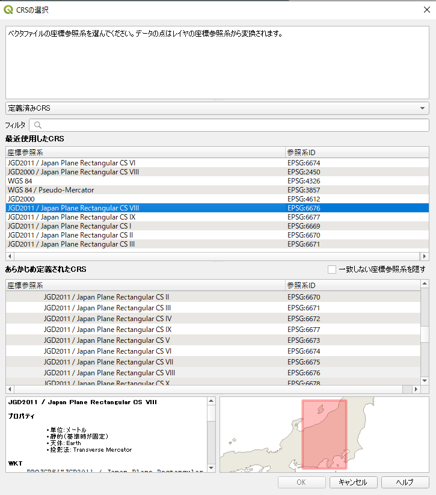

6.  文字コードは「Shift\_JIS」を選択します。

	

7.  「保存されたファイルを地図に追加する」にチェックを入れ、「OK」を押下します。

	

8.  本システムで用いる大字データでは、以下の属性フィールドが必要になります。

	GISソフトの編集機能で追加してください。

	<table>
	<colgroup>
	<col style="width: 33%" />
	<col style="width: 33%" />
	<col style="width: 32%" />
	</colgroup>
	<thead>
	<tr class="header">
	<th>フィールド名</th>
	<th>データ型</th>
	<th>説明</th>
	</tr>
	</thead>
	<tbody>
	<tr class="odd">
	<td>district_id</td>
	<td>character varying(100)</td>
	<td>大字ごとの一意のID</td>
	</tr>
	<tr class="even">
	<td>district_name</td>
	<td>character varying(256)</td>
	<td>大字名</td>
	</tr>
	<tr class="odd">
	<td>district_kana</td>
	<td>character varying(256)</td>
	<td>大字名（かな）</td>
	</tr>
	<tr class="even">
	<td>disp_order</td>
	<td>integer</td>
	<td>表示順</td>
	</tr>
	</tbody>
	</table>

	以下属性フィールドの追加手順を説明します。

	レイヤを右クリックし、メニューから「属性テーブルを開く」をクリックします。

	

9.  以下の通り属性テーブルが表示されますので、ヘッダ左端のボタンで編集モードへの切り替えを行ってください。

	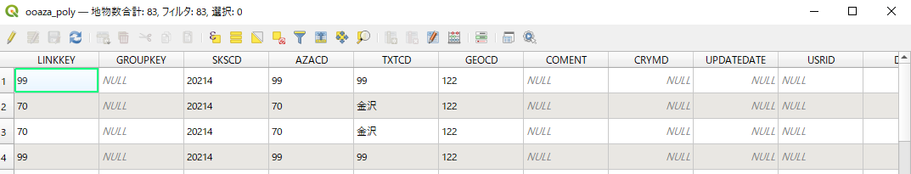

10.	「フィールドを追加」をクリックします。

	

	※編集モードへの切り替えを行わないとボタンがクリックできません。

	以下の通り「名前」、「データ型」「長さ」を入力し、「OK」を押下します。

	<span style="color: red; ">

	district\_id, district\_name, district\_kanaはシェープファイルのフィールド名文字数の制約上登録できないため、districtid, disname, diskanaとしてそれぞれ一旦登録し、データベースに取り込んだ後でフィールド名を変更します。

	</span>

	

	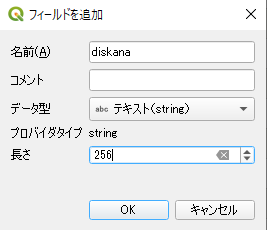

11.	追加したフィールドに値を設定します。

	編集モードであればセルにカーソルを合わせることで編集可能です。

	一括で変更したい場合、フィールド演算機能（[8-2. 地番データの取込 の手順12](#sec80201)参照）が利用可能です。

	※districtidには、地番テーブルと紐づけるための一意のIDを設定してください。

	<span style="color: red; ">
	※diskanaには、拗音・濁音なしのふりがなを設定してください。
	</span>

	

12.	編集モードを終了し、編集内容を保存してから属性テーブルを閉じます。

	

<a id="sec80102"></a>

13.	データベースにデータを取り込みます。

	まずはデータベースの接続情報をQGISに登録します。

	「ブラウザ」ウィンドウから「PostgreSQL」を右クリックし、「新規接続」を押下します。

	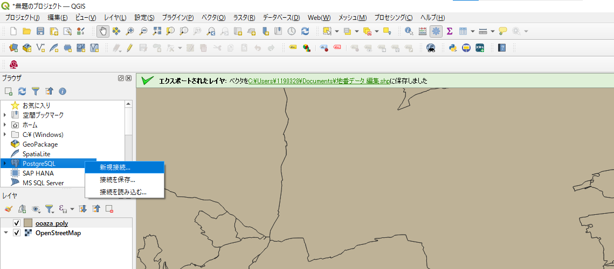

14.	データベースへの接続情報を入力します。

	-	名前：任意

	-	ホスト：DBサーバのIPアドレス

	-	ポート番号：DBのポート番号（デフォルト:5432）

	-	データベース：データベース名

	

15.	「接続テスト」を押下すると、以下のダイアログが開くので、DBに接続するユーザ名とパスワードを入力し、「OK」を押下します。

	元の画面に戻り、接続に成功すると「接続に成功しました」のダイアログが表示されるので、「OK」を押下して接続情報を登録します。

	

16.	ヘッダーメニューから「プラグイン」＞「プラグイン」の管理とインストールを押下します。

	

17.	「DB」で検索し、DB Managerが未インストールの場合インストールして有効化します。

	

18.	有効化されると、「データベース」&gt; 「DBマネージャ」を開くことができるので開きます。

	

19.	以下の通りウィンドウが開くので、「PostGIS」を展開します。

	先ほど追加した接続が表示されるので、右クリックします。

	

20.	ユーザ名とパスワードを入力し、OKを押下します。

	

21.	DBマネージャーから「レイヤ/ファイルのインポート」を押下します。

	

22.	以下のダイアログが表示されます。

	「入力」で編集後のレイヤを選択します。

	「スキーマ」は「public」を指定します。

	「テーブル」には「f\_district」を入力します。

	主キーは「districtid」を指定します。

	<span style="color: red; ">
	「空間インデックスを作成」にはチェックを外します。
	</span>

	

23.	「OK」を押下すると、インポートが開始します。

	インポートが完了すると、「インポートは成功しました」のダイアログが表示されます。

	

24.	SQLクライアントツールから、以下SQLを実行してカラム名を変更します。
	```Text
	ALTER TABLE f_district RENAME COLUMN districtid to district_id;  
	ALTER TABLE f_district RENAME COLUMN disname to district_name;  
	ALTER TABLE f_district RENAME COLUMN diskana to district_kana;
	```
25.	続いて以下SQLを実行してカラムを追加します。
	```Text
	ALTER TABLE f_district

	ADD result_column1 VARCHAR(256),

	ADD result_column2 VARCHAR(256),

	ADD result_column3 VARCHAR(256),

	ADD result_column4 VARCHAR(256),

	ADD result_column5 VARCHAR(256)
	```
26.	地番検索結果テーブルで表示するカラムに値をセットしてください。

	例）町丁目名をテーブルに表示したい場合
	```Text
	UPDATE f_district SET result_column1=district_name;
	```
	[7-8. M_地番検索結果定義](#sec708)と合わせてカラムの内容を設定してください。

<a id="sec802"></a>

## 8-2. 地番データの取込

サンプルデータを使用される際は、以下より取得してください。

-   サンプルデータを使用される場合は、以下手順の3.~14. は実施不要です。

**サンプルデータ： /SampleData/f\_lot\_number 一式**

1.  QGISを立ち上げ、「新規プロジェクト」を開きます。

	

2.  地番のシェープファイルをドラッグアンドドロップで取り込みます。
	
	<span style="color: red; ">
	※取り込むファイル形式はGISソフトが対応しているベクタデータであれば構いません。

	※取り込めるシェープファイルのデータ形式はポリゴンになります。

	※同じ地番で複数のポリゴンが存在する場合、GISソフトの「ディゾルブ」機能を使って地番ごとに一つのレコードに集約してください。</span>

	

	以下のように、取り込んだシェープファイルがレイヤに追加され、地図上に表示されます。

	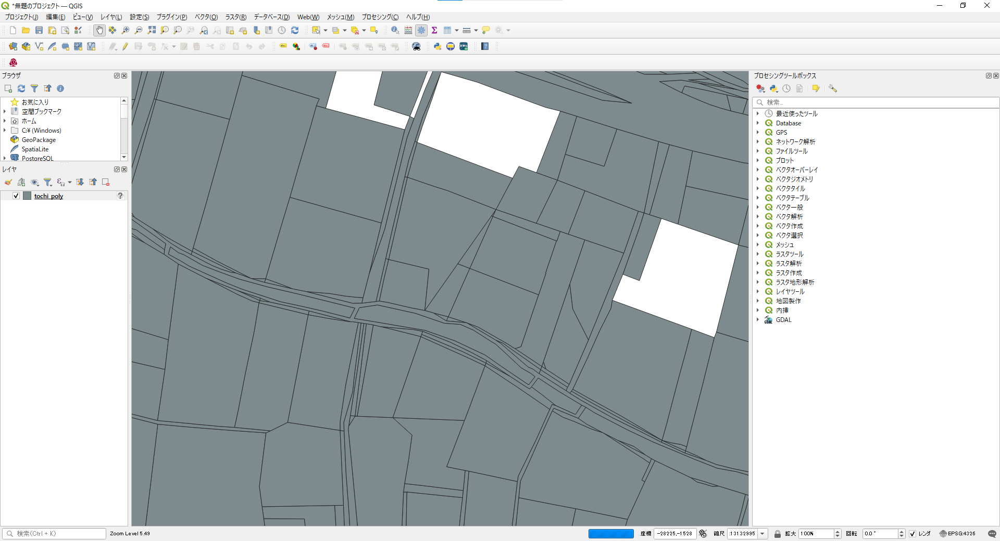

3.  ファイルを編集するため、別ファイルに保存します。

	レイヤメニューから右クリック &gt; 「エクスポート」 &gt; 「新規ファイルに地物を保存」を押下します。

	

4.  以下のようなダイアログが開きます。形式は「ESRI Shapefile」を選択し、「ファイル名」横の3点リーダから保存先を選択します。

	

5.  ファイルの座標系を設定します。「座標参照系（CRS）」の右側の地球儀アイコンを押下します。

	<span style="color: red; ">
		地番と判定レイヤで座標系を合わせておく必要があります。
	</span>
	<br>

	

6.  使用する座標系を選択し、「OK」を押下します。

	<span style="color: red; ">
	座標系は平面直角座標系から指定してください。

	平面直角座標系以外の座標系を指定した場合、地番と判定レイヤの重なり判定が正しく動作しません。

	SRID（下図 EPSG:xxxxのxxxxの部分）はアプリケーション設定で使用するので、控えておいてください。
	</span>

	

7.  文字コードは「Shift\_JIS」を選択します。

	

8.  「保存されたファイルを地図に追加する」にチェックを入れ、「OK」を押下します。

	

9.  本システムで用いる地番データでは、以下の属性フィールドが必要になります。

	GISソフトの編集機能で追加してください。

	<table>
	<colgroup>
	<col style="width: 33%" />
	<col style="width: 33%" />
	<col style="width: 32%" />
	</colgroup>
	<thead>
	<tr class="header">
	<th>フィールド名</th>
	<th>データ型</th>
	<th>説明</th>
	</tr>
	</thead>
	<tbody>
	<tr class="odd">
	<td>chiban_id</td>
	<td>integer</td>
	<td>地番ごとの一意のID</td>
	</tr>
	<tr class="even">
	<td>district_id</td>
	<td>character varying(100)</td>
	<td><p>大字ごとの一意のID</p>
	<p>大字データと連動しており、地番が所属する大字のIDを設定する</p></td>
	</tr>
	<tr class="odd">
	<td>chiban</td>
	<td>character varying(100)</td>
	<td>地番</td>
	</tr>
	</tbody>
	</table>

	以下属性フィールドの追加手順を説明します。

	レイヤを右クリックし、メニューから「属性テーブルを開く」をクリックします。

	

10.	以下の通り属性テーブルが表示されますので、
	
	ヘッダ左端のボタンで編集モードへの切り替えを行ってください。

	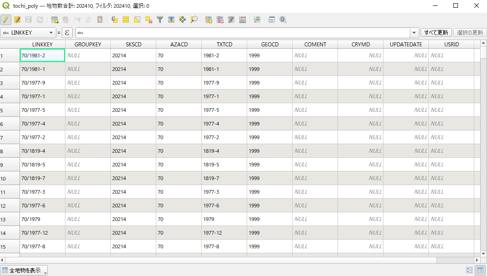

11.	「フィールドを追加」のアイコンをクリックします。
	
	
	※編集モードへの切り替えを行わないとボタンがクリックできません。

	以下の通り「名前」、「データ型」「長さ」を入力し、「OK」を押下します。

	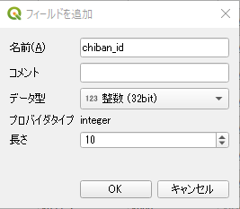

	同様に、以下の通り入力し、OKを押下します。

	<span style="color: red; ">
	district_id はシェープファイルのフィールド名文字数の制約上登録できないため、districtidとして一旦登録し、データベースに取り込んだ後でフィールド名を変更します。
	</span>

	

	

<a id="sec80201"></a>

12.	フィールド演算機能を利用して、追加したカラムにデータをセットします。

	

	編集対象のカラムを選択します。ここでは、chiban\_idを選択します。

	

	「ε」ボタンを押下します。

	

	以下のようなダイアログが開きます。 chiban\_idに対しては一意のIDを設定します。

	「レコードと属性」から「$id」を選択し、「OK」を押下します。

	

	「すべて更新」を選択します。

	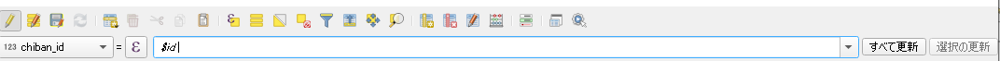

13.	chibanとdistrictidについても、フィールド演算機能を使ってデータをセットします。

	実際に使用される元データから値をセットしてください。

	<span style="color: red; ">
	※districtidに利用できるIDフィールドを予め元データに含めておくことを推奨します。
	</span>

14.	編集モードを終了し、編集内容を保存してから属性テーブルを閉じます。

	

15.	続いてデータベースにデータを取り込みます。

	※データベースの接続手順は [8-1. 大字データの取込の手順13](#sec80102) を参照してください。

	DBマネージャーから「レイヤ/ファイルのインポート」を押下します。

	「入力」で編集後のレイヤを選択します。

	「スキーマ」は「public」を指定します。

	「テーブル」には「f\_lot\_number」を入力します。

	「空間インデックスを作成」にチェックを入れます。

	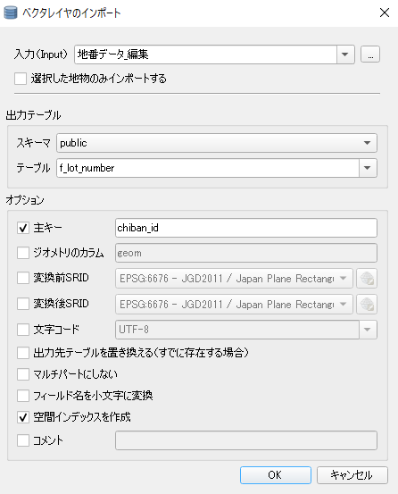

16.	「OK」を押下すると、データベースへの取込が開始されます。

	※データ件数が多い場合、取込に時間がかかることがあります。

	

17.	データ取込後、SQLクライアントツールから以下のSQLを実行してフィールド名を変更します。

	```Text
	ALTER TABLE f_lot_number rename column districtid to district_id;
	```

18.	続いて以下SQLを実行してカラムを追加します。

	```Text
	ALTER TABLE f_lot_number

	ADD result_column1 VARCHAR(256),

	ADD result_column2 VARCHAR(256),

	ADD result_column3 VARCHAR(256),

	ADD result_column4 VARCHAR(256),

	ADD result_column5 VARCHAR(256)
	```

19.	地番検索結果テーブルで表示するカラムに値をセットしてください。

	例）地番をテーブルに表示したい場合

	```Text
	UPDATE f_lot_number SET result_column1=chiban
	```
	[7-8. M_地番検索結果定義](#sec708) と合わせてカラムの内容を設定してください。

<a id="sec900"></a>

# 9 判定レイヤ取込

判定レイヤは、地番との重なり判定で使用するレイヤになります。

判定レイヤごとに、PostgreSQLにテーブルを作成します。

判定レイヤを作成する際は以下に注意してください。

1.  座標系について

	レイヤの座標系は、地番テーブルと統一してください。

	また、座標系は平面直角座標系としてください。

	平面直角座標系以外だと、重なり判定が実施できません。

2.  フィールド名について

	以下フィールドを含むようにしてください。

	<table>
	<colgroup>
	<col style="width: 33%" />
	<col style="width: 33%" />
	<col style="width: 32%" />
	</colgroup>
	<thead>
	<tr class="header">
	<th>フィールド名</th>
	<th>データ型</th>
	<th>説明</th>
	</tr>
	</thead>
	<tbody>
	<tr class="odd">
	<td>ogc_fid</td>
	<td>serial</td>
	<td>一意のID</td>
	</tr>
	<tr class="even">
	<td>wkb_geometry</td>
	<td>geometry</td>
	<td>ジオメトリ</td>
	</tr>
	</tbody>
	</table>

	重なっている地点の属性を表示したい場合、表示用のフィールドを用意してください。

	フィールド名に指定はありません。

3.  空間インデックス

	概況診断実行時のパフォーマンス向上のため、空間インデックスを設定してください。

<a id="sec901"></a>

## 9-1. 判定データ取込

以下、サンプルデータ（SHP形式）をQGISで判定レイヤとして取り込む手順を記載します。

**必要リソース： /SampleData/judgement\_layers/ 一式**

用意しているサンプルデータは下表の通りです。

<table>
<colgroup>
<col style="width: 14%" />
<col style="width: 17%" />
<col style="width: 13%" />
<col style="width: 55%" />
</colgroup>
<thead>
<tr class="header">
<th>データ</th>
<th>テーブル名</th>
<th><p>座標系</p>
<p>（EPSG）</p></th>
<th>ディレクトリ</th>
</tr>
</thead>
<tbody>
<tr class="odd">
<td>用途地域</td>
<td>use_districts</td>
<td>2450</td>
<td>
<p><strong>/SampleData/judgement_layers/use_districts/</strong></p></td>
</tr>
<tr class="even">
<td>農用地地域</td>
<td>agricultural_land</td>
<td>2450</td>
<td>/SampleData/judgement_layers/agricultural_land/</td>
</tr>
<tr class="odd">
<td>都市計画区域</td>
<td>city_planning</td>
<td>2450</td>
<td>
<p><strong>/SampleData/judgement_layers/city_planning/</strong></p></td>
</tr>
<tr class="even">
<td>埋蔵文化財包蔵地域</td>
<td>buried_cultural_property</td>
<td>2450</td>
<td>/SampleData/judgement_layers/buried_cultural_property/</td>
</tr>
<tr class="odd">
<td>浸水想定区域</td>
<td>flood_assumption</td>
<td>2450</td>
<td>
<p><strong>/SampleData/judgement_layers/flood_assumption/</strong></p></td>
</tr>
</tbody>
</table>

以下一例として、用途地域データの取込手順を記載します。

他のデータについても同様の手順で取込を実施してください。

1.  /SampleData/judgement\_layers/use\_districts/　以下のファイル一式（下記）をダウンロードします。

	-	use\_districts.cpg

	-	use\_districts.dbf

	-	use\_districts.prj

	-	use\_districts.shp

	-	use\_districts.shx

1.  QGISを立ち上げ、「新規プロジェクト」を開きます。

	

2.  「use\_districts.shp」をドラッグアンドドロップでQGISに取り込みます。

	

	以下のダイアログメッセージが表示される場合、「OK」を押下します。

	

	

3.  「データベース」&gt;「DBマネージャ」を開きます。

	

4.  「PostGIS」から[8-1](#sec801)で追加した接続を開きます。

	

5.  「レイヤ/ファイルのインポート」を押下します。

	

6.  入力（Input）でドラッグアンドドロップしたレイヤを選択します。

	スキーマはpublic、テーブルは先述のサンプルデータ一覧に記載のテーブル名とします。

	オプションを設定します。

	「主キー」にチェックを入れ、「ogc\_fid」とします。

	「ジオメトリのカラム」にチェックを入れ、「wkb\_geometry」とします。

	SRIDが平面直角座標系でない場合、「変換後SRID」にチェックを入れ平面直角座標系の座標系を指定します。

	※サンプルデータの場合、SRIDの変換は不要です。

	「空間インデックスを作成」にチェックを入れます。

	

7.  「OK」を押下します。データベースへのインポートが行われます。

	完了すると、「インポートは成功しました」のダイアログメッセージが表示されます。

	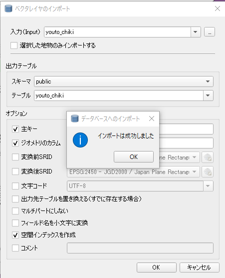


<a id="sec9011"></a>

本書では一例としてCityGMLの判定データの取込について記載します。

8.  FZKViewerをダウンロードし、PCへインストールします。

	<https://www.iai.kit.edu/english/1648.php>

9.  FZKViewerを起動し、GMLファイルをドラッグアンドドロップし、ファイルを読み込みます。

	

10.	読み込んだデータをKML形式で出力します。

	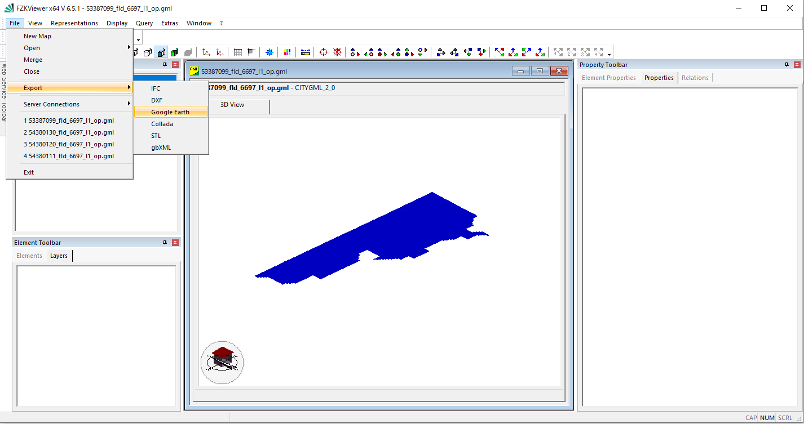

11.	QGISを起動し、KMLファイルを読み込むためプラグイン「KML Tools」をインストールします。インストールは、「プラグインの管理とインストール」から行います。

12.	「KML Tools」を使用して、「KML＋」ボタンをクリックします。

	

13.	KMLファイルを指定して読み込みます。

	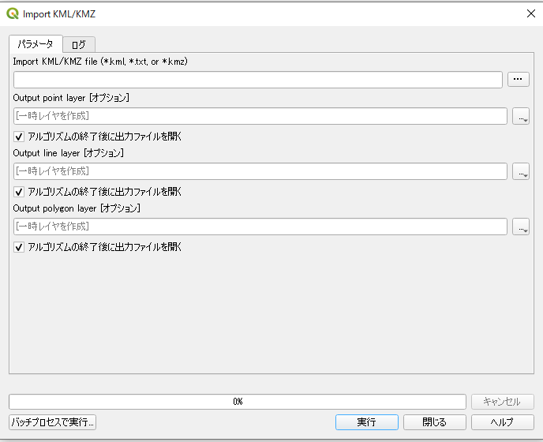

14.	読み込んだレイヤを選択し、右クリックメニュー「エクスポート」―「新規ファイルに地物を保存」選択します。

	

15.	以下のダイアログが開きます。

	「形式」に「PostgreSQL SQL dump」を選択、「座標参照系」を平面直角座標系で設定し、「OK」ボタンで保存します。

	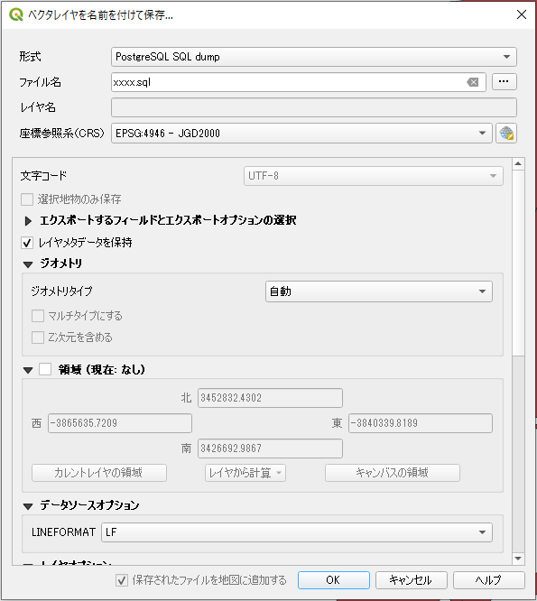

16.	PostgreSQLへデータ登録するためのSQLファイルが保存されます。

17.	本書6.テーブル作成（PostgreSQL）と同様に、A5:SQL Mk-2を使用してテーブルを作成します。

18.	作成したテーブルに16. で作成したSQLファイルに記載されているSQLを実行し、データを登録します。

<a id="sec1000"></a>

# 10 道路判定レイヤ取込


道路判定を使用する場合、道路判定レイヤとして以下テーブルをPostgreSQLに作成します。

<table>
<colgroup>
<col style="width: 33%" />
<col style="width: 33%" />
<col style="width: 32%" />
</colgroup>
<thead>
<tr class="header">
<th>テーブル名（論理名/物理名）</th>
<th>説明</th>
<th>備考</th>
</tr>
</thead>
<tbody>
<tr class="odd">
<td>F_道路LOD2 / f_road_lod2</td>
<td>道路LOD2レイヤ</td>
<td>CityGML形式から変換して投入。変換手順は第9章「判定レイヤ取込」を参照。</td>
</tr>
<tr class="even">
<td>F_道路中心線 / f_road_center_line</td>
<td>道路中心線レイヤ</td>
<td></td>
</tr>
<tr class="odd">
<td>F_区割り線 / f_split_line</td>
<td>区割り線レイヤ</td>
<td></td>
</tr>
</tbody>
</table>


道路判定レイヤを作成する際は以下に注意してください。

1.  座標系について

	レイヤの座標系は、地番テーブルと統一してください。

	また、座標系は平面直角座標系としてください。

	平面直角座標系以外だと、重なり判定が実施できません。

2.  フィールド名について

	各レイヤに以下フィールドを含むようにしてください。

	<table>
	<colgroup>
	<col style="width: 20%" />
	<col style="width: 20%" />
	<col style="width: 20%" />
	<col style="width: 40%" />
	</colgroup>
	<thead>
	<tr class="header">
	<th>テーブル名</th>
	<th>フィールド名</th>
	<th>データ型</th>
	<th>説明</th>
	</tr>
	</thead>
	<tbody>
	<tr class="odd">
	<td rowspan="7">F_道路LOD2 / f_road_lod2</td>
	<td>object_id</td>
	<td>serial</td>
	<td>一意のID</td>
	</tr>
	<tr class="even">
	<td>geom</td>
	<td>geometry</td>
	<td>ジオメトリ</td>
	</tr>
	<tr class="odd">
	<td>width</td>
	<td>float</td>
	<td>幅員</td>
	</tr>
	<tr class="even">
	<td>t_function</td>
	<td>integer</td>
	<td><p>交通領域機能。CityGMLのTrafficArea_function.xmlの情報を格納する。以下コード値を設定。</p>
	<p>1000：車道部, 1020：車道交差部, 2000：歩道部, 3000：島</p></td>
	</tr>
	<tr class="odd">
	<td>function</td>
	<td>text</td>
	<td>道路機能。CityGMLのRoad_function.xmlの情報を格納する。コード値は独自に設定可能。数値コードの場合もテキスト型に変換して格納すること。コード値に対応する案内文言をM_道路判定ラベルに設定する。</td>
	</tr>
	<tr class="even">
	<td>crossid</td>
	<td>integer</td>
	<td><p>交差ID。隣接する車道部のフィーチャと歩道部のフィーチャに共通のIDを設定することで隣接歩道判定が可能となる。設定しない場合、フィールドは作成し、値をNULLとすること。</p>
	</td>
	</tr>
	<tr class="odd">
	<td>line_number</td>
	<td>integer</td>
	<td>路線番号。同じ路線番号をもつ道路LOD2フィーチャは一つの判定結果として案内する。設定しない場合道路LOD2フィーチャごとに判定結果を案内する。設定しない場合、フィールドは作成し、値をNULLとすること。</td>
	</tr>
	<tr class="even">
	<td rowspan="2">F_道路中心線 / f_road_center_line</td>
	<td>object_id</td>
	<td>serial</td>
	<td>一意のID</td>
	</tr>
	<tr class="odd">
	<td>geom</td>
	<td>geometry</td>
	<td>ジオメトリ</td>
	</tr>
	<tr class="even">
	<td rowspan="5">F_区割り線 / f_split_line</td>
	<td>object_id</td>
	<td>serial</td>
	<td>一意のID</td>
	</tr>
	<tr class="odd">
	<td>geom</td>
	<td>geometry</td>
	<td>ジオメトリ</td>
	</tr>
	<tr class="even">
	<td>road_width</td>
	<td>float</td>
	<td>道路部幅員。幅員値不明のデータには「9999」をセットする。</td>
	</tr>
	<tr class="odd">
	<td>roadway_width</td>
	<td>float</td>
	<td>車道幅員。幅員値不明のデータには「9999」をセットする。</td>
	</tr>
	<tr class="even">
	<td>label_text</td>
	<td>text</td>
	<td>幅員値として3Dビューワ上に表示するラベルのテキスト。例) [道路部幅員]m（[車道幅員]m）
	GISソフトのフィールド演算機能等を利用してセットする。
	</td>
	</tr>
	</tbody>
	</table>

3.  空間インデックス

	概況診断実行時のパフォーマンス向上のため、空間インデックスを設定してください。


以下、サンプルデータ（SHP形式）をQGISで取り込みます。

**必要リソース： /SampleData/road\_layers/ 一式**

用意しているサンプルデータは下表の通りです。

<table>
<colgroup>
<col style="width: 14%" />
<col style="width: 17%" />
<col style="width: 13%" />
<col style="width: 55%" />
</colgroup>
<thead>
<tr class="header">
<th>データ</th>
<th>テーブル名</th>
<th><p>座標系</p>
<p>（EPSG）</p></th>
<th>ディレクトリ</th>
</tr>
</thead>
<tbody>
<tr class="odd">
<td>道路LOD2</td>
<td>f_road_lod2</td>
<td>2450</td>
<td>
<p><strong>/SampleData/road_layers/f_road_lod2/</strong></p></td>
</tr>
<tr class="even">
<td>道路中心線</td>
<td>f_road_center_line</td>
<td>2450</td>
<td>
<p><strong>/SampleData/road_layers/f_road_center_line/</strong></p></td>
</tr>
<tr class="odd">
<td>区割り線</td>
<td>f_split_line</td>
<td>2450</td>
<td>
<p><strong>/SampleData/road_layers/f_split_line/</strong></p></td>
</tr>
</tbody>
</table>

QGISでの取込手順は[9 判定レイヤ取込](#sec900)を参照してください。

注意点は下記の通りです。


1. 出力テーブルのテーブル名には上記の表の「テーブル名」に記載のテーブル名を指定してください。

2. 「主キー」にチェックを入れ「object_id」を指定してください。

3. 「ジオメトリのカラム」にチェックを入れ「geom」を指定してください。

4. 「変換後SRID」に地番データと同じ平面直角座標系の座標系が設定されていることを確認してください。

5. 「空間インデックスを作成」にチェックを入れてください。

	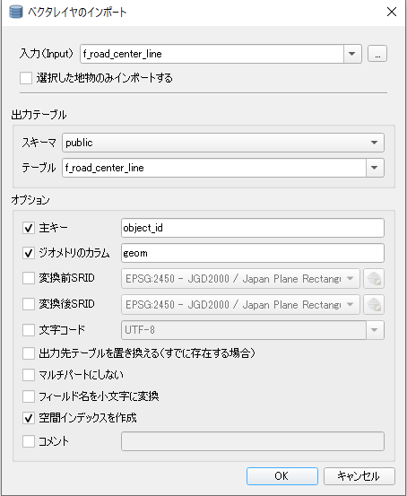

6. Shapeファイルのフィールド名文字数制約の関係で、以下のカラムについてはShapeファイル上のフィールド名を短縮名で設定しています。PostgreSQL取込後カラム名の修正を行ってください。

	<table>
	<colgroup>
	<col style="width: 20%" />
	<col style="width: 20%" />
	<col style="width: 20%" />
	<col style="width: 40%" />
	</colgroup>
	<thead>
	<tr class="header">
	<th>テーブル名</th>
	<th>フィールド名（変換前）</th>
	<th>フィールド名（変換後）</th>
	<th>説明</th>
	</tr>
	</thead>
	<tbody>
	<tr class="odd">
	<td>f_road_lod2</td>
	<td>line_num</td>
	<td>line_number</td>
	<td>路線番号</td>
	</tr>
	<tr class="even">
	<td>f_split_line</td>
	<td>roadway_wi</td>
	<td>roadway_width</td>
	<td>車道幅員</td>
	</tr>
	</tbody>
	</table>

<a id="sec1100"></a>

# 11 航空写真・建物データ配置

本システムで使用する、航空写真や建物データの配置手順を記載します。

<span style="color: red; ">
※航空写真はデフォルトでは国土地理院のタイル「全国最新写真（シームレス）」を使用しています。独自に用意した航空写真を設定されたい場合、本章の手順を実施してください。
</span>

<a id="sec1101"></a>

## 11-1. ファイルサーバ連携設定

航空写真や建物データは、ファイルサーバ上に配置し、webサーバとして配信する設定を行います。

<span style="color: red; ">

※ファイルサーバの構築手順は本書の対象外とします。

※Webサーバでファイルサーバがマウントされている前提で以下は記載します。

※Webサーバは[5-1](#sec501)で構築したApacheを使用します。左記のApacheがインストールされているサーバからファイルサーバをマウントできない場合、別途Webサーバを構築します。

</span>

1.  [5-1](#sec501)で構築したWebサーバに接続し、Apacheのhttpd.confを開きます。

	```Text
	vi /etc/httpd/conf/httpd.conf
	```

2.  ドキュメントルートを確認します。

	以下の「var/www/html」がドキュメントルートになります。

	```Text
	DocumentRoot “/var/www/html”
	```

3.  ドキュメントルートからファイルサーバのマウントルートパスにシンボリックリンクを設定します。

	```Text
	ln -s [2. で設定したドキュメントルート]/gis [ファイルサーバのマウントルートパス]
	```

4.  ディレクトリの所有権およびパーミッションを変更してください。

	```Text

	cd [2. で設定したドキュメントルート]

	chown -hR apache:apache ./gis

	chmod -c -R 755 ./gis

	```

<a id="sec1102"></a>

## 11-2. 航空写真データの配置

航空写真はXYZタイル形式となっている必要があります。

本システムでは以下の形式に対応しています。

-	{ズームレベル}/{タイル座標のx値 }/{タイル座標のy値 }.jpg

-	{ズームレベル}/{タイル座標のx値 }/{タイル座標のy値 }.png

-	{ズームレベル}/{タイル座標のy値 }/{タイル座標のx値 }.jpg

-	{ズームレベル}/{タイル座標のy値 }/{タイル座標のx値 }.png

以下「{ズームレベル}/{タイル座標のx値 }/{タイル座標のy値 }.png　」形式の航空写真の配置手順を記載します。フォルダ構造が異なる場合、適宜読み替えてください。

※タイルデータの作成手順は本書の対象外とします。

1.  以下のフォルダ構成となるように、航空写真データをファイルサーバにコピーします。

	※zip化されている場合、解凍して配置します。

	

2.  ブラウザで以下URLにアクセスし、写真が表示できることを確認してください。

	※{ }部分は実際に格納したファイル名を入れてください。

	http://\[WebサーバのIPアドレス\]/photo/{ズームレベル}/{タイル座標のx値}/{タイル座標のy値}.png

	<span style="color: red; ">
	※表示できない場合、ファイルアクセス権の設定を見直してください。
	</span>

<a id="sec1103"></a>

## 11-3. 建物データの配置

<span style="color: red; ">
	※建物データの配置は必須ではありません。
</span>

1.  3DTiles形式の建物データを入手します。

2.  データを解凍し、以下のフォルダ構成でファイルサーバに格納します。

	※複数の建物データを用いる場合、構成は適宜変更してください。

	

3.  ブラウザで以下URLにアクセスし、以下のようなJSONファイルが表示できることを確認してください。

	http://[WebサーバのIPアドレス]/building/tileset.json

	<span style="color: red; ">
	※表示できない場合、ファイルアクセス権の設定を見直してください。
	</span>

	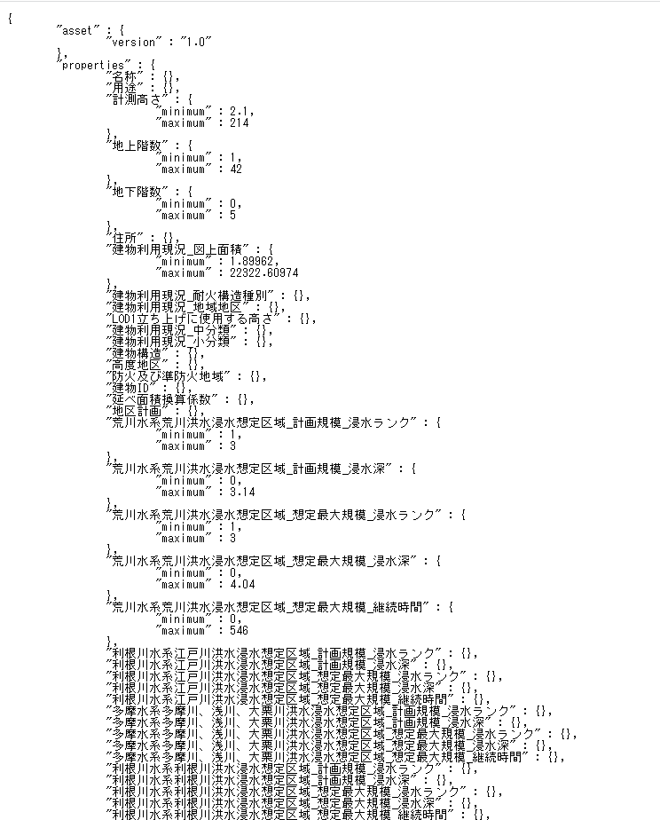

<a id="sec1200"></a>

# 12 ランドマークデータ作成

本システムでは、下図のようにランドマークを地図上に表示することで、地番の選択等の3Dビューワ画面での操作性を向上させることができます。

本章では、ランドマーク表示に使用するCZMLファイルの作成・配置手順を説明します。


<a id="sec1201"></a>

## 12-1. ランドマークのポイントデータの準備 

サンプルデータを使用される場合、**/SampleData/landmark** 以下のファイル一式を取得してください。

※作業PC上にて行う

1. QGISを起動します。

	

2.  ランドマークのポイントデータを作成し、QGISに取り込みます。

	サンプルデータを使用される場合：

	**/SampleData/landmark/landmark.shp**

	

	ポイントデータを作成する際、以下の2種類の属性フィールドを設定してください。

	<table>
	<colgroup>
	<col style="width: 50%" />
	<col style="width: 50%" />
	</colgroup>
	<thead>
	<tr class="header">
	<th>フィールド名</th>
	<th>説明</th>
	</tr>
	</thead>
	<tbody>
	<tr class="odd">
	<td>name</td>
	<td><p>ランドマークの名称.</p>
	<p>ラベルとして表示.</p></td>
	</tr>
	<tr class="even">
	<td>kind</td>
	<td><p>ランドマークのカテゴリ.</p>
	<p>ランドマークの色分け表示に使用.</p></td>
	</tr>
	</tbody>
	</table>

	

3. ポイントデータをGeoJSON形式にエクスポートします。

	レイヤを右クリックし、メニューから「エクスポート」&gt;「新規ファイルに地物を保存」を押下します。

	

4. 形式で「GeoJSON」を選択します。

	

5. 「ファイル名」右の「…」から保存先とファイル名を指定します。	

	座標参照系で「EPSG:4326 –WGS84」を選択します。

	

6. 「OK」を押下します。

	

<a id="sec1202"></a>

## 12-2. Python3.x 実行環境の準備

※作業PC上にて行う

Python3.xの実行環境を準備します。

実行環境に指定はありませんが、本書では実行環境としてAnacondaを使用します。

1.	以下からAnacondaをインストールします。

	<https://www.anaconda.com/products/distribution>

	Anacondaインストール手順の参考サイト：

	<https://www.python.jp/install/anaconda/windows/install.html>

2. インストールが完了するとスタートメニューに「Anaconda3(64-bit)」が追加されます。

	「Anaconda3(64-bit)」&gt; 「Anaconda Prompt(anaconda3)」を立ち上げます。

	

3. Anaconda Promptが開きます。

	

4. 以下コマンドを入力し仮想環境を作成します。

	```Text
	conda create -n landmark-env python=3.9
	```

	※ landmark-envの箇所は任意の環境名

	作成中に以下の通り確認されるので、「y」を入力します。

	

5. 以下コマンドを入力し仮想環境を有効化します。

	```Text 
	conda activate landmark-env
	```

	環境が以下のように(base)から(landmark-env)に切り替わっていることを確認します。

	

6. 以下コマンドを入力し、外部ライブラリをインストールします。

	```Text 
	pip install Pillow
	```

<a id="sec1203"></a>

## 12-3. generate\_landmark\_billboard.pyの設定変更

※作業PC上にて行う

1.	以下からgenerate\_landmark\_billboard.pyを取得します。

	**取得元:**

	**/Settings/environment\_settings/generate\_landmark\_billboard.py**

2.	作業ディレクトリを作成し、「generate\_landmark\_billboard.py」と、[12-1. ランドマークのポイントデータの準備](#sec1201)で作成したGeoJSONファイルを格納します。

3.  generate\_landmark\_billboard.pyをエディタで開きます。

4.	generate\_landmark\_billboard.pyの12行目から20行目を編集します。

	[12-1. ](#sec1201)で作成した属性フィールド「kind」の属性フィールド値の種類ごとに色分けを設定します。

	色は0-255のRGB値で設定してください。

	参考ページ：

	<https://www.lab-nemoto.jp/www/leaflet_edu/else/ColorMaker.html>

	カテゴリを増やす場合、color\_define = \[　\] の中に要素を追加・削除します。


	```Text
			# ビルボードの色分け定義をここで設定してください。

			# (【カテゴリ値】, (r,g,b)) で設定します。
	        color_define = [

	            ("駅", (230,121,40)),

	            ("学校", (132,245,211)),

	            ("警察", (0,0,255)),

	            ("消防", (209,0,128)),

	            ("地方の機関", (255,0,0)),

	            ("博物館", (128,78,87)),

	            ("病院", (132,181,87)),

	            ("郵便局", (255,0,0))

	        ]
	```

	※color\_defineを設定しなかった場合、デフォルトで以下の色に設定されます。

	

5.	generate\_landmark\_billboard.pyの189行目から204行目を編集します。

	```Text
	if __name__ == '__main__':

	    # ビルボードフォントパス

	    os.environ["FONT_PATH"] = "C:/Windows/Fonts/meiryo.ttc"

	    # ソースJSONファイル

	    os.environ["SRC_JSON_FILE"] = "./landmark.geojson"

	    # 画像保存パス

	    os.environ["DEST_IMG_FOLDER"] = "billboard_image"

	    os.environ["SAVE_CZML_NAME"] = "./landmark.czml"

	    # ラベルとして表示するプロパティ

	    os.environ["LABEL_PROPERTIES"] = "name"

	    # 色分け表示プロパティ

	    os.environ["COLOR_LEGEND_PROPERTIES"] = "kind"

	    # 画像名テンプレート

	    os.environ["IMAGE_NAME_TEMPLATE"] = "landmark_%s.png"

	    # CZMLヘッダのname属性

	    os.environ["CZML_HEADER_NAME"] = "landmark"

	    # CZMLファイル保存パス

	    os.environ['CZML_FILE_PATH'] = "./landmark.czml"

	    # メイン処理

	    main()
	```

<a id="sec1204"></a>

## 12-4. generate\_landmark\_billboard.pyの実行

※作業PC上にて行う

1. 作業ディレクトリ上に「billboard\_image」フォルダを作成します。

2. 作業ディレクトリ上に「landmark.czml」が存在する場合、ほかの場所に退避させます。

3. 作業ディレクトリが以下の構成になっていることを確認してください。

	-	「billboard\_image」フォルダ

	-	landmark.geojson

	-	generate\_landmark\_billbboard.py

	

4. Anaconda promptを開き、作業ディレクトリに移動します。

	```Text 
	cd 作業ディレクトリ
	```

5. 以下コマンドでpythonファイルを実行します。

	```Text 
	python generate_landmark_billboard.py
	```

6. エラーが表示されることなく、以下の通り終了しているかどうか確認します。

	

7.	作業ディレクトリにlandmark.czmlが生成されていることを確認します。

	

8.	landmark.czmlをテキストエディタやメモ帳で開き、中身が生成されていることを確認します。

	

9.	billboard\_imageフォルダの下に画像が作成されていることを確認します。

	

10.	画像を開いた時に以下のようにランドマーク名が表示できていればOKです。

	

<a id="sec1205"></a>

## 12-5. 生成ファイル一式の配置

1.	ファイルサーバに「landmark」ディレクトリを作成します。

2.	「landmark」ディレクトリに[12-4. generate_landmark_billboard.py](#sec1204)で生成したlandmark.czmlとbillboard\_imageフォルダを配置します。

3.	以下でアクセスできることを確認します。

	http://\[WebサーバのIPアドレス\]/landmark/landmark.czml

<a id="sec1300"></a>

# 13 アタッチメントデータ配置

本システムでは、判定レイヤの各地物にアタッチメントデータを紐づけることで、判定結果欄にファイルやファイルへのリンクを表示することができます。

本章では、アタッチメントデータの配置方法を説明します。

以下の手順でデータを配置した後で、次章の手順でレイヤを公開してください。

<a id="sec1301"></a>

## 13-1. アタッチメントデータ、アタッチメントレイヤの用意

レイヤとアタッチメントデータの対応関係は下図の通り、レイヤの属性情報からアタッチメントとの対応関係が照合できるようにします。


<a id="sec1302"></a>

## 13-2. アタッチメントレイヤの登録

[9-1. 判定データ取込](#sec901)と同様の手順で、アタッチメントレイヤを登録します。


<a id="sec1303"></a>

## 13-3. アタッチメントデータの格納

アタッチメントデータの格納先はWeb/DBサーバになります。

1.  Web/DBサーバにssh接続します。

2.  Spring Boot のapplication.propertiesで設定している場所（app.file.service.rootpath）にアタッチメントデータを配置します。

	※仮に、「attachement」フォルダの中にアタッチメントデータを格納した状態で配置する場合の手順を記載します。

	```Text 
	mkdir /mnt/s3/application/

	mv attachment /mnt/s3/application/
	```

	※「/mnt/s3/application/」 はapp.file.service.rootpathで設定している場所 

	※Spring Boot の[application.propertiesの設定手順](#sec1701)を参照してください。

3.	パーミッションの確認及び変更を行います。

	```Text 
	cd /mnt/s3
	```

	ディレクトリの所有権及びパーミッションを変更してください。

	```Text 
	chown -hR tomcat:tomcat ./application

	chmod -c -R 755 ./application

	```

<a id="sec1304"></a>

## 13-4. アタッチメントデータの表示設定

1. まず、アタッチメントレイヤをGeoServerに登録します。

	設定手順は[14-3. 判定対象レイヤを作成する](#sec1403)を参照してください。

	上記手順9では「SQLビューを新規作成」からSQLビューパラメータを設定してください。

2. M_レイヤテーブルに以下の内容を設定します。（[7-3. M_レイヤ](#sec703)参照）	

	- layer_query : ogc_fid:@2
		
		※ 一意のIDをクエリで指定できるように設定します。
	- query_require_flag: 1

3. M_区分判定テーブルに以下の内容を設定します。（[7-5. M_区分判定](#sec705)参照）

	- gis_judgement: 1

	- judgement_layer: 手順2で設定したレイヤのレイヤID

	- applicable_description: 以下の通り、アタッチメントデータへのリンクを埋め込んでください。

		```Text
		<a>https://[Webサーバのドメイン名]/api/file/view/[アタッチメントデータのルートフォルダ名]/@1.png</a>
		```

	- table_name: [13-2](#sec1302)で登録したテーブル名を設定してください。

	- field_name: [ファイルパスを格納したカラム名],[一意のIDを格納したカラム名] を設定してください。

	- display_attribute_flag: 3

<a id="sec1400"></a>

# 14 GeoServerレイヤ作成

本システムの3Dビューワ画面上に表示する地番レイヤや判定対象レイヤを設定します。

<a id="sec1401"></a>

## 14-1. ワークスペースとストアを登録する

1.  以下URLから、GeoServerにログインします。

	初期IDとパスワードは admin/geoserver になります。

	<span style="color: red; ">
	セキュリティの観点から、初期パスワードは初回ログイン後に変更してください。
	</span>

	http://\[web]サーバのIPアドレス\]:8080/geoserver

	

2.  メニューバーから「ワークスペース」を選択します。

	

3.  登録済みのワークスペース一覧が開きます。「新規ワークスペース追加」を選択します。

	

4.  Name. ネームスペースURIに任意の名前を入力し、「保存」を押します。

	<span style="color: red; ">
	※サンプルデータを使用される際はワークスペース名を「devps」としてください。
	</span>

	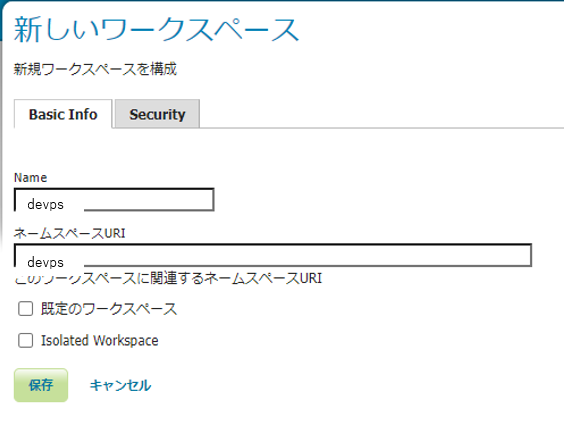

	<br>
	<span style="color: red; ">
	※登録したワークスペース名は以降のレイヤ設定や、<a href="#sec1900">19 アプリケーション設定ファイル更新(3DViewer)</a>でも使用します。
	</span>

5.  メニューバーから「ストア」を選択します。

	

6.  登録済みのストア一覧が開きます。「ストア新規追加」を押下します。

	

7.  新規データソースから、「PostGIS」を選択します。

	

8.  ワークスペースで、4. で作成したワークスペースを選択し、任意のデータソース名を入力します。

	パラメータ接続の部分には、[5-5.PostgreSQL14のインストール](#sec505)で作成したデータベースへの接続情報を入力します。入力が終わったら「保存」を押下します。

	

<a id="sec1402"></a>

## 14-2. 地番レイヤを作成する

地番レイヤは以下のレイヤを作成する必要があります。

レイヤ作成の際はそれぞれ下表のスタイルファイルとSQLファイルを使用します。

ファイルは **/Settings/environment_settings/** より下表に記載のファイルを取得してください。

<table>
<colgroup>
<col style="width: 13%" />
<col style="width: 13%" />
<col style="width: 18%" />
<col style="width: 26%" />
<col style="width: 20%" />
<col style="width: 8%" />
</colgroup>
<thead>
<tr class="header">
<th>レイヤ名</th>
<th>使用箇所</th>
<th>説明</th>
<th>スタイルファイル</th>
<th>SQLファイル</th>
<th>凡例</th>
</tr>
</thead>
<tbody>
<tr class="odd">
<td>全地番</td>
<td>申請地選択</td>
<td>すべての地番を表示.</td>
<td>layer_style_lotnumber_all_view.sld</td>
<td>layer_sql_lotnumber_all_view.txt</td>
<td></td>
</tr>
<tr class="even">
<td>申請中地番</td>
<td>行政トップ画面</td>
<td>申請中の地番を表示.</td>
<td>layer_style_lotnumber_application_target.sld</td>
<td>layer_sql_lotnumber_applying.txt</td>
<td></td>
</tr>
<tr class="odd">
<td>申請対象地番</td>
<td>概況診断結果表示</td>
<td>申請対象の地番を表示.</td>
<td>layer_style_lotnumber_application_target.sld</td>
<td>layer_sql_lotnumber_disignate.txt</td>
<td></td>
</tr>
<tr class="even">
<td>選択中地番</td>
<td>申請地選択</td>
<td>選択中の地番を表示.</td>
<td>layer_style_lotnumber_selected.sld</td>
<td>layer_sql_lotnumber_search_establishment.txt</td>
<td></td>
</tr>
<tr class="odd">
<td>地番検索結果（事業者）</td>
<td>地番検索</td>
<td>地番検索の結果に該当する地番を表示.</td>
<td>layer_style_lotnumber_result.sld</td>
<td>layer_sql_lotnumber_search_establishment.txt</td>
<td></td>
</tr>
<tr class="even">
<td>廃止_地番検索結果（行政）</td>
<td>廃止_地番検索（行政）</td>
<td><p>地番検索の結果に該当する地番を表示.</p>
<p>申請中地番を着色表示.</p></td>
<td>layer_style_lotnumber_result_government.sld</td>
<td>llayer_sql_lotnumber_search_government.txt</td>
<td></td>
</tr>
<tr class="odd">
<td>申請情報表示地番</td>
<td>申請情報表示地番</td>
<td>行政側の申請情報検索結果の行クリック時にクリック業の申請地番を着色表示.</td>
<td>layer_style_lotnumber_application_info.sld</td>
<td>layer_sql_lotnumber_disignate.txt</td>
<td></td>
</tr>
</tbody>
</table>

1.  一覧表のスタイルファイルの種類ごとにスタイルを計5種類登録します。メニューバーから「スタイル」を選択します。

	

2.  登録済みのスタイル一覧が開きます。「新規スタイル追加」を押下します。

	

3.  ユーザ名を入力します。名前は任意ですが、判別しやすいようにスタイルファイルファイルの名前としておきます。

	ワークスペースは、[14-1. ワークスペースとストアを登録する](#sec1401)で作成したワークスペースを選択します。

	

4.  「ファイルを選択」を押下し、スタイル（.sld）ファイルを選択します。

	

	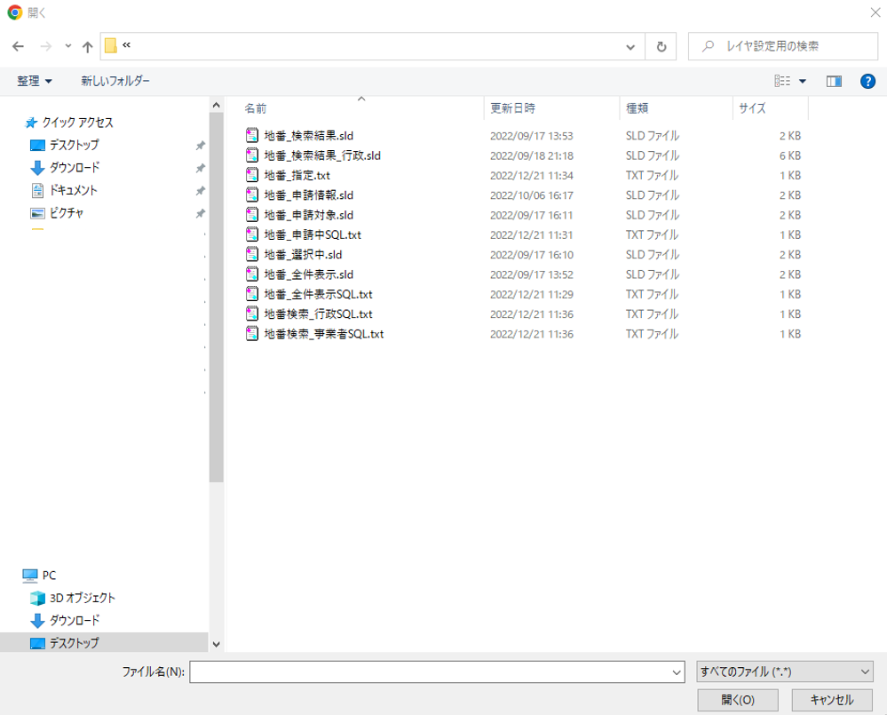

5.  「アップロード」をクリックします。

	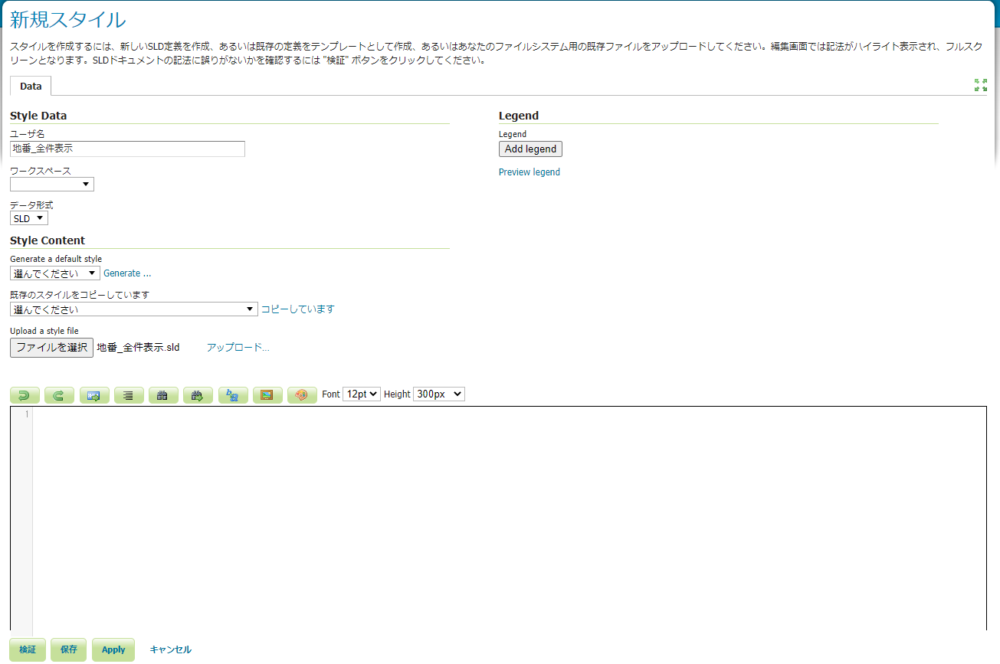

6.  アップロードされるsldファイルの中身が表示されるので、「検証」を押下して、「保存」を押下します。

	

7.  スタイルが登録されます。残りのスタイルファイルについても、同様に登録を実施します。

8.  続いてレイヤを登録します。

	<span style="color: red; ">
	※レイヤについては、本節冒頭のレイヤ一覧表に記載のすべてのレイヤを登録する必要があります。

	※範囲矩形の情報を全地番レイヤで取得し他レイヤに適用する必要があるため、まずは「全地番」のレイヤを登録してから残りのレイヤを登録してください。
	
	</span>

9.	メニューバーから「レイヤ」を選択します。

	

10.	登録済みのレイヤ一覧が表示されます。「リソース新規追加」を押下します。

	

11.	レイヤ追加元で、[14-1. ワークスペースとストアを登録する](#sec1401)で作成したストアを選択します。

	

12.	データベースに登録済みのテーブルが一覧表示されます。

	「SQLビューを新規作成」を選択します。

	

13.	「名称を表示」にレイヤ名を入力します。

	「SQLステートメント」にSQLファイルの中身を貼り付けます。

	


14.	「SQLからパラメータを推測」を押下し、「ジオメトリタイプとSRIDを推測」にチェックを入れた状態で「属性」の「再読み込み」を押下します。

	読み込むと、属性が一覧表示されます。


	

<a id="sec140215"></a>

15. 「保存」を押下します。

	エラーが出る場合、SQLビューパラメータの各デフォルト値にf_lot_numberテーブルに登録されている任意の地番IDをセットします。

	

16. 「レイヤ編集」に遷移します。

	下の方に遷移して、「範囲矩形」の欄を確認します。

	

	

17.	「ネイティブの範囲矩形」で「データを元に算出」を押下し、「緯度経度範囲矩形」で「ネイティブの範囲をもとに算出」を押下します。

	

<a id="sec140218"></a>

18.	以下の通り値が出力されます。

	出力された値は、レイヤの描画範囲になります。

	「ネイティブの範囲矩形」の値は以降のレイヤでも使用するため、控えておきます。

	

19.	一度上にスクロールし、タブから「公開」を選択します。

	

20.	タブが切り替わります。「WMS設定」で、「デフォルトスタイル」を選択します。スタイル一覧から、手順7. までに作成したスタイルを選択します。

	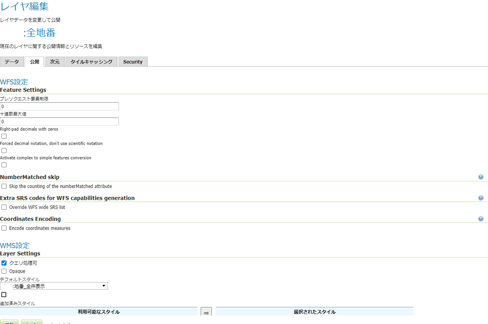

21.	タブを再び切り替えて、「タイルキャッシング」を開きます。

	

22.	「このレイヤーのキャッシュ済みレイヤーを作成」と「このレイヤのタイルキャッシングを有効化」のチェックを外します。

	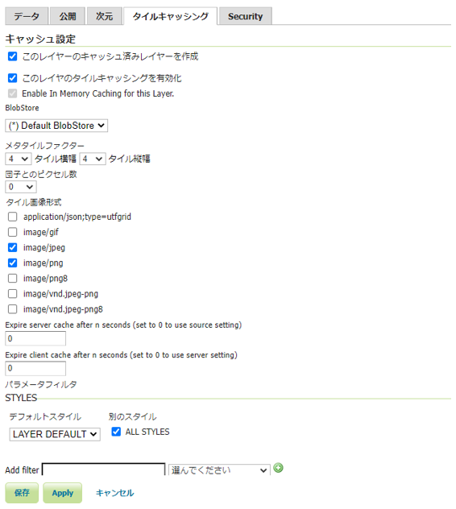

23.	「保存」を押下します。レイヤが登録されます。

	

24.	登録結果を確認します。メニューバーから「レイヤプレビュー」を選択します。

	

25.	作成済みのレイヤ一覧が表示されます。作成したレイヤの行の「OpenLayers」を選択します。

	

26.	別タブが開き、レイヤーのプレビューが確認できます。

	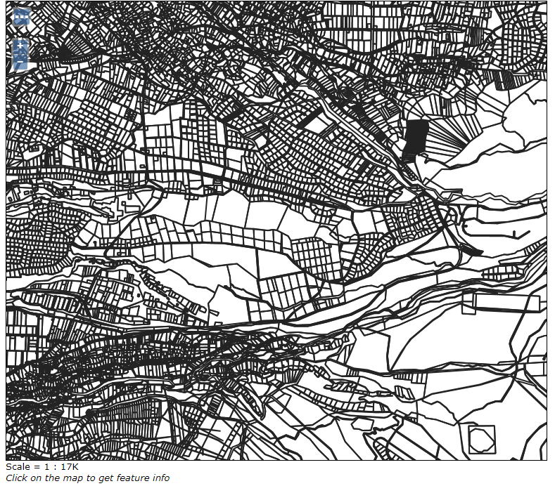

27.	残りの地番レイヤについても、同様にレイヤの作成を進めます。


	スタイルとSQLビューについては、本節冒頭の表に対応するファイルを使用してください。

	残りのレイヤでは「SQLビューパラメータを推測」を押下した際に、SQLビューパラメータ一覧が表示されます。デフォルト値を設定しないと、次の属性の再読み込みに失敗するので注意してください。

	レイヤ毎に以下の通りデフォルト値を設定してください。

	※「デフォルト値」に実際に存在する地番の地番IDを「\_」（アンダーバー）区切りで設定すると、指定した地番をレイヤプレビューで表示することができます。

	-	申請中地番

		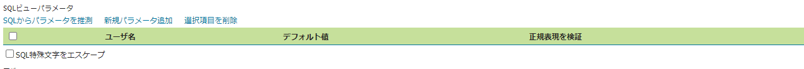

	-	申請対象地番

		

	-	選択中地番

		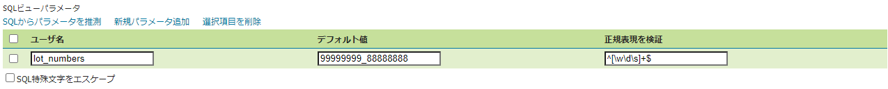

	-	地番検索結果（事業者）

		

	-	地番検索結果（行政）

		

	範囲矩形の「ネイティブの範囲矩形」については、[手順18.](#sec140218)で控えておいた値を入力してください。<span style="color: red; ">範囲矩形入力後に、「緯度経度範囲矩形」の「ネイティブの範囲を元に算出」を押下します。<span>

	

<a id="sec1403"></a>

## 14-3. 判定対象レイヤを作成する

判定対象ごとに、レイヤを作成します。

1.  まず、レイヤのスタイル（.sldファイル）を作成します。QGISを開きます。

	

2.  PostgreSQLから、DBサーバに接続します。

	※接続の作成手順は[8-1. 大字データの取込](#sec801)を参照してください。

	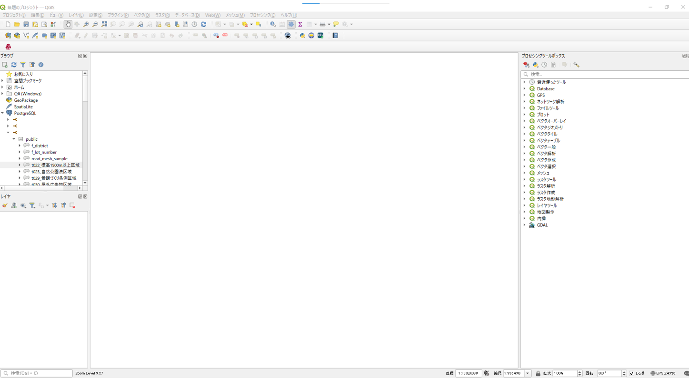

3.  レイヤを作成する判定レイヤのテーブルを選択し、ドラッグアンドドロップで地図上に表示します。

	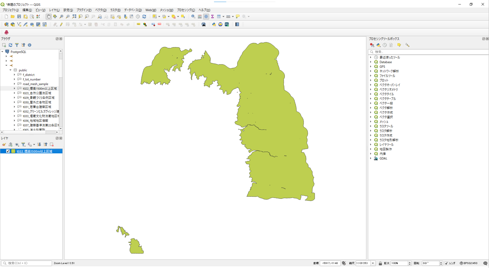

4.  追加したレイヤを右クリックし、メニューからプロパティを開きます。

	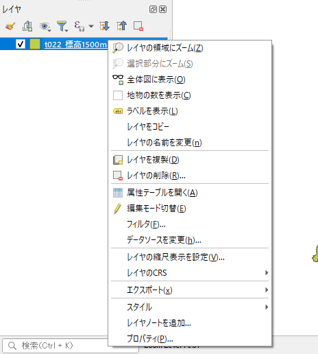

5.  スタイルを設定します。

	スタイルの設定方法は[こちら](https://docs.qgis.org/3.16/ja/docs/user_manual/style_library/style_manager.html)を参考にしてください。

	

6.  スタイル設定後、レイヤを右クリックし、「エクスポート」&gt;「QGISレイヤスタイルファイルとして保存」を選択します。

	

7.  「SLDスタイルファイル」を選択し、ファイルを保存する場所を選択します。

	選択後、「OK」でファイルを出力します。

	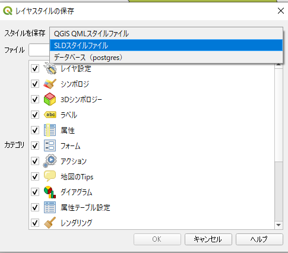

	

8.  出力したSLDファイルを、スタイルとしてGeoServerに登録します。

	スタイルの登録手順は[14-2. 地番レイヤを作成する](#sec1402)の手順1.~ 7. を参照してください。

9.  続いてレイヤを登録します。

	メニューバーから「レイヤ」を選択し、続いて「リソース新規追加」を押下します。

	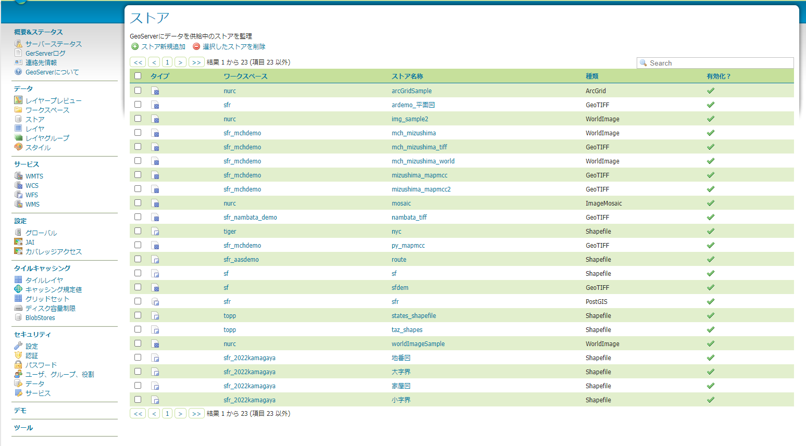

	

	レイヤの属性情報を使用して表示する地物を絞り込みたい場合、[14-2. 地番レイヤを作成する](#sec1402)と同様に「SQLビューを新規作成」から、以下の要領でSQLステートメントを設定し、SQLビューパラメータを設定します。

	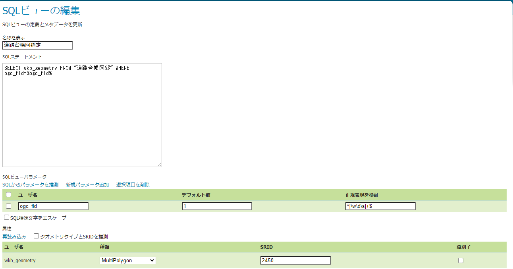


	サンプルデータでは、用途地域が該当します。
	以下テキストファイル内のSQLを貼り付けてください。

	**/Settings/environment_settings/layer_sql_use_district.txt**

10.	レイヤ追加元で、[14-1. ワークスペースとストアを登録する](#sec1401)で追加したデータソースを選択します。

	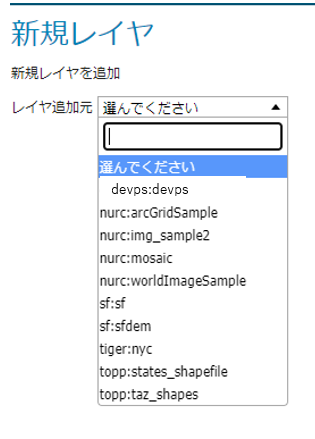

11.	データベースに登録済みのテーブル一覧が表示されます。

	レイヤを作成する判定レイヤのテーブルの行の「再公開」を押下します。

	

12.	レイヤ編集画面が開きます。

	

13.	「データ」タブで範囲矩形を編集します。

	「ネイティブの範囲矩形」で、「データを元に算出」を押下し、続いて「緯度経度範囲矩形」の「ネイティブの範囲を元に算出」を押下します。

	

14. 「公開」タブに切り替えて、「WMS設定」のデフォルトスタイルで手順⑧で登録したスタイルを選択します。

	

15. 「タイルキャッシング」タブに切り替えて、「このレイヤーのキャッシュ済みレイヤーを作成」と「このレイヤのタイルキャッシングを有効化」のチェックを外します。

	

16.	「保存」を押下します。

17.	残りの判定レイヤについても、同様の手順で登録を実施してください。


<a id="sec1404"></a>

## 14-4. 道路判定レイヤを作成する

道路判定を使用する場合、以下のレイヤを作成する必要があります。

レイヤ作成の際はそれぞれ下表のスタイルファイルとSQLファイルを使用します。

ファイルは **/Settings/environment_settings/road_judge/** より下表に記載のファイルを取得してください。

レイヤの設定手順は[14-2](#sec1402)を参照してください。

「ネイティブの範囲矩形」の値には、[「全地番」で登録した値と同じ値](#sec140218)を設定してください。

「該当区割り線」の「SQLビューパラメータ」を設定する際は、「max_object_id」と「min_object_id」の「正規表現を検証」の欄を空欄に修正してください。

「SQLビューパラメータ」のデフォルト値が設定されていないとエラーになるので、「道路判定結果(LOD2)」と「隣接歩道」にはf_load_lod2テーブルの任意のobject_id、「該当区割り線」と「幅員値」にはf_split_lineテーブルの任意のobject_idを設定してください。([参照](#sec140215))

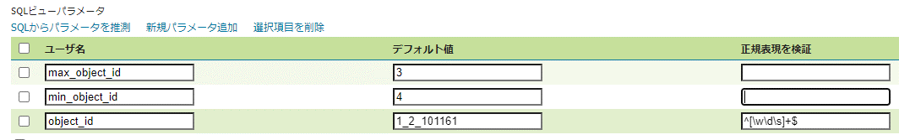


<table>
<colgroup>
<col style="width: 15%" />
<col style="width: 30%" />
<col style="width: 20%" />
<col style="width: 20%" />
<col style="width: 15%" />
</colgroup>
<thead>
<tr class="header">
<th>レイヤ名</th>
<th>説明</th>
<th>スタイルファイル</th>
<th>SQLファイル</th>
<th>凡例</th>
</tr>
</thead>
<tbody>
<tr class="odd">
<td>道路判定結果(LOD2)</td>
<td>判定対象の道路LOD2レイヤを表示。</td>
<td>layer_style_road_lod2.sld</td>
<td>layer_sql_road_lod2.txt</td>
<td></td>
</tr>
<tr class="even">
<td>該当区割り線</td>
<td>判定の結果取得された区割り線を表示。最大幅員の区割り線を赤、最小幅員の区割り線を青、幅員値不明の区割り線を緑で表示。</td>
<td>layer_style_split_line.sld</td>
<td>layer_sql_split_line.txt</td>
<td></td>
</tr>
<tr class="odd">
<td>隣接歩道</td>
<td>判定の結果取得された隣接歩道を表示。申請地番+5.0mバッファと重なる範囲を表示。</td>
<td>layer_style_adjacent_sidewalk.sld</td>
<td>layer_sql_adjacent_sidewalk.txt</td>
<td></td>
</tr>
<tr class="even">
<td>幅員値</td>
<td>判定の結果取得された区割り線の幅員値をラベル表示。</td>
<td>layer_style_road_width_value.sld</td>
<td>layer_sql_road_width_value.txt</td>
<td></td>
</tr>
</tbody>
</table>

<a id="sec140401"></a>

GeoServerでレイヤ設定後、M_レイヤテーブルには下表の内容を設定してください。（[7-3](#sec703)参照）

※layer_codeの「devps」の部分には[14-1](#sec1401)で作成したワークスペース名を設定してください。

<table>
<colgroup>
<col style="width: 30%" />
<col style="width: 5%" />
<col style="width: 10%" />
<col style="width: 15%" />
<col style="width: 40%" />
<col style="width: 5%" />
</colgroup>
<thead>
<tr class="header">
<th>レイヤ名</th>
<th>layer_type</th>
<th>table_name</th>
<th>layer_code</th>
<th>layer_query</th>
<th>query_require_flg</th>
</tr>
</thead>
<tbody>
<tr class="odd">
<td>道路判定結果(LOD2)</td>
<td>0</td>
<td>f_road_lod2</td>
<td>devps:道路判定結果(LOD2)</td>
<td>{roadLod2}object_id:{value}</td>
<td>1</td>
</tr>
<tr class="even">
<td>該当区割り線</td>
<td>0</td>
<td>f_split_line</td>
<td>devps:該当区割り線</td>
<td>{splitLine}object_id:{value};max_object_id:{maxWidth};min_object_id:{minWidth}</td>
<td>1</td>
</tr>
<tr class="odd">
<td>隣接歩道</td>
<td>0</td>
<td>f_road_lod2</td>
<td>devps:隣接歩道</td>
<td>{sideWalk}side_walks:{side_walk};lot_numbers:{lot_number}</td>
<td>1</td>
</tr>
<tr class="even">
<td>幅員値</td>
<td>0</td>
<td>f_split_line</td>
<td>devps:幅員値</td>
<td>@wfs{widthText}object_id:{value}</td>
<td>1</td>
</tr>
</tbody>
</table>

また、M_区分判定テーブルのsimultaneous_display_layer（同時表示レイヤ）には上記で設定した4レイヤのレイヤコードをカンマ区切りで指定します。

M_区分判定テーブルでは下表に示したカラムの設定を確認してください。（[7-5](#sec705)参照）

<table>
<colgroup>
<col style="width: 15%" />
<col style="width: 15%" />
<col style="width: 70%" />
</colgroup>
<thead>
<tr class="header">
<th>カラム名</th>
<th>エイリアス</th>
<th>道路判定向けの設定注意事項</th>
</tr>
</thead>
<tbody>
<tr class="odd">
<td>gis_judgement</td>
<td>GIS判定</td>
<td><p>GIS判定を行うか否かと、GIS判定方式を設定</p>
<p>5=道路判定 で設定してください。</p>
</tr>
<tr class="even">
<td>buffer</td>
<td>バッファ</td>
<td><p>バッファ判定時のバッファ半径(m,小数可)</p>
<p>地番+バッファに重なる道路LOD2レイヤを取得する際にバッファ半径として使用するので
道路特性等の利用環境に合わせて設定してください。</p></td>
</tr>
<tr class="odd">
<td>display_attribute_flag</td>
<td>重なり属性表示フラグ</td>
<td><p>GIS重なり属性表示を行うか否かと、属性表示方法を設定</p>
<p>3=概況診断結果一覧テーブルで行を分けて属性表示　を設定してください。</p>
<p></p>
<p><span style="color: red; ">※道路判定の場合、table_nameとfield_nameは設定不要です。</span></p>
</tr>
<tr class="even">
<td>judgement_layer</td>
<td>判定対象レイヤ</td>
<td><p>GIS判定で使用するレイヤのレイヤID。</p>
<p>カンマ区切りで複数指定可</p>
<p></p>
<p><span style="color: red; ">※道路判定では本カラムは使用していないので0で設定してください。</span></p>
</tr>
<tr class="odd">
<td>applicable_description</td>
<td>該当表示文言</td>
<td><p>該当時に概況診断結果一覧のツールチップと帳票の詳細に表示・出力する文字列</p>
<p>改行可</p>
<p>&lt;a&gt;&lt;/a&gt;で囲んだ範囲の文字列をリンクとして表示</p>
<p>&lt;span&gt;&lt;/span&gt;で囲んだ範囲の文字列はstyle属性でスタイル設定可能</p>
<p>道路判定(gis_judgement=5)の場合、判定結果による文言変更箇所に置換文字列を設定する。置換文字列の設定内容については、<a href="#sec7013">7-13. M_道路判定ラベル</a>を参照のこと</p>
</td>
</tr>
<tr class="even">
<td>simultaneous_display_layer</td>
<td>同時表示レイヤ</td>
<td><p>概況診断結果一覧画面で判定対象レイヤと同時に表示する関連レイヤのID（カンマ区切り）</p>
<p>道路判定用にM_レイヤに設定した4レイヤのレイヤIDをカンマ区切りで指定してください。</p></td>
</tr>
<tr class="odd">
<td>simultaneous_display_layer_flag</td>
<td>同時表示レイヤ表示有無</td>
<td><p>概況診断結果一覧画面で判定対象レイヤと同時に関連レイヤを表示するか否か</p>
<p>1=表示 を設定してください。</p></td>
</tr>
</tbody>
</table>

<a id="sec1500"></a>

# 15 GeoServerのapache設定

<a id="sec1501"></a>

## 15-1. Apacheの設定

1.  httpd.conf を編集します。

	```Text 
	sudo vi /etc/httpd/conf/httpd.conf
	```

2.	最終行に以下の内容を追記して保存します。

	```Text
	LimitRequestLine 2097152

	<Location /geoserver>

	# For CSRF
	RequestHeader set Origin "http://localhost:8080"

	# For 502
	SetEnv proxy-initial-not-pooled 1
	# SetEnv force-proxy-request-1.0 1
	# SetEnv proxy-nokeepalive 1

	# For proxies
	ProxyPreserveHost On
	ProxyPass http://localhost:8080/geoserver
	ProxyPassReverse http://localhost:8080/geoserver
	</Location>
	```

3.	設定を反映する為、apacheの再起動を行います。
	合わせてApacheがネットワーク経由で外部サーバに接続できるよう許可しておきます。

	```Text
	sudo setsebool -P httpd_can_network_connect 1
	sudo systemctl restart httpd
	```

4.	再起動後、「http://&lt;サーバマシンのIPアドレス&gt;/geoserver/」でログイン画面が表示されることを確認してください。

	※ログインを行って操作する場合は8080ポートを使用してください。セキュリティ上80ポートからのログイン操作は弾かれてしまいます。

<a id="sec1600"></a>

# 16 アプリケーションデプロイ（Spring Boot）

確認済みサーバ環境：CentOS Stream 9

確認済み作業PC環境 ：Windows 10 Pro

<a id="sec1601"></a>

## 16-1. 必要ツールのインストール

※作業PC上にて行う

1.  Spring Tool Suite 4のインストールを行ってください。

	<https://spring.io/tools>

	※インストール方法の参考サイト：

	<https://qiita.com/t-shin0hara/items/d60116ab299a4dc8a9d0>

2.  lombokのインストールを行ってください。

	<https://projectlombok.org/download>

	※インストール方法の参考サイト：

	<https://qiita.com/r_saiki/items/82231ded1450f5ed5671>

<a id="sec1602"></a>

## 16-2. warの作成準備

※作業PC上にて行う

1.	**/SRC/api**からソースコードを入手し、適当な場所にworkspaceを作成してプロジェクトを配置してください。

	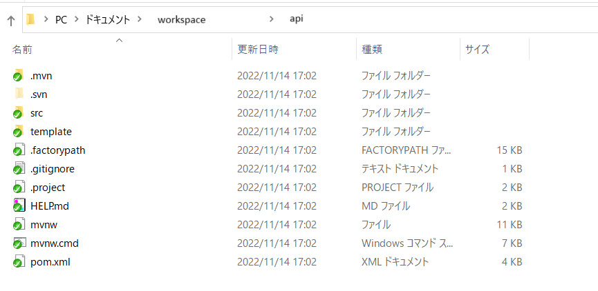

2.	Spring Tool Suite 4を起動して、1. で作成したworkspaceをlaunchしてください。

	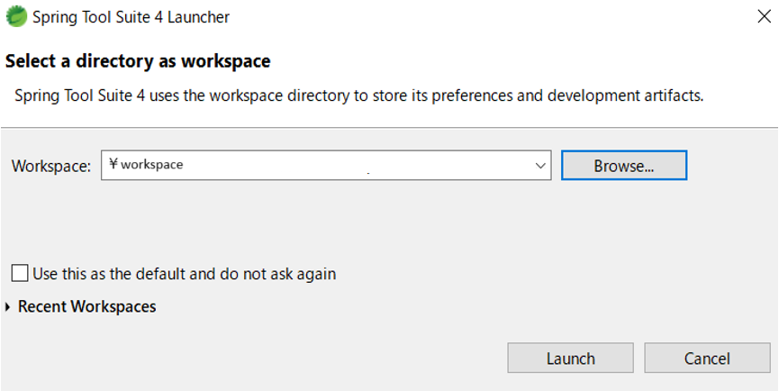

3.	プロジェクトのインポートを行います。

	Import projects .. &gt; Maven &gt; Existing Maven Projectsを選択してください。

	

	Root Directoryにworkspace内に配置したproject folderを指定します。

	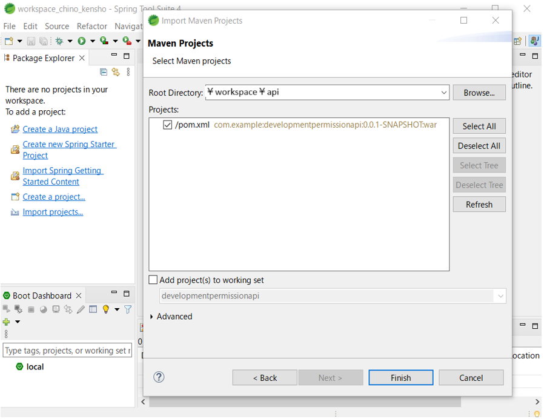

4.	Mavenの更新を行います。

	プロジェクト右クリック&gt; Maven &gt; Update Projectを選択してください。

	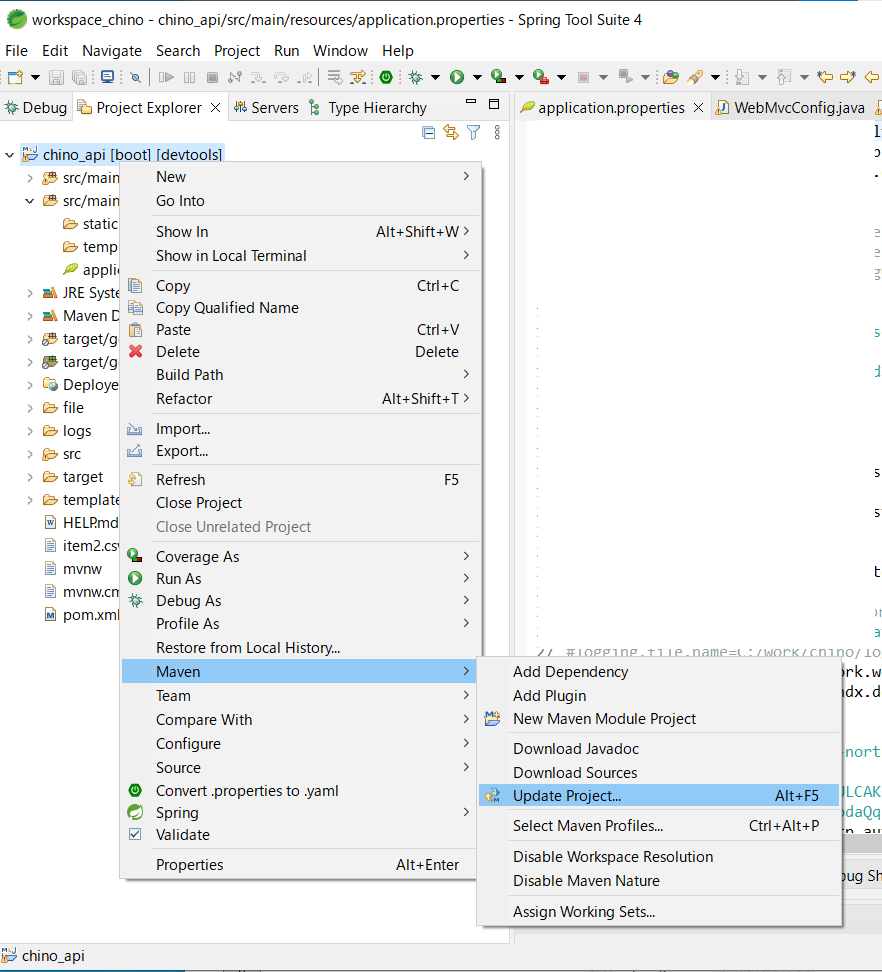

	更新画面でOKを選択すると、Mavenの更新が始まります。

	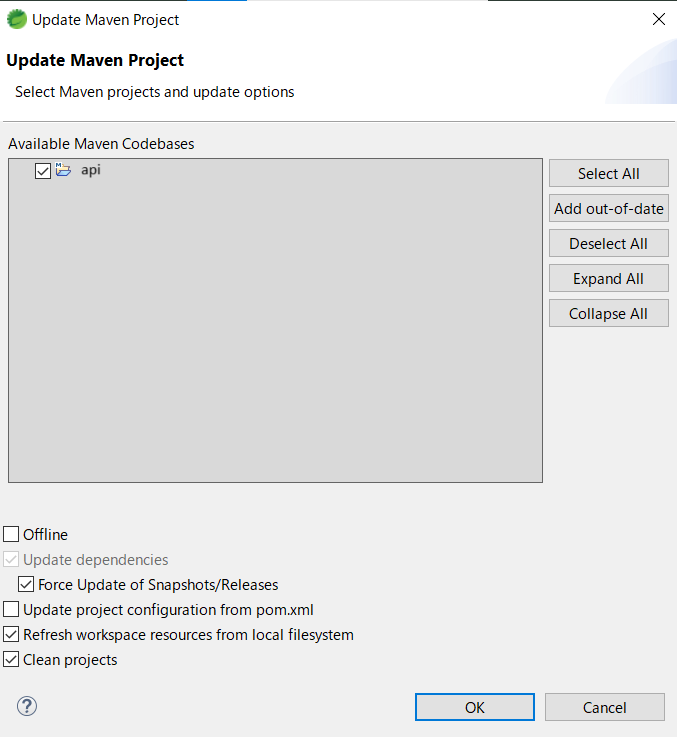

5.	src/main/resources/application.propertiesの編集を行ってください。

	プロパティ一覧と、編集を行う箇所は次章を参照してください。

	変更が必要な設定箇所は以下になります。

	-	データベースとの接続情報

	-	メールサーバとの接続情報

	-	データの座標系

	-	自治体名

	<span style="color: red; ">
	※application.propertiesが文字化けする場合は、application.propertiesを右クリック&gt;properties&gt;Resource&gt;Text file encodingをUTF-8へ変更してください。
	</span>

	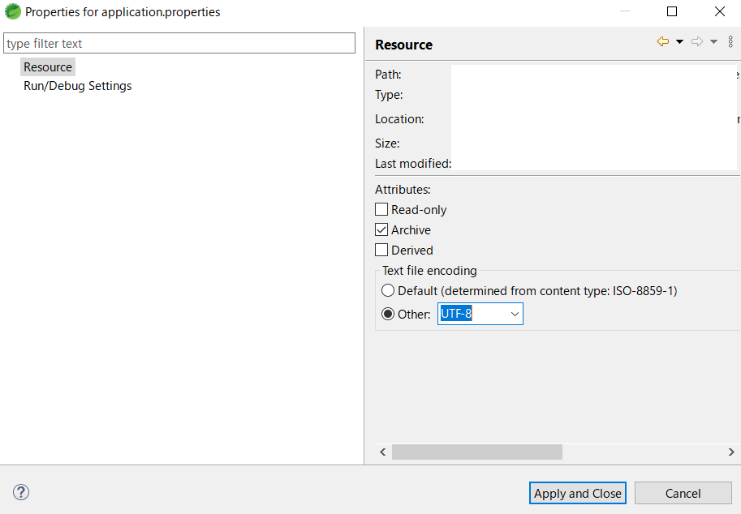

<a id="sec1603"></a>

## 16-3. warの作成　

※作業PC上にて行う

1.	プロジェクト右クリック&gt; Run As &gt; Maven buildを選択してください。

	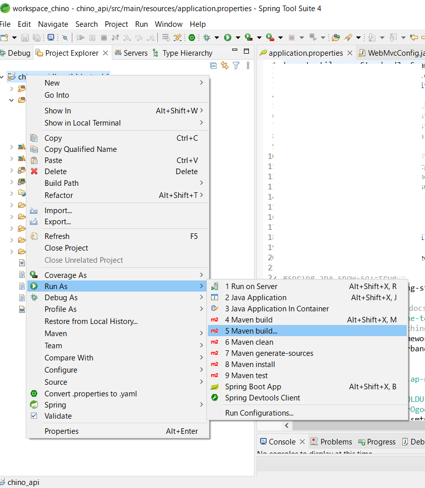

2.	Goalsに「package」を入力し、Runボタンを押下します。

	

3.	targetフォルダにdevelopmentpermissionapi-0.0.1-SNAPSHOT.warが作られていることを確認してください。

<a id="sec1604"></a>

## 16-4. warのデプロイ

1.	Webサーバの適当な場所にdevelopmentpermissionapi-0.0.1-SNAPSHOT.warをアップロードしてください。ここでは /home/upload/ に転送する事としています。

2.	tomcatに配備します。

	※配備の際、developmentpermissionapi-0.0.1-SNAPSHOT.war から<span style="color: red; ">developmentpermissionapi.war</span>に名前を変更してください。

	```Text
	cd /home/upload/

	sudo mv developmentpermissionapi-0.0.1-SNAPSHOT.war /opt/apache-tomcat/webapps/developmentpermissionapi.war
	```

	※配備後にapplication.propertiesを編集する場合は下記のように行います。編集後、保存して再起動を行ってください。
	```Text
	sudo vi /opt/apache-tomcat/webapps/developmentpermissionapi/WEB-INF/classes/application.properties

	sudo systemctl restart tomcat
	```

<a id="sec1605"></a>

## 16-5. メール設定ファイル、概況診断結果テンプレート、帳票テンプレート、マニュアルの配置

1.	適当な場所にプロジェクト直下にあるtemplateフォルダの「mail.properties（メール設定ファイル）」、「judgeResult.xlsx（概況診断結果テンプレート）」、「事業者向けマニュアル（PDF形式）」、「行政担当者向けマニュアル（PDF形式）」、「M_帳票マスタテーブルで設定している帳票」をアップロードしてください。

	※ マニュアルは別途ご用意ください。

	※ <span style="color:red">M_帳票マスタテーブルで設定した帳票は事前協議完了時及び許可判定完了時に生成（複製）されます。</span><br/>
	サンプルデータを使用する際の帳票テンプレートはtemplateフォルダで既に用意されています。
	対象のテンプレートファイルは以下です。<br/>
	「32条協議書.xlsx」、「同意通知書.xlsx」、「調書.xlsx」、「開発行為許可通知書.xlsx」、「開発行為許可申請書.xlsx」<br/>
	また、独自の帳票生成を実施する場合、<a href="#sec7022">7-22. M_帳票（m_ledger）</a>、<a href="#sec7022">7-21. M_帳票ラベル（m_ledger_label）</a>を参照してDB設定及び対応する帳票テンプレートを事前にご準備ください。<br>

	ここではtemplateフォルダ配下のファイル一式を /home/upload/ に転送した例を示しています。

2.	application.propertiesで設定している場所（app.mail.properties.path、app.judge.report.path）に「mail.properties（メール設定ファイル）」と「judgeResult.xlsx（概況診断結果テンプレート）」を配置します。

	必要に応じてフォルダの作成を行ってください。

	application.propertiesで設定済みのパスに合わせて配置します。
	```Text
	cd /home/upload/

	sudo mkdir -p [app.mail.properties.pathで設定したパス]
	
	sudo mkdir -p [app.judge.report.pathで設定したパス]

	sudo mv [app.mail.properties.pathで設定したファイル名] [app.mail.properties.pathで設定したパス]

	sudo mv [app.judge.report.pathで設定したファイル名] [app.judge.report.pathで設定したパス]
	```

	下記はデフォルトの設定場所の場合の手順になります。
	```Text
	cd /home/upload/

	sudo mkdir -p /opt/apache-tomcat/properties/
	
	sudo mkdir -p /mnt/s3/application/report/

	sudo mv mail.properties /opt/apache-tomcat/properties/

	sudo mv judgeResult.xlsx /mnt/s3/application/report/
	```

3.	M_帳票マスタテーブルで設定している帳票を配置します。

	必要に応じてフォルダの作成を行ってください。

	application.properties及びM_帳票マスタテーブルで設定済みのパスに合わせて配置します。
	```Text
	cd /home/upload/

	sudo mkdir -p [app.file.rootpathで設定したパス]/[M_帳票マスタテーブル.template_pathで設定したパス]

	sudo mv [M_帳票マスタテーブル.template_pathで設定したファイル名] [app.file.rootpathで設定したパス]/[M_帳票マスタテーブル.template_pathで設定したパス]

	```

	下記はデフォルトの設定場所の場合の手順になります。
	
	サンプルデータで使用している「32条協議書.xlsx」、「同意通知書.xlsx」、「調書.xlsx」、「開発行為許可通知書.xlsx」、「開発行為許可申請書.xlsx」の配置方法を示します。
	```Text
	cd /home/upload/

	sudo mkdir -p /mnt/s3/application/ledger/template/

	sudo mv 32条協議書.xlsx /mnt/s3/application/ledger/template/
	
	sudo mv 同意通知書.xlsx /mnt/s3/application/ledger/template/

	sudo mv 調書.xlsx /mnt/s3/application/ledger/template/

	sudo mv 開発行為許可通知書.xlsx /mnt/s3/application/ledger/template/

	sudo mv 開発行為許可申請書.xlsx /mnt/s3/application/ledger/template/
	```

4. application.propertiesで設定している場所（app.file.rootpath/app.file.manual.folder/）にマニュアルを配置します。
	また、ファイル名は事業者用マニュアルがapp.file.manual.business.file、行政用マニュアルがapp.file.manual.goverment.fileで設定したファイル名とします。

	必要に応じてフォルダの作成を行ってください。

	application.propertiesで設定済みのパスに合わせて配置します。
	```Text
	cd /home/upload/

	sudo mkdir -p [app.file.rootpathで設定したパス]/[app.file.manual.folderで設定したパス]
	
	sudo mv [app.file.manual.business.fileで設定したファイル名] [app.file.rootpathで設定したパス]/[app.file.manual.folderで設定したパス]
	
	sudo mv [app.file.manual.goverment.fileで設定したファイル名] [app.file.rootpathで設定したパス]/[app.file.manual.folderで設定したパス]
	```

	下記はデフォルトの設定場所の場合の手順になります。
	```Text
	cd /home/upload/

	sudo mkdir -p /mnt/s3/application/manual/
	
	sudo mv 事業者用マニュアル.pdf /mnt/s3/application/manual/
	
	sudo mv 行政用マニュアル.pdf /mnt/s3/application/manual/
	```

5.  パーミッションの確認及び変更を行います。

	ディレクトリの所有権及びパーミッションを変更してください。

	下記はデフォルトの設定場所の場合の手順になります。
	```Text 
	sudo chown -hR tomcat:tomcat /mnt/s3/application

	sudo chmod -c -R 755 /mnt/s3/application

	sudo chown -hR tomcat:tomcat /opt/apache-tomcat/properties

	sudo chmod -c -R 755 /opt/apache-tomcat/properties
	```

6.	設定を反映する為、tomcatの再起動を行います。

	```Text 
	sudo systemctl restart tomcat
	```

<a id="sec1606"></a>

## 16-6. Apacheの設定

1.	httpd.conf を編集します。

	```Text 
	sudo vi /etc/httpd/conf/httpd.conf
	```

	最終行に以下の内容を追記して保存します。

	```Text
	ProxyPass /api http://localhost:8080/developmentpermissionapi

	ProxyPassReverse /api http://localhost:8080/developmentpermissionapi
	```

2.	設定を反映する為、apacheの再起動を行います。

	```Text 
	sudo systemctl restart httpd
	```

<a id="sec1607"></a>

## 16-7. デプロイ後の確認

1.	http://&lt;サーバマシンのIPアドレス&gt;/api/auth/checkAuth?jigyousya=true にアクセスします。

	※画面上には何も表示されません。

2.	http://&lt;サーバマシンのIPアドレス&gt;/api/category/viewsにアクセスします。

	下記のように表示されていれば、デプロイが正常に行われています。

	

<a id="sec1700"></a>

# 17 アプリケーション設定ファイル更新(Spring Boot)

以下にアプリケーション設定ファイルの設定一覧を記載します。

環境やアプリケーションの用途に応じて設定を変更してください。


<span style="color: red; ">
※「環境」列に○がついている項目は、環境や利用目的に応じた設定が必須です。

※ 日本語はUnicodeエスケープ形式として記載してください。

</span>

<a id="sec1701"></a>

## 17-1. application.properties

<table>
<colgroup>
<col style="width: 33%" />
<col style="width: 6%" />
<col style="width: 6%" />
<col style="width: 25%" />
<col style="width: 28%" />
</colgroup>
<thead>
<tr class="header">
<th rowspan="2"><strong>プロパティ名</strong></th>
<th colspan="2"><strong>環境設定</strong></th>
<th rowspan="2"><strong>内容</strong></th>
<th rowspan="2"><strong>設定値</strong></th>
</tr>
<tr>
<th><strong>必須</strong></th>
<th><strong>任意</strong></th>
</tr>
</thead>
<tbody>
<tr>
<td>spring.jpa.database</td>
<td>　</td>
<td>　</td>
<td>データベース種類</td>
<td>POSTGRESQL</td>
</tr>
<tr>
<td>spring.datasource.url</td>
<td>○</td>
<td>　</td>
<td>データベース接続情報</td>
<td>jdbc:postgresql://[DBサーバのIPアドレス]:[DBサーバのポート番号]/[データベース名]</td>
</tr>
<tr>
<td>spring.datasource.username</td>
<td>○</td>
<td>　</td>
<td>データベースアクセスに使用するユーザ名</td>
<td>postgres</td>
</tr>
<tr>
<td>spring.datasource.password</td>
<td>○</td>
<td>　</td>
<td>データベースアクセスに使用するパスワード</td>
<td>（省略）</td>
</tr>
<tr>
<td>app.mail.host</td>
<td>○</td>
<td>　</td>
<td>メール送信設定（ホスト名）</td>
<td>[SMTPサーバのホスト名]</td>
</tr>
<tr>
<td>app.mail.port</td>
<td>○</td>
<td>　</td>
<td>メール送信設定（ポート番号）</td>
<td>[SMTPサーバのポート番号]</td>
</tr>
<tr>
<td>app.mail.username</td>
<td>○</td>
<td>　</td>
<td>メール送信設定（ユーザ名）</td>
<td>[SMTPサーバのユーザ名]</td>
</tr>
<tr>
<td>app.mail.password</td>
<td>○</td>
<td>　</td>
<td>メール送信設定（パスワード）</td>
<td>[SMTPサーバのパスワード]</td>
</tr>
<tr>
<td>app.mail.sendfrom</td>
<td>○</td>
<td>　</td>
<td><p>メール送信設定</p>
<p>（送信元アドレス）</p></td>
<td>送信元のメールアドレス</td>
</tr>
<tr>
<td>app.mail.accept.timestamp.format</td>
<td>　</td>
<td>　</td>
<td>メールの申請登録日時フォーマット</td>
<td>yyyy/MM/dd HH:mm</td>
</tr>
<tr>
<td>app.mail.validsendmail</td>
<td>○</td>
<td>　</td>
<td>メール通知機能有効・無効<br />
※TRUE = 有効/FALSE=無効</td>
<td>TRUE</td>
</tr>
<tr>
<td>app.mail.send.interval</td>
<td>　</td>
<td>　</td>
<td> 問い合わせメール通知間隔(分)</td>
<td>1</td>
</tr>
<tr>
<td>app.mail.send.answer.update</td>
<td>　</td>
<td>　</td>
<td>回答更新通知（行政向け）を送信するかどうか (0:送信しない、1:送信する)</td>
<td>0</td>
</tr>
<tr>
<td>app.applicant.name.item.number</td>
<td>　</td>
<td>　</td>
<td>O_申請者情報の氏名を格納したアイテム番号(メール通知で使用)</td>
<td>1</td>
</tr>
<tr>
<td>app.cors.allowed.origins</td>
<td>○</td>
<td></td>
<td>CORS許可オリジン</td>
<td>
<p><span style="color: red; ">本API実行を許可するoriginを指定</span>
<br>
例）https://example.com
</p>
</td>
</tr>
<tr>
<td>app.filter.ignore</td>
<td>　</td>
<td>　</td>
<td>フィルタの例外パス</td>
<td><p>（省略）</p>
<p>※ ログイン画面でも使用する為、「/label」の例外path設定は必須</p></td>
</tr>
<tr>
<td>app.filter.goverment</td>
<td>　</td>
<td>　</td>
<td>フィルタの行政のみ許可するパス</td>
<td>（省略）</td>
</tr>
<tr>
<td>app.filter.unable</td>
<td>　</td>
<td>　</td>
<td>アクセス不能パス</td>
<td>（省略）</td>
</tr>
<tr>
<td>app.custom.log.flag</td>
<td></td>
<td>○</td>
<td><p>カスタムログを使用するかどうか</p>
<p><br />
<span style="color: red; ">※カスタムログは利用者のアクセス履歴を記録するために使用するログになります。目的に応じて設定を変更してください。</span></p></td>
<td>true</td>
</tr>
<tr>
<td>logging.level.org.springframework.web</td>
<td>　</td>
<td>○</td>
<td>アプリケーションログ出力レベル設定</td>
<td>INFO</td>
</tr>
<tr>
<td>logging.level.developmentpermission</td>
<td>　</td>
<td>○</td>
<td>アプリケーションログ出力レベル設定</td>
<td>DEBUG</td>
</tr>
<tr>
<td>spring.servlet.multipart.max-file-size</td>
<td>　</td>
<td>　</td>
<td>ファイル1つの最大サイズ</td>
<td>50MB</td>
</tr>
<tr>
<td>spring.servlet.multipart.max-request-size</td>
<td>　</td>
<td>　</td>
<td>複数ファイル全体の最大サイズ</td>
<td>100MB</td>
</tr>
<tr>
<td>server.address</td>
<td>　</td>
<td>　</td>
<td>Server IP Address</td>
<td>127.0.0.1</td>
</tr>
<tr>
<td>app.filter.cookie.expire</td>
<td>　</td>
<td>　</td>
<td>Cookieの有効時間(秒)</td>
<td>2592000</td>
</tr>
<tr>
<td>app.epsg</td>
<td>○</td>
<td>　</td>
<td>システムテーブル内GeometryのEPSG<br />
<span style="color: red; ">※地番、判定レイヤの座標系に合わせて変更してください。</span></td>
<td>[平面直角座標系のEPSG]<br />
例)2450</td>
</tr>
<tr>
<td>app.lonlat.epsg</td>
<td>　</td>
<td>　</td>
<td>画面表示応答で使用する座標系（EPSG）</td>
<td>4326</td>
</tr>
<tr>
<td>app.city.name</td>
<td>○</td>
<td>　</td>
<td>市町村名</td>
<td>[市町村名]</td>
</tr>
<tr>
<td>app.jwt.token.secretkey</td>
<td>○</td>
<td></td>
<td><p>JWTの秘密鍵</p>
<p></p>
<p><span style="color: red; ">※tokenの検証や署名で使用</span></p></td>
<td>[自治体固有のsecretKey]</td>
</tr>
<tr>
<td>app.api.secretkey</td>
<td>○</td>
<td></td>
<td><p>リマインド通知APIの認証で使用する共通鍵</p></td>
<td>[自治体固有のsecretKey]</td>
</tr>
<tr>
<td>logging.file.name</td>
<td>　</td>
<td>○</td>
<td>ログ出力ファイル名</td>
<td>/opt/apache-tomcat/logs/developmentpermission/developmentPermission.log</td>
</tr>
<tr>
<td>app.mail.properties.path</td>
<td>　</td>
<td>　</td>
<td>メール通知系定義プロパティパス</td>
<td>/opt/apache-tomcat/properties/mail.properties</td>
</tr>
<tr>
<td>app.judge.report.path</td>
<td>　</td>
<td>　</td>
<td>テンプレートパス</td>
<td>/mnt/s3/application/report/judgeResult.xlsx</td>
</tr>
<tr>
<td>app.file.rootpath</td>
<td>　</td>
<td>　</td>
<td>ファイル管理rootパス</td>
<td>/mnt/s3/application</td>
</tr>
<tr>
<td>app.file.application.folder</td>
<td>　</td>
<td>　</td>
<td>申請ファイル管理フォルダパス</td>
<td>/application</td>
</tr>
<tr>
<td>app.file.answer.folder</td>
<td>　</td>
<td>　</td>
<td>回答ファイル管理フォルダパス</td>
<td>/answer</td>
</tr>
<tr>
<td>app.file.inquiry.folder</td>
<td>　</td>
<td>　</td>
<td>問合せファイル管理フォルダパス</td>
<td>/chat</td>
</tr>
<tr>
<td>app.file.manual.folder</td>
<td>　</td>
<td>　</td>
<td>マニュアルファイル管理フォルダパス</td>
<td>/manual</td>
</tr>
<tr>
<td>app.file.ledger.folder</td>
<td>　</td>
<td>　</td>
<td>帳票ファイル管理フォルダパス</td>
<td>/ledger</td>
</tr>
<tr>
<td>app.file.manual.business.file</td>
<td>　</td>
<td>〇</td>
<td>事業者用マニュアルファイル</td>
<td>\u4e8b\u696d\u8005\u7528\u30de\u30cb\u30e5\u30a2\u30eb.pdf</td>
</tr>
<tr>
<td>app.file.manual.goverment.file</td>
<td>　</td>
<td>〇</td>
<td>行政用マニュアルファイル</td>
<td>\u884c\u653f\u7528\u30de\u30cb\u30e5\u30a2\u30eb.pdf</td>
</tr>
<tr>
<td>app.file.service.rootpath</td>
<td>　</td>
<td>　</td>
<td>レイヤ関連ファイル取得サービスルートパス</td>
<td>/mnt/s3/application/layer</td>
</tr>
<tr>
<td>app.file.judgement.folder</td>
<td>　</td>
<td>　</td>
<td>概況診断画像管理フォルダパス</td>
<td>/opt/apache-tomcat/img_tmp</td>
</tr>
<tr>
<td>app.json.log.rootPath.judgeresult</td>
<td>　</td>
<td></td>
<td>概況診断結果ログのpath</td>
<td>/mnt/s3/application/customlogs/judgeresult/</td>
</tr>
<tr>
<td>app.file.developmentRegister.rootPath</td>
<td>　</td>
<td></td>
<td>開発登録簿ファイル出力ルートパス</td>
<td>/mnt/s3/application/development_register</td>
</tr>
<tr>
<td>app.csv.log.path.business.login</td>
<td>　</td>
<td></td>
<td>事業者ログイン（アクセス）ログのpath</td>
<td>/mnt/s3/application/customlogs/business_login_log.csv</td>
</tr>
<tr>
<td>app.csv.log.path.judge.report</td>
<td>　</td>
<td></td>
<td>概況診断結果レポート（出力件数）ログのpath</td>
<td>/mnt/s3/application/customlogs/judge_report_log.csv</td>
</tr>
<tr>
<td>app.csv.log.path.application.register</td>
<td>　</td>
<td></td>
<td>申請登録ログのpath</td>
<td>/mnt/s3/application/customlogs/application_register_log.csv</td>
</tr>
<tr>
<td>app.csv.log.path.administration.login</td>
<td>　</td>
<td></td>
<td>行政ログインログのpath</td>
<td>/mnt/s3/application/customlogs/administration_login_log.csv</td>
</tr>
<tr>
<td>app.csv.log.path.answer.register</td>
<td>　</td>
<td></td>
<td>回答登録ログのpath</td>
<td>/mnt/s3/application/customlogs/answer_register_log.csv</td>
</tr>
<tr>
<td>app.csv.log.path.answer.notification</td>
<td>　</td>
<td></td>
<td>回答通知ログのpath</td>
<td>/mnt/s3/application/customlogs/answer_notification_log.csv</td>
</tr>
<tr>
<td>app.csv.log.path.answer.confirm</td>
<td>　</td>
<td>　</td>
<td>回答確認ログのpath</td>
<td>/mnt/s3/application/customlogs/answer_confirm_log.csv</td>
</tr>
<tr>
<td>app.csv.log.path.questionnaire.reply</td>
<td>　</td>
<td>　</td>
<td>利用目的保存ログのpath</td>
<td>/mnt/s3/application/customlogs/questionnaire_reply_log.csv</td>
</tr>
<tr>
<td>app.csv.log.path.application.reapplication</td>
<td>　</td>
<td>　</td>
<td>再申請登録ログのpath</td>
<td>/mnt/s3/application/customlogs/application_reapplication_log.csv</td>
</tr>
<tr>
<td>app.csv.log.path.chat.business.message.post</td>
<td>　</td>
<td>　</td>
<td>チャット投稿（事業者）ログのpath</td>
<td>/mnt/s3/application/customlogs/chat_business_message_post_log.csv</td>
</tr>
<tr>
<td>app.csv.log.path.chat.government.message.post</td>
<td>　</td>
<td>　</td>
<td>チャット投稿（行政）ログのpath</td>
<td>/mnt/s3/application/customlogs/chat_government_message_post_log.csv</td>
</tr>
<tr>
<td>app.csv.log.path.lotnumber.search.establishment</td>
<td>　</td>
<td>　</td>
<td>地番検索（事業者）ログのpath</td>
<td>/mnt/s3/application/customlogs/lotnumber_search_establishment_log.csv</td>
</tr>
<tr>
<td>app.csv.log.path.category.views</td>
<td>　</td>
<td>　</td>
<td>申請区分項目取得ログのpath</td>
<td>/mnt/s3/application/customlogs/category_views_log.csv</td>
</tr>
<tr>
<td>app.csv.log.path.answer.consent.input</td>
<td>　</td>
<td>　</td>
<td>同意項目承認否認登録（事業者）ログのpath</td>
<td>/mnt/s3/application/customlogs/answer_consent_input_log.csv</td>
</tr>
<tr>
<td>app.csv.log.path.answer.register.government.confirm</td>
<td>　</td>
<td>　</td>
<td>回答登録(行政確定登録内容登録（事前協議のみ）)ログのpath</td>
<td>/mnt/s3/application/customlogs/answer_government_confirm_register_log.csv</td>
</tr>
<tr>
<td>app.csv.log.path.answer.register.government.confirm.department</td>
<td>　</td>
<td>　</td>
<td>回答登録(部署回答行政確定登録内容登録（事前協議のみ）)ログのpath</td>
<td>/mnt/s3/application/customlogs/department_answer_government_confirm_register_log.csv</td>
</tr>
<tr>
<td>app.def.questionarypurpose</td>
<td>　</td>
<td>〇</td>
<td><p>利用目的定義（アンケート用）</p>
<p><span style="color: red; ">※事業者向け初期画面で利用目的のログ集計が可能です。画面に表示する選択項目の設定をここで実施してください。</span>
</p>
</td>
<td><p>初期値では以下が設定されています。</p>
<p>0：開発許可</p>
<p>1：その他</p>
</td>
</tr>
<tr>
<td>app.def.judgementType</td>
<td>　</td>
<td>〇</td>
<td><p>概況診断タイプ定義</p>
<p><span style="color: red; ">※申請区分選択画面で概況診断タイプの選択が可能です。選択可能な概況診断タイプとコード値の対応をここで設定してください。設定したコード値は、<a href="#sec701">7-1. M_申請区分選択画面</a>で、表示対象の画面に対して概況診断タイプとして設定してください。</span>
</p></td>
<td><p>初期値では以下が設定されています。</p>
<p>0：開発許可</p>
<p>1：その他</p>
</td>
</tr>
<tr>
<td>app.judgementtype.default.value</td>
<td>　</td>
<td>〇</td>
<td>概況診断タイプリストのデフォルト選択値</td>
<td>0</td>
</tr>
<tr>
<td>app.application.answer.buffer.days</td>
<td>　</td>
<td>〇</td>
<td>申請登録時の回答予定のバッファ日数（各区分判定の回答予定日数最大値に追加で加算）</td>
<td>0</td>
</tr>
<tr>
<td>app.application.step2.control.department.buffer.days</td>
<td>　</td>
<td>〇</td>
<td>事前協議の申請登録時の統括部署向けのバッファ日数</td>
<td>2</td>
</tr>
<tr>
<td>app.application.step2.control.department.accepting.confirm.days</td>
<td>　</td>
<td>〇</td>
<td>事前協議の統括部署の受付確認日数</td>
<td>1</td>
</tr>
<tr>
<td>app.roadjudge.roadcenterline.buffer</td>
<td>　</td>
<td>〇</td>
<td>道路判定 道路中心線取得バッファ(m)</td>
<td>15.0</td>
</tr>
<tr>
<td>app.roadjudge.roadtype.nondisplay.value</td>
<td>　</td>
<td>〇</td>
<td>道路判定 道路種別該当時文言非表示対象道路種別値（該当時に他の案内文言を非表示とする道路種別値をカンマ区切りで指定）</td>
<td>1,2,3,9020</td>
</tr>
<tr>
<td>app.roadjudge.roadtype.nondisplay.identifyText</td>
<td>　</td>
<td>〇</td>
<td>道路判定 道路種別該当時文言非表示対象テキスト識別子（該当時に非表示とする対象の案内文言の識別子をカンマ区切りで指定）</td>
<td>{width_text_area},{max_width_text_area},{min_width_text_area},{split_line_result_area},{walkway_result_area},{display_by_width_area}</td>
</tr>
<tr>
<td>app.roadjudge.roadtype.unknown.value</td>
<td>　</td>
<td>〇</td>
<td>道路判定 道路種別不明値</td>
<td>9020</td>
</tr>
<tr>
<td>app.role.business</td>
<td>　</td>
<td>　</td>
<td>事業者のロール</td>
<td>1</td>
</tr>
<tr>
<td>app.department.business</td>
<td>　</td>
<td>　</td>
<td>事業者の部署コード</td>
<td>0000000000</td>
</tr>
<tr>
<td>app.file.answer.foldername.format</td>
<td>　</td>
<td>　</td>
<td>回答ファイル用フォルダのtimestampフォーマット</td>
<td>yyyyMMddHHmmssSSS</td>
</tr>
<tr>
<td>app.def.status</td>
<td>　</td>
<td>　</td>
<td>申請ステータス定義</td>
<td>　</td>
</tr>
<tr>
<td>app.def.answerstatus</td>
<td>　</td>
<td>　</td>
<td>問合せステータス定義</td>
<td>　</td>
</tr>
<tr>
<td>app.def.itemanswerstatus</td>
<td>　</td>
<td>　</td>
<td>条文ステータス定義</td>
<td>　</td>
</tr>
<tr>
<td>app.def.answerfilehistory.updatetype</td>
<td>　</td>
<td>　</td>
<td>回答ファイル履歴更新タイプ定義</td>
<td>　</td>
</tr>
<tr>
<td>app.def.answer.notify.type</td>
<td>　</td>
<td>　</td>
<td>回答通知の通知種別定義（ログ出力用）</td>
<td>　</td>
</tr>
<tr>
<td>app.def.answer.register.updatetype</td>
<td>　</td>
<td>　</td>
<td>回答登録の操作種別定義（ログ出力用）</td>
<td>　</td>
</tr>
<tr>
<td>app.category.judgement.attribute.joint</td>
<td>　</td>
<td>　</td>
<td>概況診断 重なり属性表示フラグが1の場合の属性区切り文字</td>
<td>\u30FB</td>
</tr>
<tr>
<td>app.category.judgement.attribute.distance.replaceText</td>
<td></td>
<td></td>
<td>概況診断 距離表示置き換え文字</td>
<td>{distance}</td>
</tr>
<tr>
<td>app.category.judgement.attribute.distance.replacedText</td>
<td></td>
<td></td>
<td>概況診断 距離表示置き換え後文字</td>
<td>\u8ddd\u96e2\uff1a</td>
</tr>
<tr>
<td>app.category.judgement.attribute.distance.applicationAreaText</td>
<td></td>
<td></td>
<td>概況診断 距離表示置き換え後文字（申請地範囲内の場合の表示文言）</td>
<td>\u7533\u8acb\u5730\u7bc4\u56f2\u5185</td>
</tr>
<tr>
<td>app.category.judgement.distance.epsg</td>
<td></td>
<td></td>
<td>概況診断 距離判定時に使用するepsg</td>
<td>4612</td>
</tr>
<tr>
<td>app.application.versioninformation.text</td>
<td></td>
<td></td>
<td>申請版情報表示用文字列</td>
<td>\u7b2c{version}\u7248</td>
</tr>
<tr>
<td>app.application.versioninformation.replacetext</td>
<td></td>
<td></td>
<td>申請版情報置換文字列</td>
<td>{version}</td>
</tr>
<tr>
<td>app.application.default.reapplication.false</td>
<td></td>
<td></td>
<td>申請登録時再申請不要で登録する区分判定概要文字列（カンマ区切り）</td>
<td>\u4e8b\u524d\u76f8\u8ac7\u4e0d\u8981</td>
</tr>
<tr>
<td>app.application.default.reapplication.true</td>
<td></td>
<td></td>
<td>申請登録時再申請必要で登録する区分判定概要文字列（カンマ区切り）</td>
<td>\u8981\u518d\u7533\u8acb</td>
</tr>
<tr>
<td>app.application.default.discussion.false</td>
<td></td>
<td></td>
<td>申請登録時事前協議不要で登録する区分判定概要文字列（カンマ区切り）</td>
<td>\u4e8b\u524d\u5354\u8b70\u4e0d\u8981</td>
</tr>
<tr>
<td>app.application.default.discussion.true</td>
<td></td>
<td></td>
<td>申請登録時事前協議必要で登録する区分判定概要文字列（カンマ区切り）</td>
<td>\u8981\u4e8b\u524d\u5354\u8b70</td>
</tr>
<tr>
<td>app.application.goverment.add.answer.title</td>
<td></td>
<td></td>
<td>回答登録時行政で登録した回答の関連条項表示文字列</td>
<td>\u305d\u306e\u4ed6</td>
</tr>
<tr>
<td>app.application.permission.default.add.judgementItemId</td>
<td></td>
<td></td>
<td>許可判定の申請登録時一律追加の判定項目ID（カンマ区切り）</td>
<td>9991,9992</td>
</tr>
<tr>
<td>app.category.judgement.attribute.nullValue</td>
<td></td>
<td></td>
<td>概況診断 属性NULL時表示文字</td>
<td>---</td>
</tr>
<tr>
<td>app.roadjudge.splitcenterline.buffer</td>
<td></td>
<td></td>
<td>道路判定 分割道路中心線取得時分割処理用バッファ径(m)</td>
<td>0.001</td>
</tr>
<tr>
<td>app.roadjudge.roadMaxWidth.replaceText</td>
<td></td>
<td></td>
<td>道路判定 道路部幅員置き換え文字</td>
<td>{road_max_width}</td>
</tr>
<tr>
<td>app.roadjudge.roadwayMaxWidth.replaceText</td>
<td></td>
<td></td>
<td>道路判定 車道幅員置き換え文字</td>
<td>{roadway_max_width}</td>
</tr>
<tr>
<td>app.roadjudge.roadMinWidth.replaceText</td>
<td></td>
<td></td>
<td>道路判定 道路部最小幅員置き換え文字</td>
<td>{road_min_width}</td>
</tr>
<tr>
<td>app.roadjudge.roadwayMinWidth.replaceText</td>
<td></td>
<td></td>
<td>道路判定 車道幅員最小置き換え文字</td>
<td>{roadway_min_width}</td>
</tr>
<tr>
<td>app.roadjudge.layerQueryReplaceText.value</td>
<td></td>
<td></td>
<td>道路判定 レイヤクエリ値置き換え文字</td>
<td>{value}</td>
</tr>
<tr>
<td>app.roadjudge.identifyText.roadLod2Layer</td>
<td></td>
<td></td>
<td>道路判定 道路LOD2レイヤ識別文字</td>
<td>{roadLod2}</td>
</tr>
<tr>
<td>app.roadjudge.identifyText.splitLineLayer</td>
<td></td>
<td></td>
<td>道路判定 区割り線レイヤ識別文字</td>
<td>{splitLine}</td>
</tr>
<tr>
<td>app.roadjudge.identifyText.maxWidthLayer</td>
<td></td>
<td></td>
<td>道路判定 最大幅員レイヤ識別文字</td>
<td>{maxWidth}</td>
</tr>
<tr>
<td>app.roadjudge.identifyText.minWidthLayer</td>
<td></td>
<td></td>
<td>道路判定 最小幅員レイヤ識別文字</td>
<td>{minWidth}</td>
</tr>
<tr>
<td>app.roadjudge.identifyText.sideWalkLayer</td>
<td></td>
<td></td>
<td>道路判定 隣接歩道レイヤ識別文字</td>
<td>{sideWalk}</td>
</tr>
<tr>
<td>app.roadjudge.identifyText.widthTextLayer</td>
<td></td>
<td></td>
<td>道路判定 幅員値レイヤ識別文字</td>
<td>{widthText}</td>
</tr>
<tr>
<td>app.roadjudge.identifyText.sideWalkLayer.lotNumber</td>
<td></td>
<td></td>
<td>道路判定 隣接歩道地番ID値置き換え文字</td>
<td>{lot_number}</td>
</tr>
<tr>
<td>app.roadjudge.identifyText.sideWalkLayer.sideWalk</td>
<td></td>
<td></td>
<td>道路判定 隣接歩道隣接歩道ID値置き換え文字</td>
<td>{side_walk}</td>
</tr>
<tr>
<td>app.roadjudge.identifyText.widthTextArea</td>
<td></td>
<td></td>
<td>道路判定 幅員表示範囲識別文字</td>
<td>{width_text_area}</td>
</tr>
<tr>
<td>app.roadjudge.identifyText.maxWidthTextArea</td>
<td></td>
<td></td>
<td>道路判定 最大幅員表示範囲識別文字</td>
<td>{max_width_text_area}</td>
</tr>
<tr>
<td>app.roadjudge.identifyText.minWidthTextArea</td>
<td></td>
<td></td>
<td>道路判定 最小幅員表示範囲識別文字</td>
<td>{min_width_text_area}</td>
</tr>
<tr>
<td>app.roadjudge.identifyText.splitLineResult</td>
<td></td>
<td></td>
<td>道路判定 分割線取得結果表示範囲識別文字</td>
<td>{split_line_result_area}</td>
</tr>
<tr>
<td>app.roadjudge.identifyText.walkwayResult</td>
<td></td>
<td></td>
<td>道路判定 隣接歩道判定結果表示範囲識別文字</td>
<td>{walkway_result_area}</td>
</tr>
<tr>
<td>app.roadjudge.identifyText.displayByWidth</td>
<td></td>
<td></td>
<td>道路判定 幅員による段階表示範囲識別文字</td>
<td>{display_by_width_area}</td>
</tr>
<tr>
<td>app.roadjudge.identifyText.roadTypeResult</td>
<td></td>
<td></td>
<td>道路判定 道路種別案内表示範囲識別文字</td>
<td>{road_type_result_area}</td>
</tr>
<tr>
<td>app.roadjudge.splitLineResult.flag.bothSide</td>
<td></td>
<td></td>
<td>道路判定 分割線取得結果 両側取得フラグ値</td>
<td>2</td>
</tr>
<tr>
<td>app.roadjudge.splitLineResult.flag.oneSide</td>
<td></td>
<td></td>
<td>道路判定 分割線取得結果 片側取得フラグ値</td>
<td>1</td>
</tr>
<tr>
<td>app.roadjudge.splitLineResult.flag.noSide</td>
<td></td>
<td></td>
<td>道路判定 分割線取得結果 取得なしフラグ値</td>
<td>0</td>
</tr>
<tr>
<td>app.roadjudge.splitLineResult.flag.error</td>
<td></td>
<td></td>
<td>道路判定 分割線取得結果 取得エラーフラグ値</td>
<td>-1</td>
</tr>
<tr>
<td>app.roadjudge.walkwayResult.true</td>
<td></td>
<td></td>
<td>道路判定 隣接歩道判定結果 隣接有りフラグ値</td>
<td>1</td>
</tr>
<tr>
<td>app.roadjudge.walkwayResult.false</td>
<td></td>
<td></td>
<td>道路判定 隣接歩道判定結果 隣接なしフラグ値</td>
<td>0</td>
</tr>
<tr>
<td>app.roadjudge.widthErrorCode</td>
<td></td>
<td></td>
<td>道路判定 幅員エラーコード</td>
<td>9999</td>
</tr>
<tr>
<td>app.applicant.id.length</td>
<td>　</td>
<td>　</td>
<td>照合IDの文字数</td>
<td>20</td>
</tr>
<tr>
<td>app.password.length</td>
<td>　</td>
<td>　</td>
<td>パスワード発行時の文字数</td>
<td>10</td>
</tr>
<tr>
<td>app.password.character</td>
<td>　</td>
<td>　</td>
<td>パスワードに使用する文字種</td>
<td>0123456789ABCDEFGHIJKLMNOPQRSTUVWXYZabcdefghijklmnopqrstuvwxyz</td>
</tr>
<tr>
<td>app.application.report.filename.header</td>
<td>　</td>
<td>　</td>
<td>申請登録時の概況診断レポート接頭句</td>
<td>\u6982\u6CC1\u8A3A\u65AD\u7D50\u679C_</td>
</tr>
<tr>
<td>app.application.report.filename.footer</td>
<td>　</td>
<td>　</td>
<td>申請登録時の概況診断レポート接尾句(日付フォーマット)</td>
<td>_yyyy_MM_dd</td>
</tr>
<tr>
<td>app.application.report.fileid</td>
<td>　</td>
<td>　</td>
<td>申請登録時の概況診断レポートのファイルID</td>
<td>9999</td>
</tr>
<tr>
<td>app.answer.report.filename.header</td>
<td>　</td>
<td>　</td>
<td>回答通知時の回答レポート接頭句</td>
<td>\u56de\u7b54\u30ec\u30dd\u30fc\u30c8_</td>
</tr>
<tr>
<td>app.answer.report.filename.footer</td>
<td>　</td>
<td>　</td>
<td>回答通知時の回答レポート接尾句(日付フォーマット)</td>
<td>_yyyy_MM_dd</td>
</tr>
<tr>
<td>app.answer.report.fileid</td>
<td>　</td>
<td>　</td>
<td>回答通知時の回答レポートのファイルID</td>
<td>9998</td>
</tr>
<tr>
<td>app.answer.report.master.filename</td>
<td>　</td>
<td>　</td>
<td>回答レポートの表示名</td>
<td>\u56de\u7b54\u30ec\u30dd\u30fc\u30c8</td>
</tr>
<tr>
<td>app.lotnumber.getfigure.limit</td>
<td>　</td>
<td>　</td>
<td>範囲選択時地番取得上限</td>
<td>500</td>
</tr>
<tr>
<td>app.lotnumber.result.type.lotnumber</td>
<td>　</td>
<td>　</td>
<td>テーブル種別: 地番</td>
<td>1</td>
</tr>
<tr>
<td>app.lotnumber.result.type.district</td>
<td>　</td>
<td>　</td>
<td>テーブル種別: 大字</td>
<td>0</td>
</tr>
<tr>
<td>app.application.result.type.category</td>
<td>　</td>
<td>　</td>
<td>参照タイプ: 申請区分</td>
<td>0</td>
</tr>
<tr>
<td>app.application.result.type.applicant</td>
<td>　</td>
<td>　</td>
<td>参照タイプ: 申請者情報</td>
<td>1</td>
</tr>
<tr>
<td>app.application.result.type.other</td>
<td>　</td>
<td>　</td>
<td>参照タイプ: その他</td>
<td>2</td>
</tr>
<tr>
<td>app.application.table.application.category</td>
<td>　</td>
<td>　</td>
<td>テーブル名: O_申請区分</td>
<td>o_application_category</td>
</tr>
<tr>
<td>app.application.table.application.category.master</td>
<td>　</td>
<td>　</td>
<td>テーブル名: M_申請区分</td>
<td>m_application_category</td>
</tr>
<tr>
<td>app.application.table.applicant.information</td>
<td>　</td>
<td>　</td>
<td>テーブル名: O_申請者情報</td>
<td>o_applicant_information</td>
</tr>
<tr>
<td>app.application.table.answer</td>
<td>　</td>
<td>　</td>
<td>テーブル名: O_回答</td>
<td>o_answer</td>
</tr>
<tr>
<td>app.application.table.category.judgement</td>
<td>　</td>
<td>　</td>
<td>テーブル名: M_区分設定</td>
<td>m_category_judgement</td>
</tr>
<tr>
<td>app.application.table.department</td>
<td>　</td>
<td>　</td>
<td>テーブル名: M_部署</td>
<td>m_department</td>
</tr>
<tr>
<td>app.application.table.application</td>
<td>　</td>
<td>　</td>
<td>テーブル名： O_申請</td>
<td>o_application</td>
</tr>
<tr>
<td>app.application.column.status</td>
<td>　</td>
<td>　</td>
<td>カラム名：O_申請.ステータス</td>
<td>status</td>
</tr>
<tr>
<td>app.application.column.applicationid</td>
<td>　</td>
<td>　</td>
<td>カラム名：O_申請.申請ID</td>
<td>application_id</td>
</tr>
<tr>
<td>app.application.category.column.applicationid</td>
<td>　</td>
<td>　</td>
<td>O_申請区分 申請ID</td>
<td>application_id</td>
</tr>
<tr>
<td>app.application.category.column.viewid</td>
<td>　</td>
<td>　</td>
<td>O_申請区分 画面ID</td>
<td>view_id</td>
</tr>
<tr>
<td>app.application.category.column.categoryid</td>
<td>　</td>
<td>　</td>
<td>O_申請区分 申請区分ID</td>
<td>category_id</td>
</tr>
<tr>
<td>app.application.category.master.column.categoryid</td>
<td>　</td>
<td>　</td>
<td>M_申請区分 申請区分ID</td>
<td>category_id</td>
</tr>
<tr>
<td>app.application.category.master.column.viewid</td>
<td>　</td>
<td>　</td>
<td>M_申請区分 画面ID</td>
<td>view_id</td>
</tr>
<tr>
<td>app.application.category.master.column.order</td>
<td>　</td>
<td>　</td>
<td>M_申請区分 昇順</td>
<td>order</td>
</tr>
<tr>
<td>app.application.category.master.column.labelname</td>
<td>　</td>
<td>　</td>
<td>M_申請区分 選択肢名</td>
<td>label_name</td>
</tr>
<tr>
<td>app.applicant.information.column.applicationid</td>
<td>　</td>
<td>　</td>
<td>O_申請者情報 申請ID</td>
<td>application_id</td>
</tr>
<tr>
<td>app.applicant.information.column.applicantid</td>
<td>　</td>
<td>　</td>
<td>O_申請者情報 申請者情報ID</td>
<td>applicant_id</td>
</tr>
<tr>
<td>app.applicant.information.column.item1</td>
<td>　</td>
<td>　</td>
<td>O_申請者情報　項目1</td>
<td>item_1</td>
</tr>
<tr>
<td>app.applicant.information.column.item2</td>
<td>　</td>
<td>　</td>
<td>O_申請者情報　項目2</td>
<td>item_2</td>
</tr>
<tr>
<td>app.applicant.information.column.item3</td>
<td>　</td>
<td>　</td>
<td>O_申請者情報　項目3</td>
<td>item_3</td>
</tr>
<tr>
<td>app.applicant.information.column.item4</td>
<td>　</td>
<td>　</td>
<td>O_申請者情報　項目4</td>
<td>item_4</td>
</tr>
<tr>
<td>app.applicant.information.column.item5</td>
<td>　</td>
<td>　</td>
<td>O_申請者情報　項目5</td>
<td>item_5</td>
</tr>
<tr>
<td>app.applicant.information.column.item6</td>
<td>　</td>
<td>　</td>
<td>O_申請者情報　項目6</td>
<td>item_6</td>
</tr>
<tr>
<td>app.applicant.information.column.item7</td>
<td>　</td>
<td>　</td>
<td>O_申請者情報　項目7</td>
<td>item_7</td>
</tr>
<tr>
<td>app.applicant.information.column.item8</td>
<td>　</td>
<td>　</td>
<td>O_申請者情報　項目8</td>
<td>item_8</td>
</tr>
<tr>
<td>app.applicant.information.column.item9</td>
<td>　</td>
<td>　</td>
<td>O_申請者情報　項目9</td>
<td>item_9</td>
</tr>
<tr>
<td>app.applicant.information.column.item10</td>
<td>　</td>
<td>　</td>
<td>O_申請者情報　項目10</td>
<td>item_10</td>
</tr>
<tr>
<td>app.applicant.information.column.mailaddress</td>
<td>　</td>
<td>　</td>
<td>O_申請者情報　メールアドレス</td>
<td>mail_address</td>
</tr>
<tr>
<td>app.applicant.information.column.collationid</td>
<td>　</td>
<td>　</td>
<td>O_申請者情報　照合ID</td>
<td>collation_id</td>
</tr>
<tr>
<td>app.applicant.information.column.password</td>
<td>　</td>
<td>　</td>
<td>O_申請者情報　パスワード</td>
<td>password</td>
</tr>
<tr>
<td>app.answer.column.answerid</td>
<td>　</td>
<td>　</td>
<td>O_回答 回答ID</td>
<td>answer_id</td>
</tr>
<tr>
<td>app.answer.column.applicationid</td>
<td>　</td>
<td>　</td>
<td>O_回答 申請ID</td>
<td>application_id</td>
</tr>
<tr>
<td>app.answer.column.judgementid</td>
<td>　</td>
<td>　</td>
<td>O_回答 判定項目ID</td>
<td>judgement_id</td>
</tr>
<tr>
<td>app.answer.column.judgementresult</td>
<td>　</td>
<td>　</td>
<td>O_回答 判定結果</td>
<td>judgement_result</td>
</tr>
<tr>
<td>app.answer.column.answercontent</td>
<td>　</td>
<td>　</td>
<td>O_回答 回答内容</td>
<td>answer_content</td>
</tr>
<tr>
<td>app.answer.column.notifiedtext</td>
<td>　</td>
<td>　</td>
<td>O_回答 通知テキスト</td>
<td>notified_text</td>
</tr>
<tr>
<td>app.answer.column.registerdatetime</td>
<td>　</td>
<td>　</td>
<td>O_回答 登録日時</td>
<td>register_datetime</td>
</tr>
<tr>
<td>app.answer.column.updatedatetime</td>
<td>　</td>
<td>　</td>
<td>O_回答 更新日時</td>
<td>update_datetime</td>
</tr>
<tr>
<td>app.answer.column.completeflag</td>
<td>　</td>
<td>　</td>
<td>O_回答 完了フラグ</td>
<td>complete_flag</td>
</tr>
<tr>
<td>app.answer.column.notifiedflag</td>
<td>　</td>
<td>　</td>
<td>O_回答 通知フラグ</td>
<td>notified_flag</td>
</tr>
<tr>
<td>app.category.judgement.column.judgementitemid</td>
<td>　</td>
<td>　</td>
<td>M_区分判定 判定項目ID</td>
<td>judgement_item_id</td>
</tr>
<tr>
<td>app.category.judgement.column.departmentid</td>
<td>　</td>
<td>　</td>
<td>M_区分判定 担当部署ID</td>
<td>department_id</td>
</tr>
<tr>
<td>app.category.judgement.column.category1</td>
<td>　</td>
<td>　</td>
<td>M_区分判定 区分1</td>
<td>category_1</td>
</tr>
<tr>
<td>app.category.judgement.column.category2</td>
<td>　</td>
<td>　</td>
<td>M_区分判定 区分2</td>
<td>category_2</td>
</tr>
<tr>
<td>app.category.judgement.column.category3</td>
<td>　</td>
<td>　</td>
<td>M_区分判定 区分3</td>
<td>category_3</td>
</tr>
<tr>
<td>app.category.judgement.column.category4</td>
<td>　</td>
<td>　</td>
<td>M_区分判定 区分4</td>
<td>category_4</td>
</tr>
<tr>
<td>app.category.judgement.column.category5</td>
<td>　</td>
<td>　</td>
<td>M_区分判定 区分5</td>
<td>category_5</td>
</tr>
<tr>
<td>app.category.judgement.column.category6</td>
<td>　</td>
<td>　</td>
<td>M_区分判定 区分6</td>
<td>category_6</td>
</tr>
<tr>
<td>app.category.judgement.column.category7</td>
<td>　</td>
<td>　</td>
<td>M_区分判定 区分7</td>
<td>category_7</td>
</tr>
<tr>
<td>app.category.judgement.column.category8</td>
<td>　</td>
<td>　</td>
<td>M_区分判定 区分8</td>
<td>category_8</td>
</tr>
<tr>
<td>app.category.judgement.column.category9</td>
<td>　</td>
<td>　</td>
<td>M_区分判定 区分9</td>
<td>category_9</td>
</tr>
<tr>
<td>app.category.judgement.column.category10</td>
<td>　</td>
<td>　</td>
<td>M_区分判定 区分10</td>
<td>category_10</td>
</tr>
<tr>
<td>app.category.judgement.column.gisjudgement</td>
<td>　</td>
<td>　</td>
<td>M_区分判定 GIS判定</td>
<td>gis_judgement</td>
</tr>
<tr>
<td>app.category.judgement.column.buffer</td>
<td>　</td>
<td>　</td>
<td>M_区分判定 バッファ</td>
<td>buffer</td>
</tr>
<tr>
<td>app.category.judgement.column.judgementlayer</td>
<td>　</td>
<td>　</td>
<td>M_区分判定 判定対象レイヤ</td>
<td>judgement_layer</td>
</tr>
<tr>
<td>app.category.judgement.column.title</td>
<td>　</td>
<td>　</td>
<td>M_区分判定 タイトル</td>
<td>title</td>
</tr>
<tr>
<td>app.category.judgement.column.applicablesummary</td>
<td>　</td>
<td>　</td>
<td>M_区分判定 該当表示概要</td>
<td>applicable_summary</td>
</tr>
<tr>
<td>app.category.judgement.column.applicabledescription</td>
<td>　</td>
<td>　</td>
<td>M_区分判定 該当表示文言</td>
<td>applicable_description</td>
</tr>
<tr>
<td>app.category.judgement.column.nonapplicabledisplayflag</td>
<td>　</td>
<td>　</td>
<td>M_区分判定 非該当表示有無</td>
<td>non_applicable_display_flag</td>
</tr>
<tr>
<td>app.category.judgement.column.nonapplicablesummary</td>
<td>　</td>
<td>　</td>
<td>M_区分判定 非該当表示概要</td>
<td>non_applicable_summary</td>
</tr>
<tr>
<td>app.category.judgement.column.nonapplicabledescription</td>
<td>　</td>
<td>　</td>
<td>M_区分判定 非該当表示文言</td>
<td>non_applicable_description</td>
</tr>
<tr>
<td>app.category.judgement.column.tablename</td>
<td>　</td>
<td>　</td>
<td>M_区分判定 テーブル名</td>
<td>table_name</td>
</tr>
<tr>
<td>app.category.judgement.column.fieldname</td>
<td>　</td>
<td>　</td>
<td>M_区分判定 フィールド名</td>
<td>field_name</td>
</tr>
<tr>
<td>app.category.judgement.column.nonapplicablelayerdisplayflag</td>
<td>　</td>
<td>　</td>
<td>M_区分判定 判定レイヤ非該当時表示有無</td>
<td>non_applicable_layer_display_flag</td>
</tr>
<tr>
<td>app.category.judgement.column.simultaneousdisplaylayer</td>
<td>　</td>
<td>　</td>
<td>M_区分判定 同時表示レイヤ</td>
<td>simultaneous_display_layer</td>
</tr>
<tr>
<td>app.category.judgement.column.simultaneousdisplaylayerflag</td>
<td>　</td>
<td>　</td>
<td>M_区分判定 同時表示レイヤ表示有無</td>
<td>simultaneous_display_layer_flag</td>
</tr>
<tr>
<td>app.department.column.departmentid</td>
<td>　</td>
<td>　</td>
<td>M_部署 部署ID</td>
<td>department_id</td>
</tr>
<tr>
<td>app.department.column.departmentname</td>
<td>　</td>
<td>　</td>
<td>M_部署 部署名</td>
<td>department_name</td>
</tr>
<tr>
<td>app.department.column.answerauthorityflag</td>
<td>　</td>
<td>　</td>
<td>M_部署 回答権限フラグ</td>
<td>answer_authority_flag</td>
</tr>
<tr>
<td>app.department.column.mailaddress</td>
<td>　</td>
<td>　</td>
<td>M_部署 メールアドレス</td>
<td>mail_address</td>
</tr>
<tr>
<td>app.chat.search.title.step2</td>
<td>　</td>
<td>　</td>
<td>問合せ検索 対象列出力内容（事前協議）</td>
<td>\u4e8b\u524d\u5354\u8b70\u554f\u5408\u305b\uff08{department_name}\uff09</td>
</tr>
<tr>
<td>app.chat.search.title.step3</td>
<td>　</td>
<td>　</td>
<td>問合せ検索 対象列出力内容（許可判定）</td>
<td>\u8a31\u53ef\u5224\u5b9a\u554f\u5408\u305b</td>
</tr>
<tr>
<td>app.chat.search.title.step2.replaceText</td>
<td>　</td>
<td>　</td>
<td>問合せ検索 対象列出力内容置換文字列（事前協議）</td>
<td>{department_name}</td>
</tr>
<tr>
<td>app.chat.search.csv.headName.status</td>
<td>　</td>
<td>　</td>
<td>問合せ検索CSV出力 出力ラベル名:ステータス</td>
<td>\u30b9\u30c6\u30fc\u30bf\u30b9</td>
</tr>
<tr>
<td>app.chat.search.csv.headName.applicationid</td>
<td>　</td>
<td>　</td>
<td>問合せ検索CSV出力 出力ラベル名:申請ID</td>
<td>\u7533\u8acbID</td>
</tr>
<tr>
<td>app.chat.search.csv.headName.title</td>
<td>　</td>
<td>　</td>
<td>問合せ検索CSV出力 出力ラベル名:対象</td>
<td>\u5bfe\u8c61</td>
</tr>
<tr>
<td>app.chat.search.csv.headName.department</td>
<td>　</td>
<td>　</td>
<td>問合せ検索CSV出力 出力ラベル名:回答担当課</td>
<td>\u56de\u7b54\u62c5\u5f53\u8ab2</td>
</tr>
<tr>
<td>app.chat.search.csv.headName.initialDate</td>
<td>　</td>
<td>　</td>
<td>問合せ検索CSV出力 出力ラベル名:初回投稿日時</td>
<td>\u521d\u56de\u6295\u7a3f\u65e5\u6642</td>
</tr>
<tr>
<td>app.chat.search.csv.headName.latestDate</td>
<td>　</td>
<td>　</td>
<td>問合せ検索CSV出力 出力ラベル名:最新投稿日時</td>
<td>\u6700\u65b0\u6295\u7a3f\u65e5\u6642</td>
</tr>
<tr>
<td>app.chat.search.csv.headName.latestAnswer</td>
<td>　</td>
<td>　</td>
<td>問合せ検索CSV出力 出力ラベル名:最新回答者</td>
<td>\u6700\u65b0\u56de\u7b54\u8005</td>
</tr>
<tr>
<td>app.chat.search.csv.headName.latestAnswerDate</td>
<td>　</td>
<td>　</td>
<td>問合せ検索CSV出力 出力ラベル名:最新回答日時</td>
<td>\u6700\u65b0\u56de\u7b54\u65e5\u6642</td>
</tr>
<tr>
<td>app.application.answer.file.item.step2</td>
<td>　</td>
<td>　</td>
<td>申請回答情報の回答ファイル一覧 対象列出力内容（事前協議）</td>
<td>\u4e8b\u524d\u5354\u8b70\u56de\u7b54\u30d5\u30a1\u30a4\u30eb\uff08{department_name}\uff09</td>
</tr>
<tr>
<td>app.application.answer.file.item.step2.replaceText</td>
<td>　</td>
<td>　</td>
<td>申請回答情報の回答ファイル一覧 対象列出力内容置換文字列（事前協議）</td>
<td>{department_name}</td>
</tr>
<tr>
<td>app.application.answer.file.item.step3</td>
<td>　</td>
<td>　</td>
<td>申請回答情報の回答ファイル一覧 対象列出力内容（許可判定）</td>
<td>\u8a31\u53ef\u5224\u5b9a\u56de\u7b54\u30d5\u30a1\u30a4\u30eb</td>
</tr>
<tr>
<td>app.judge.report.name</td>
<td>　</td>
<td>　</td>
<td>ダウンロード時のファイル名</td>
<td>judgeReport.xlsx</td>
</tr>
<tr>
<td>app.answer.report.name</td>
<td>　</td>
<td>　</td>
<td>ダウンロード時のファイル名(回答レポート)</td>
<td>answerReport.xlsx</td>
</tr>
<tr>
<td>app.judge.report.page.maxrow</td>
<td>　</td>
<td>　</td>
<td>ページ当たりの最大行数</td>
<td>47</td>
</tr>
<tr>
<td>app.judge.report.font.name</td>
<td>　</td>
<td>　</td>
<td>帳票フォント名</td>
<td>\u6E38\u30B4\u30B7\u30C3\u30AF</td>
</tr>
<tr>
<td>app.judge.report.separator</td>
<td>　</td>
<td>　</td>
<td>複数項目の区切り文字</td>
<td>,</td>
</tr>
<tr>
<td>app.judge.report.date.row</td>
<td>　</td>
<td>　</td>
<td>出力日 出力行</td>
<td>0</td>
</tr>
<tr>
<td>app.judge.report.date.col</td>
<td>　</td>
<td>　</td>
<td>出力日 出力列</td>
<td>5</td>
</tr>
<tr>
<td>app.judge.report.date.format</td>
<td>　</td>
<td>　</td>
<td>出力日 フォーマット</td>
<td>yyyy/MM/dd</td>
</tr>
<tr>
<td>app.judge.report.overview.startrow</td>
<td>　</td>
<td>　</td>
<td>概況図 開始行</td>
<td>1</td>
</tr>
<tr>
<td>app.judge.report.overview.endrow</td>
<td>　</td>
<td>　</td>
<td>概況図 終了行</td>
<td>6</td>
</tr>
<tr>
<td>app.judge.report.overview.startcol</td>
<td>　</td>
<td>　</td>
<td>概況図 開始列</td>
<td>5</td>
</tr>
<tr>
<td>app.judge.report.overview.endcol</td>
<td>　</td>
<td>　</td>
<td>概況図 終了列</td>
<td>20</td>
</tr>
<tr>
<td>app.judge.report.category.startrow</td>
<td>　</td>
<td>　</td>
<td>区分 開始行</td>
<td>7</td>
</tr>
<tr>
<td>app.judge.report.category.endrow</td>
<td>　</td>
<td>　</td>
<td>区分 終了行</td>
<td>16</td>
</tr>
<tr>
<td>app.judge.report.title.col</td>
<td>　</td>
<td>　</td>
<td>区分名 出力列</td>
<td>0</td>
</tr>
<tr>
<td>app.judge.report.description.col</td>
<td>　</td>
<td>　</td>
<td>区分説明 出力列</td>
<td>5</td>
</tr>
<tr>
<td>app.judge.report.address.row</td>
<td>　</td>
<td>　</td>
<td>開発予定地　出力行</td>
<td>1</td>
</tr>
<tr>
<td>app.judge.report.address.col</td>
<td>　</td>
<td>　</td>
<td>開発予定地　出力列</td>
<td>21</td>
</tr>
<tr>
<td>app.judge.report.lotnumber.separators</td>
<td>　</td>
<td>　</td>
<td>開発予定地 番地区切り文字群(正規表現)</td>
<td>[-,\uff0d,\u2010,\u2015,\u306e\u3000]</td>
</tr>
<tr>
<td>app.judge.report.judgeresult.startrow</td>
<td>　</td>
<td>　</td>
<td>判定結果出力開始行</td>
<td>18</td>
</tr>
<tr>
<td>app.judge.report.judgeresult.mergerow</td>
<td>　</td>
<td>　</td>
<td>判定結果 結合行数</td>
<td>2</td>
</tr>
<tr>
<td>app.judge.report.judgeresult.title.col</td>
<td>　</td>
<td>　</td>
<td>判定結果タイトル 出力列</td>
<td>0</td>
</tr>
<tr>
<td>app.judge.report.judgeresult.title.mergecol</td>
<td>　</td>
<td>　</td>
<td>判定結果タイトル 結合列数</td>
<td>12</td>
</tr>
<tr>
<td>app.judge.report.judgeresult.title.font.size</td>
<td>　</td>
<td>　</td>
<td>判定結果タイトル 文字サイズ</td>
<td>8</td>
</tr>
<tr>
<td>app.judge.report.judgeresult.summary.col</td>
<td>　</td>
<td>　</td>
<td>判定結果要約 出力列</td>
<td>12</td>
</tr>
<tr>
<td>app.judge.report.judgeresult.summary.mergecol</td>
<td>　</td>
<td>　</td>
<td>判定結果要約 結合列数</td>
<td>17</td>
</tr>
<tr>
<td>app.judge.report.judgeresult.summary.font.size</td>
<td>　</td>
<td>　</td>
<td>判定結果要約 文字サイズ</td>
<td>7</td>
</tr>
<tr>
<td>app.judge.report.judgeresult.description.mergerow</td>
<td>　</td>
<td>　</td>
<td>判定結果詳細 行結合数</td>
<td>11</td>
</tr>
<tr>
<td>app.judge.report.judgeresult.description.title.col</td>
<td>　</td>
<td>　</td>
<td>判定結果詳細 タイトル出力列</td>
<td>0</td>
</tr>
<tr>
<td>app.judge.report.judgeresult.description.title.font.size</td>
<td>　</td>
<td>　</td>
<td>判定結果詳細 タイトル　文字サイズ</td>
<td>8</td>
</tr>
<tr>
<td>app.judge.report.judgeresult.description.title.mergecol</td>
<td>　</td>
<td>　</td>
<td>判定結果詳細 タイトル 結合列数</td>
<td>6</td>
</tr>
<tr>
<td>app.judge.report.judgeresult.description.col</td>
<td>　</td>
<td>　</td>
<td>判定結果詳細　詳細列</td>
<td>6</td>
</tr>
<tr>
<td>app.judge.report.judgeresult.description.mergecol</td>
<td>　</td>
<td>　</td>
<td>判定結果詳細 詳細結合列数</td>
<td>13</td>
</tr>
<tr>
<td>app.judge.report.judgeresult.description.font.size</td>
<td>　</td>
<td>　</td>
<td>判定結果詳細 詳細　文字サイズ</td>
<td>8</td>
</tr>
<tr>
<td>app.judge.report.judgeresult.description.image.col</td>
<td>　</td>
<td>　</td>
<td>判定結果詳細 画像列</td>
<td>19</td>
</tr>
<tr>
<td>app.judge.report.judgeresult.description.image.mergecol</td>
<td>　</td>
<td>　</td>
<td>判定結果詳細 画像結合列数</td>
<td>10</td>
</tr>
<tr>
<td>app.judge.report.judgeresult.description.nogis.label</td>
<td>　</td>
<td>　</td>
<td>「画像なし 区分判定」ラベル</td>
<td>\u753B\u50CF\u306A\u3057\r\n\u533A\u5206\u5224\u5B9A</td>
</tr>
<tr>
<td>app.judge.report.judgeresult.description.noapply.label</td>
<td>　</td>
<td>　</td>
<td> 「画像なし 非該当」ラベル</td>
<td>\u753b\u50cf\u306a\u3057\r\n\u975e\u8a72\u5f53</td>
</tr>
<tr>
<td>app.judge.report.judgeresult.description.nogis.label.size</td>
<td>　</td>
<td>　</td>
<td>「画像なし 区分判定」ラベル文字サイズ</td>
<td>20</td>
</tr>
<tr>
<td>app.judge.report.judgeresult.description.answer.title.megerow</td>
<td>　</td>
<td>　</td>
<td>判定結果詳細 回答タイトル結合行数</td>
<td>1</td>
</tr>
<tr>
<td>app.judge.report.judgeresult.description.answer.title.mergecol</td>
<td>　</td>
<td>　</td>
<td>判定結果詳細 回答タイトル結合列数</td>
<td>23</td>
</tr>
<tr>
<td>app.judge.report.judgeresult.description.answer.title.template.text1</td>
<td>　</td>
<td>　</td>
<td>判定結果詳細 回答タイトルテンプレート文字列1</td>
<td>\u56de\u7b54(ID=</td>
</tr>
<tr>
<td>app.judge.report.judgeresult.description.answer.title.template.text2</td>
<td>　</td>
<td>　</td>
<td>判定結果詳細 回答タイトルテンプレート文字列2</td>
<td>)</td>
</tr>
<tr>
<td>app.judge.report.judgeresult.description.answer.title.template.text3</td>
<td>　</td>
<td>　</td>
<td>判定結果詳細 回答タイトルテンプレート文字列3</td>
<td>\u56de\u7b54</td>
</tr>
<tr>
<td>app.judge.report.judgeresult.description.answer.title.col</td>
<td>　</td>
<td>　</td>
<td>判定結果詳細 回答タイトル出力列</td>
<td>6</td>
</tr>
<tr>
<td>app.judge.report.judgeresult.description.answer.content.mergerow</td>
<td>　</td>
<td>　</td>
<td>判定結果詳細 回答内容結合行数</td>
<td>11</td>
</tr>
<tr>
<td>app.judge.report.judgeresult.description.answer.content.mergecol</td>
<td>　</td>
<td>　</td>
<td>判定結果詳細 回答内容結合列数</td>
<td>23</td>
</tr>
<tr>
<td>app.judge.report.judgeresult.description.answer.content.col</td>
<td>　</td>
<td>　</td>
<td>判定結果詳細 回答内容出力列</td>
<td>6</td>
</tr>
<tr>
<td>app.judge.report.judgeresult.description.answer.title.noapply</td>
<td>　</td>
<td>　</td>
<td>判定結果詳細 回答タイトル非該当時文字列</td>
<td>\u56de\u7b54(\u975e\u8a72\u5f53)</td>
</tr>
<tr>
<td>app.judge.report.judgeresult.description.answer.content.noapply</td>
<td>　</td>
<td>　</td>
<td>判定結果詳細 回答内容非該当時文字列</td>
<td>\u975e\u8a72\u5f53\u3067\u3059\u3002</td>
</tr>
<tr>
<td>app.judge.report.judgeresult.description.answer.delete</td>
<td>　</td>
<td>　</td>
<td>判定結果詳細 行政による回答削除</td>
<td>\u3053\u306e\u9805\u76ee\u306f\u884c\u653f\u62c5\u5f53\u8005\u306b\u3088\u308a\u524a\u9664\u3055\u308c\u307e\u3057\u305f\u3002</td>
</tr>

<tr>
<td>app.csv.log.header.business.login</td>
<td>　</td>
<td></td>
<td>事業者ログイン（アクセス）ログのheader カンマ区切り</td>
<td>\u30ed\u30b0\u30a4\u30f3\u65e5\u6642,\u30a2\u30af\u30bb\u30b9ID,IP\u30a2\u30c9\u30ec\u30b9</td>
</tr>
<tr>
<td>app.csv.log.header.judge.report</td>
<td>　</td>
<td></td>
<td>概況診断結果レポート（出力件数）ログのheader カンマ区切り</td>
<td>\u30a2\u30af\u30bb\u30b9\u65e5\u6642,\u30a2\u30af\u30bb\u30b9ID,\u6982\u6cc1\u8a3a\u65ad\u7d50\u679cID,\u7533\u8acb\u7a2e\u985e,\u7533\u8acb\u6bb5\u968e\r\n</td>
</tr>
<tr>
<td>app.csv.log.header.application.register</td>
<td>　</td>
<td></td>
<td>申請登録ログのheader カンマ区切り</td>
<td>\u30a2\u30af\u30bb\u30b9ID,\u30a2\u30af\u30bb\u30b9\u65e5\u6642,\u6982\u6cc1\u8a3a\u65ad\u7d50\u679cID,\u7533\u8acbID,\u7533\u8acb\u7a2e\u985e,\u7533\u8acb\u6bb5\u968e</td>
</tr>
<tr>
<td>app.csv.log.header.administration.login</td>
<td>　</td>
<td></td>
<td>行政ログインログのheader カンマ区切り</td>
<td>\u30a2\u30af\u30bb\u30b9ID,IP\u30a2\u30c9\u30ec\u30b9,\u30ed\u30b0\u30a4\u30f3\u65e5\u6642,\u30ed\u30b0\u30a4\u30f3\u30e6\u30fc\u30b6,\u6240\u5c5e\u90e8\u7f72</td>
</tr>
<tr>
<td>app.csv.log.header.answer.register</td>
<td>　</td>
<td></td>
<td>回答登録ログのheader カンマ区切り</td>
<td>\u30a2\u30af\u30bb\u30b9ID,\u767b\u9332\u65e5\u6642,\u64cd\u4f5c\u30e6\u30fc\u30b6,\u64cd\u4f5c\u30e6\u30fc\u30b6\u6240\u5c5e\u90e8\u7f72,\u7533\u8acbID,,\u7533\u8acb\u7a2e\u985e,\u7533\u8acb\u6bb5\u968e,\u7248\u60c5\u5831,\u64cd\u4f5c\u7a2e\u5225,\u56de\u7b54ID,\u56de\u7b54\u5bfe\u8c61\u6761\u9805,\u66f4\u65b0\u3057\u305f\u56de\u7b54\u5185\u5bb9</td>
</tr>
<tr>
<td>app.csv.log.header.answer.notification</td>
<td>　</td>
<td></td>
<td>回答通知ログのheader カンマ区切り</td>
<td> \u30a2\u30af\u30bb\u30b9ID,\u901a\u77e5\u65e5\u6642,\u64cd\u4f5c\u30e6\u30fc\u30b6,\u64cd\u4f5c\u30e6\u30fc\u30b6\u6240\u5c5e\u90e8\u7f72,\u7533\u8acbID,\u7533\u8acb\u7a2e\u985e,\u7533\u8acb\u6bb5\u968e,\u7248\u60c5\u5831,\u901a\u77e5\u7a2e\u5225</td>
</tr>
<tr>
<td>app.csv.log.header.answer.confirm</td>
<td>　</td>
<td></td>
<td>回答確認ログのheader カンマ区切り</td>
<td>\u30a2\u30af\u30bb\u30b9ID,\u30a2\u30af\u30bb\u30b9\u65e5\u6642,\u7533\u8acbID,\u7533\u8acb\u7a2e\u985e,\u7533\u8acb\u6bb5\u968e,\u7248\u60c5\u5831</td>
</tr>
<tr>
<td>app.csv.log.header.questionnaire.reply</td>
<td>　</td>
<td></td>
<td>アンケートの利用目的保存ログのheader カンマ区切り</td>
<td>\u30a2\u30af\u30bb\u30b9ID,\u5229\u7528\u76ee\u7684</td>
</tr>

<tr>
<td>app.csv.log.header.application.reapplication</td>
<td>　</td>
<td></td>
<td>再申請登録ログのheader カンマ区切り</td>
<td>\u30a2\u30af\u30bb\u30b9ID,\u30a2\u30af\u30bb\u30b9\u65e5\u6642,\u7533\u8acbID,\u7533\u8acb\u7a2e\u985e,\u7533\u8acb\u6bb5\u968e,\u7248\u60c5\u5831</td>
</tr>
<tr>
<td>app.csv.log.header.chat.business.message.post</td>
<td>　</td>
<td></td>
<td> チャット投稿（事業者）ログのheader カンマ区切り</td>
<td>\u30a2\u30af\u30bb\u30b9ID,\u30a2\u30af\u30bb\u30b9\u65e5\u6642,\u7533\u8acbID,\u7533\u8acb\u7a2e\u985e,\u7533\u8acb\u6bb5\u968e,\u56de\u7b54ID,\u554f\u5408\u305b\u90e8\u7f72</td>
</tr>
<tr>
<td>app.csv.log.header.lotnumber.search.establishment</td>
<td>　</td>
<td></td>
<td>地番検索（事業者）ログのheader カンマ区切り</td>
<td>\u30a2\u30af\u30bb\u30b9ID,\u30a2\u30af\u30bb\u30b9\u65e5\u6642</td>
</tr>
<tr>
<td>app.csv.log.header.category.views</td>
<td>　</td>
<td></td>
<td>地番検索（事業者）ログのheader カンマ区切り</td>
<td>\u30a2\u30af\u30bb\u30b9ID,\u30a2\u30af\u30bb\u30b9\u65e5\u6642</td>
</tr>
<tr>
<td>app.csv.log.header.chat.government.message.post</td>
<td>　</td>
<td></td>
<td>チャット投稿（行政）ログのheader カンマ区切り</td>
<td>\u30a2\u30af\u30bb\u30b9ID,\u30a2\u30af\u30bb\u30b9\u65e5\u6642,\u64cd\u4f5c\u30e6\u30fc\u30b6,\u64cd\u4f5c\u30e6\u30fc\u30b6\u6240\u5c5e\u90e8\u7f72,\u7533\u8acbID,\u7533\u8acb\u7a2e\u985e,\u7533\u8acb\u6bb5\u968e,\u56de\u7b54ID,\u554f\u5408\u305b\u90e8\u7f72</td>
</tr>
<tr>
<td>app.csv.log.header.answer.consent.input</td>
<td>　</td>
<td>　</td>
<td>同意項目承認否認登録（事業者（事前協議のみ））ログのheader カンマ区切り</td>
<td>\u30a2\u30af\u30bb\u30b9ID,\u767b\u9332\u65e5\u6642,\u7533\u8acbID,\u7533\u8acb\u7a2e\u985e,\u7533\u8acb\u6bb5\u968e,\u7248\u60c5\u5831,\u56de\u7b54ID,\u56de\u7b54\u5bfe\u8c61,\u66f4\u65b0\u3057\u305f\u4e8b\u696d\u8005\u5408\u5426\u30b9\u30c6\u30fc\u30bf\u30b9,\u66f4\u65b0\u3057\u305f\u4e8b\u696d\u8005\u5408\u5426\u30b3\u30e1\u30f3\u30c8</td>
</tr>
<tr>
<td>app.csv.log.header.answer.register.government.confirm</td>
<td>　</td>
<td>　</td>
<td>回答登録(行政確定登録内容登録（事前協議のみ）)ログのheader カンマ区切り</td>
<td>\u30a2\u30af\u30bb\u30b9ID,\u767b\u9332\u65e5\u6642,\u64cd\u4f5c\u30e6\u30fc\u30b6,\u64cd\u4f5c\u30e6\u30fc\u30b6\u6240\u5c5e\u90e8\u7f72,\u7533\u8acbID,\u7533\u8acb\u7a2e\u985e,\u7533\u8acb\u6bb5\u968e,\u7248\u60c5\u5831,\u56de\u7b54ID,\u56de\u7b54\u5bfe\u8c61,\u66f4\u65b0\u3057\u305f\u884c\u653f\u78ba\u8a8d\u767b\u9332\u30b9\u30c6\u30fc\u30bf\u30b9,\u66f4\u65b0\u3057\u305f\u884c\u653f\u78ba\u8a8d\u767b\u9332\u65e5\u6642,\u66f4\u65b0\u3057\u305f\u884c\u653f\u78ba\u8a8d\u767b\u9332\u30b3\u30e1\u30f3\u30c8</td>
</tr>
<tr>
<td>app.csv.log.header.answer.register.government.confirm.department</td>
<td>　</td>
<td>　</td>
<td>回答登録(部署全体の行政確定登録内容登録（事前協議のみ）)ログのheader カンマ区切り</td>
<td>\u30a2\u30af\u30bb\u30b9ID,\u767b\u9332\u65e5\u6642,\u64cd\u4f5c\u30e6\u30fc\u30b6,\u64cd\u4f5c\u30e6\u30fc\u30b6\u6240\u5c5e\u90e8\u7f72,\u7533\u8acbID,\u7533\u8acb\u7a2e\u985e,\u7533\u8acb\u6bb5\u968e,\u7248\u60c5\u5831,\u90e8\u7f72\u56de\u7b54ID,\u56de\u7b54\u5bfe\u8c61\u90e8\u7f72,\u66f4\u65b0\u3057\u305f\u884c\u653f\u78ba\u8a8d\u767b\u9332\u30b9\u30c6\u30fc\u30bf\u30b9,\u66f4\u65b0\u3057\u305f\u884c\u653f\u78ba\u8a8d\u767b\u9332\u65e5\u6642,\u66f4\u65b0\u3057\u305f\u884c\u653f\u78ba\u8a8d\u767b\u9332\u30b3\u30e1\u30f3\u30c8</td>
</tr>
<tr>
<td>app.answer.deadlineXDaysAgo</td>
<td>　</td>
<td>〇</td>
<td>回答.期日X日前</td>
<td>3</td>
</tr>
<tr>
<td>app.answer.bufferDays</td>
<td>　</td>
<td>〇</td>
<td>回答.回答予定のバッファ日数</td>
<td>1</td>
</tr>
<tr>
<td>app.answer.bussinesStatusDays</td>
<td>　</td>
<td>〇</td>
<td>回答.事業者へ合意登録日時の日数</td>
<td>3</td>
</tr>
<tr>
<td>app.answer.bussinesRegisterDays</td>
<td>　</td>
<td>〇</td>
<td>回答.事業者合意登録日時のZ日前</td>
<td>3</td>
</tr>
<tr>
<td>app.reminder.mail.enabledTypes</td>
<td>　</td>
<td>〇</td>
<td>リマインド通知の有効対象</td>
<td>1,2,3,4,5,6</td>
</tr>
<tr>
<td>app.exclude.select.departments</td>
<td>　</td>
<td>〇</td>
<td>リマインド通知除外選択部署(部署IDカンマ区切り)</td>
<td>1099</td>
</tr>
<tr>
<td>app.ledger.output.detail.ledgerId.list</td>
<td>　</td>
<td>〇</td>
<td>条項詳細出力を行う帳票IDリスト（カンマ区切り）</td>
<td>1001,2002</td>
</tr>
<tr>
<td>app.ledger.properties</td>
<td>　</td>
<td>〇</td>
<td>帳票プロパティ定義</td>
<td>[帳票ID：{key:value}]の形式<br>プロパティは<a href="#sec1703">17-3.帳票プロパティ定義</a>の形式で指定可能</td>
</tr>
<tr>
<td>tomcat.util.scan.StandardJarScanFilter.jarsToSkip</td>
<td>　</td>
<td>　</td>
<td>　</td>
<td>*-*.jar</td>
</tr>
<tr>
<td>spring.mvc.hiddenmethod.filter.enabled</td>
<td>　</td>
<td>　</td>
<td>　</td>
<td>TRUE</td>
</tr>
<tr>
<td>spring.webflux.hiddenmethod.filter.enabled</td>
<td>　</td>
<td>　</td>
<td>　</td>
<td>TRUE</td>
</tr>
<tr>
<td>spring.mvc.pathmatch.matching-strategy</td>
<td>　</td>
<td>　</td>
<td>　</td>
<td>ANT_PATH_MATCHER</td>
</tr>
</tbody>
</table>


<a id="sec1702"></a>

## 17-2. mail.properties

各通知メールの件名や本文はこのファイルで設定します。

テキストエディタ等で編集を行ってください。

<span style="color:red;">
テンプレートファイル中の本システムへのリンクは以下の設定となっておりますので、環境に合わせて修正してください。

https://[domain name of the environment]/plateau/login/

</span>

<table>
<colgroup>
<col style="width: 50%" />
<col style="width: 50%" />
</colgroup>
<thead>
<tr class="header">
<th><strong>プロパティ名</strong></th>
<th><strong>内容</strong></th>
</tr>
</thead>
<tbody>
<tr class="odd">
<td>mail.bussiness.application.accept.subject</td>
<td>回答確認ID/パスワード通知(事業者向け)　件名</td>
</tr>
<tr class="even">
<td>mail.bussiness.application.accept.body</td>
<td>回答確認ID/パスワード通知(事業者向け)　本文</td>
</tr>
<tr class="odd">
<td>mail.application.accept.subject</td>
<td>申請受付通知(行政向け)　件名</td>
</tr>
<tr class="even">
<td>mail.application.accept.body</td>
<td>申請受付通知(行政向け)　本文</td>
</tr>
<tr class="odd">
<td>mail.application.accept.body.accept.content</td>
<td>申請受付通知(行政向け)　本文 -コメント文言（統括部署管理者の受付通知案内）</td>
</tr>
<tr class="even">
<td>mail.application.accept.body.application.file.changed.content</td>
<td>申請受付通知(行政向け)　本文 -コメント文言（申請ファイル差し替え案内）</td>
</tr>
<tr class="odd">
<td>mail.application.file.change.subject</td>
<td>申請提出書類変更通知(行政向け)　件名</td>
</tr>
<tr class="even">
<td>mail.application.file.change.body</td>
<td>申請提出書類変更通知(行政向け)　本文</td>
</tr>
<tr class="odd">
<td>mail.bussiness.answer.finish.subject</td>
<td>回答完了通知(事業者向け)　件名</td>
</tr>
<tr class="even">
<td>mail.bussiness.answer.finish.body</td>
<td>回答完了通知(事業者向け)　本文</td>
</tr>
<tr class="odd">
<td>mail.bussiness.answer.finish.body.comment.reapplication</td>
<td>回答完了通知(事業者向け)　本文 -コメント文言（再申請案内）</td>
</tr>
<tr class="even">
<td>mail.bussiness.answer.finish.body.comment.agreement.registration</td>
<td>回答完了通知(事業者向け)　本文 -コメント文言（事業者合意登録案内）</td>
</tr>
<tr class="odd">
<td>mail.bussiness.answer.finish.body.comment.next.step</td>
<td>回答完了通知(事業者向け)　本文 -コメント文言（次の申請段階への再申請案内）</td>
</tr>
<tr class="even">
<td>mail.answer.update.subject</td>
<td>廃止_回答更新通知(行政向け)　件名</td>
</tr>
<tr class="odd">
<td>mail.answer.update.body</td>
<td>廃止_回答更新通知(行政向け)　本文</td>
</tr>
<tr class="even">
<td>mail.answer.finish.subject</td>
<td>全部署回答完了通知(行政向け)　件名</td>
</tr>
<tr class="odd">
<td>mail.answer.finish.body</td>
<td>全部署回答完了通知(行政向け)　本文</td>
</tr>
<tr class="even">
<td>mail.inquiry.from.bussiness.subject</td>
<td>事業者からの問合せ通知(行政向け)　件名</td>
</tr>
<tr class="odd">
<td>mail.inquiry.from.bussiness.body</td>
<td>事業者から問合せ通知(行政向け)　本文</td>
</tr>
<tr class="even">
<td>mail.inquiry.from.government.subject</td>
<td>行政からの問合せ通知(行政向け)　件名</td>
</tr>
<tr class="odd">
<td>mail.inquiry.from.government.body</td>
<td>行政からの問合せ通知(行政向け)　本文</td>
</tr>
<tr class="even">
<td>mail.bussiness.inquiry.subject</td>
<td>問合せ回答通知(事業者向け)　件名</td>
</tr>
<tr class="odd">
<td>mail.bussiness.inquiry.body</td>
<td>問合せ回答通知(事業者向け)　本文</td>
</tr>
<tr class="even">
<td>mail.reapplication.accept.subject</td>
<td>廃止_再申請受付通知(行政向け)　件名</td>
</tr>
<tr class="odd">
<td>mail.reapplication.accept.body</td>
<td>廃止_再申請受付通知(行政向け)　本文</td>
</tr>
<tr class="even">
<td>mail.reapplication.accept.notification.subject</td>
<td>廃止_再申請受付通知(行政・回答通知担当課向け)　件名</td>
</tr>
<tr class="odd">
<td>mail.reapplication.accept.notification.body</td>
<td>廃止_再申請受付通知(行政・回答通知担当課向け)　本文</td>
</tr>
<tr class="even">
<td>mail.application.accept.notification.subject</td>
<td>申請受付通知(行政・回答通知担当課向け)　件名</td>
</tr>
<tr class="odd">
<td>mail.application.accept.notification.body</td>
<td>申請受付通知(行政・回答通知担当課向け)　本文</td>
</tr>
<tr class="even">
<td>mail.application.accept.notification.negotiation.additional.comment</td>
<td>申請受付通知(行政・回答通知担当課向け)　本文 -コメント文言（事前協議回答受付案内）</td>
</tr>
<tr class="odd">
<td>mail.bussiness.reapplication.answer.finish.subject</td>
<td>廃止_回答完了（再申請）通知(事業者向け)　件名</td>
</tr>
<tr class="even">
<td>mail.bussiness.reapplication.answer.finish.body</td>
<td>廃止_回答完了（再申請）通知(事業者向け)　本文</td>
</tr>
<tr class="odd">
<td>mail.bussiness.reapplication.accept.subject</td>
<td>廃止_再申請受付通知(事業者向け)　件名</td>
</tr>
<tr class="even">
<td>mail.bussiness.reapplication.accept.body</td>
<td>廃止_再申請受付通知(事業者向け)　本文</td>
</tr>
<tr class="odd">
<td>mail.application.remand.subject</td>
<td>事前協議差戻通知(事業者向け) 件名</td>
</tr>
<tr class="even">
<td>mail.application.remand.body</td>
<td>事前協議差戻通知(事業者向け) 本文</td>
</tr>
<tr class="odd">
<td>mail.response.approval.subject</td>
<td>回答許可通知(行政（統括部署管理者）向け) 件名</td>
</tr>
<tr class="even">
<td>mail.response.approval.body</td>
<td>回答許可通知(行政（統括部署管理者）向け) 本文</td>
</tr>
<tr class="odd">
<td>mail.consent.denial.notification.subject</td>
<td>同意項目否認通知(行政（回答担当課）向け) 件名</td>
</tr>
<tr class="even">
<td>mail.consent.denial.notification.body</td>
<td>同意項目否認通知(行政（回答担当課）向け) 本文</td>
</tr>
<tr class="odd">
<td>mail.consent.regist.notification.subject</td>
<td>同意項目登録通知（行政（回答担当課）） 件名</td>
</tr>
<tr class="even">
<td>mail.consent.regist.notification.body</td>
<td>同意項目登録通知（行政（回答担当課）） 本文</td>
</tr>
<tr class="odd">
<td>mail.consent.regist.notification.body.comment.consent.completed</td>
<td>同意項目登録通知（行政（回答担当課）） 本文-コメント文言（事業者側で同意項目登録完了）</td>
</tr>
<tr class="even">
<td>mail.negotiation.confirmed.notification.subject</td>
<td>事前協議行政確定登録完了通知(行政（回答担当課管理者）向け) 件名</td>
</tr>
<tr class="odd">
<td>mail.negotiation.confirmed.notification.body</td>
<td>事前協議行政確定登録完了通知(行政（回答担当課管理者）向け) 本文</td>
</tr>
<tr class="even">
<td>mail.negotiation.confirmed.approval.notification.subject</td>
<td>事前協議行政確定登録許可通知（行政（統括部署管理者）向け） 件名</td>
</tr>
<tr class="odd">
<td>mail.negotiation.confirmed.approval.notification.body</td>
<td>事前協議行政確定登録許可通知（行政（統括部署管理者）向け） 本文</td>
</tr>
<tr class="even">
<td>mail.answer.remind.notification.subject</td>
<td>回答リマインド通知（行政（回答担当課）向け） 件名</td>
</tr>
<tr class="odd">
<td>mail.answer.remind.notification.body</td>
<td>回答リマインド通知（行政（回答担当課）向け） 本文</td>
</tr>
<tr class="even">
<td>mail.negotiation.answer.remind.notification.subject</td>
<td>事前協議回答リマインド通知（事業者） 件名</td>
</tr>
<tr class="odd">
<td>mail.negotiation.answer.remind.notification.body</td>
<td>事前協議回答リマインド通知（事業者） 本文</td>
</tr>
<tr class="even">
<td>mail.answer.notification.remind.notification.subject</td>
<td>回答通知リマインド通知（行政（回答通知課）事前相談：回答通知担当、事前協議：①統括部署管理者、②各部署管理者、許可判定：許可判定通知担当課管理者） 件名</td>
</tr>
<tr class="odd">
<td>mail.answer.notification.remind.notification.body</td>
<td>回答通知リマインド通知（行政（回答通知課）事前相談：回答通知担当、事前協議：①統括部署管理者、②各部署管理者、許可判定：許可判定通知担当課管理者） 本文</td>
</tr>
<tr class="even">
<td>mail.negotiation.confirm.remind.notification.subject</td>
<td>行政確定登録リマインド通知（行政　事前協議：①統括部署管理者、②各部署管理者、③各部署担当者） 件名</td>
</tr>
<tr class="odd">
<td>mail.negotiation.confirm.remind.notification.body</td>
<td>行政確定登録リマインド通知（行政　事前協議：①統括部署管理者、②各部署管理者、③各部署担当者） 本文</td>
</tr>
<tr class="even">
<td>mail.inquiry.remind.notification.subject</td>
<td>問合せリマインド通知（行政　回答担当課） 件名</td>
</tr>
<tr class="odd">
<td>mail.inquiry.remind.notification.body</td>
<td>問合せリマインド通知（行政　回答担当課） 本文</td>
</tr>
<tr class="even">
<td>mail.report.receipt.notification.subject</td>
<td>帳票受領通知（行政（許可判定・事前協議回答権限部署管理者）） 件名</td>
</tr>
<tr class="odd">
<td>mail.report.receipt.notification.body</td>
<td>帳票受領通知（行政（許可判定・事前協議回答権限部署管理者）） 本文</td>
</tr>
<tr class="even">
<td>mail.answer.all.remind.subject</td>
<td>リマインド通知(行政向け) 件名</td>
</tr>
<tr class="odd">
<td>mail.answer.all.remind.deadline.body</td>
<td>リマインド通知(行政向け) 本文(回答期限)</td>
</tr>
<tr class="even">
<td>mail.answer.all.remind.notification.body</td>
<td>リマインド通知(行政向け) 本文(回答通知)</td>
</tr>
<tr class="odd">
<td>mail.answer.all.remind.notification.registered.body</td>
<td>リマインド通知(行政向け) 本文(行政確定未登録)</td>
</tr>
<tr class="even">
<td>mail.answer.all.remind.chat.registered.body</td>
<td>リマインド通知(行政向け) 本文(問い合わせ未回答)</td>
</tr>
<tr class="odd">
<td>mail.answer.all.remind.notification.step.body</td>
<td>リマインド通知(行政向け) 本文(申請段階)</td>
</tr>
<tr class="even">
<td>mail.answer.all.remind.notification.step.overdue.body</td>
<td>リマインド通知(行政向け) 本文(期限超過)</td>
</tr>
<tr class="odd">
<td>mail.answer.all.remind.notification.step.xDaysBeforeDueDate.body</td>
<td>リマインド通知(行政向け) 本文(期限まで少し)</td>
</tr>
<tr class="even">
<td>mail.answer.all.remind.chat.body</td>
<td>リマインド通知(行政向け) 本文(期限超過・問い合わせ)</td>
</tr>
<tr class="odd">
<td>mail.answer.all.remind.end.body</td>
<td>リマインド通知(行政向け) 本文(末尾・リマインド)</td>
</tr>
<tr class="even">
<td>mail.answer.all.remind.business.subject</td>
<td>リマインド通知(事業者向け) 件名</td>
</tr>
<tr class="odd">
<td>mail.answer.all.remind.business.title.body</td>
<td>リマインド通知(事業者向け) 本文(タイトル)</td>
</tr>
<tr class="even">
<td>mail.answer.all.remind.business.body</td>
<td>リマインド通知(事業者向け) 本文</td>
</tr>
<tr class="odd">
<td>mail.answer.all.remind.business.end.body</td>
<td>リマインド通知(事業者向け) 本文(末尾)</td>
</tr>
<tr class="even">
<td>mail.application.accept.notification.login.info.subject</td>
<td>初回申請受付時、申請受付通知(回答通知担当課向け)（照合ID・パスワードを含む） 件名</td>
</tr>
<tr class="odd">
<td>mail.application.accept.notification.login.info.body</td>
<td>初回申請受付時、申請受付通知(回答通知担当課向け)（照合ID・パスワードを含む） 本文</td>
</tr>
</tbody>
</table>

以下項目について、メール本文に通知対象の内容を表示するように設定することが可能です。

<table>
<colgroup>
<col style="width: 52%" />
<col style="width: 47%" />
</colgroup>
<thead>
<tr class="header">
<th><strong>キー</strong></th>
<th><strong>内容</strong></th>
</tr>
</thead>
<tbody>
<tr class="odd">
<td>${照合ID}</td>
<td>事業者が申請・回答確認に使用する照合ID</td>
</tr>
<tr class="even">
<td>${パスワード}</td>
<td>事業者が申請・回答確認に使用するパスワード</td>
</tr>
<tr class="odd">
<td>${申請者氏名}</td>
<td>申請者氏名</td>
</tr>
<tr class="even">
<td>${申請者メールアドレス}</td>
<td>申請者メールアドレス</td>
</tr>
<tr class="odd">
<td>${申請地番}</td>
<td>申請地番一覧（カンマ区切り）</td>
</tr>
<tr class="even">
<td>${対象}</td>
<td>判定項目のタイトル（条項）</td>
</tr>
<tr class="odd">
<td>${判定結果}</td>
<td>判定結果のサマリ</td>
</tr>
<tr class="even">
<td>${申請登録日時}</td>
<td>申請登録日時</td>
</tr>
<tr class="odd">
<td>${回答日数}</td>
<td>回答予定日数</td>
</tr>
<tr class="even">
<td>${申請月}</td>
<td>申請登録日時の月</td>
</tr>
<tr class="odd">
<td>${申請日}</td>
<td>申請登録日時の日</td>
</tr>
<tr class="even">
<td>${回答対象}</td>
<td>判定項目のタイトル（条項）</td>
</tr>
<tr class="odd">
<td>${問い合わせ内容}</td>
<td>問合せ内容</td>
</tr>
<tr class="even">
<td>${部署名}</td>
<td>部署名</td>
<tr class="odd">
<td>${回答内容}</td>
<td>問合せ回答内容</td>
</tr>
<tr class="even">
<td>${申請種類}</td>
<td>申請種類</td>
</tr>
<tr class="odd">
<td>${申請段階}</td>
<td>申請段階 事前相談,事前協議,許可判定</td>
</tr>
<tr class="even">
<td>${版番号}</td>
<td>申請版番号</td>
</tr>
<tr class="odd">
<td>${申請ID}</td>
<td>申請ID</td>
</tr>
<tr class="even">
<td>${統括部署管理者の受付確認コメント}</td>
<td>統括部署管理者の受付確認コメント(メール本文)</td>
</tr>
<tr class="odd">
<td>${申請ファイル変更案内}</td>
<td>差し替えた申請ファイルの案内文</td>
</tr>
<tr class="even">
<td>${コメント}</td>
<td>統括部署管理者の受付確認コメント</td>
</tr>
<tr class="odd">
<td>${申請ファイル名}</td>
<td>申請ファイル名</td>
</tr>
<tr class="even">
<td>${指示元担当課}</td>
<td>申請ファイル 指示元担当課名</td>
</tr>
<tr class="odd">
<td>${修正内容}</td>
<td>申請ファイル 修正内容</td>
</tr>
<tr class="even">
<td>${コメント１}</td>
<td>メールに付与するコメント</td>
</tr>
<tr class="odd">
<td>${合意内容}</td>
<td>事前協議事業者合意内容</td>
</tr>
<tr class="even">
<td>${合意日付}</td>
<td>事前協議事業者合意日付</td>
</tr>
<tr class="odd">
<td>${回答期限}</td>
<td>回答期限日</td>
</tr>
<tr class="even">
<td>${帳票名}</td>
<td>事業者が受領した帳票名</td>
</tr>
</tbody>
</table>


$rep\[ から \]$rep までの内容を繰り返し表示させることができます。

\$rep内で置き換え可能なのは\${対象}と\${判定結果}のみです。

※設定例

```Text

### 申請受付通知(行政向け)

# 件名

mail.application.accept.subject=【開発許可申請受付の通知】

# 本文

mail.application.accept.body=\

○○市　開発許可申請の受付\r\n\

\r\n\

担当の開発許可申請を新たに受け付けました。\r\n\

受付情報は以下になります。\r\n\

\r\n\

申請者氏名：${申請者氏名}\r\n\

申請者メールアドレス：${申請者メールアドレス}\r\n\

申請地番：${申請地番}\r\n\

\r\n\

以下について回答お願いいたします。\r\n\

$rep\[\

\r\n\

対象：${対象}\r\n\

判定結果：${判定結果}\r\n\

\]$rep\
```
<a id="sec1703"></a>

## 17-3. 帳票プロパティ定義

application.propertiesのapp.ledger.propertiesで指定可能なプロパティの一覧を以下に示します。

<table>
<colgroup>
<col style="width: 40%" />
<col style="width: 8%" />
<col style="width: 40%" />
</colgroup>
<thead>
<tr class="header">
<th><strong>キー</strong></th>
<th><strong>必須</strong></th>
<th><strong>説明</strong></th>
</tr>
</thead>
<tbody>

<tr>
<td>fontName</td>
<td></td>
<td>フォント名<br/>（※設定しない場合、帳票テンプレートのフォントで印字する）</td>
</tr>
<tr>
<td>editSrartRow</td>
<td></td>
<td>編集開始行<br/>（※設定しない場合、帳票テンプレートの最終行の次行から印字する）</td>
</tr>
<tr>
<td>firstPageMaxRow</td>
<td>〇</td>
<td>編集開始の１ページ目に、印字可能の最大行数<br/>（※次ページの最大行数とは違う）</td>
</tr>
<tr>
<td>pageMaxRow</td>
<td>〇</td>
<td>編集開始の2ページ目に、印字可能の最大行数</td>
</tr>
<tr>
<td>printAreaStartCol</td>
<td></td>
<td>印刷範囲の開始列<br/>（※0から設定（例：A列　＝　0）、※設定しない場合、テンプレートの印刷範囲のまま）</td>
</tr>
<tr>
<td>printAreaEndCol</td>
<td></td>
<td>印刷範囲の終了列<br/>（※0から設定（例：A列　＝　0）、※設定しない場合、テンプレートの印刷範囲のまま）</td>
</tr>
<tr>
<td>departmentNameStartCol</td>
<td></td>
<td>印字開始列<br/>（※設定しない場合、課名を印字しない）</td>
</tr>
<tr>
<td>departmentNameFontSize</td>
<td></td>
<td>フォントサイズ<br/>（※設定しない場合、テンプレートファイルのデフォルトフォントサイズで印字する）</td>
</tr>
<tr>
<td>departmentNameRowMaxCharacter</td>
<td></td>
<td>行当たりの最大文字数<br/>（※設定しない、または、0で設定する場合、改行文字が有っても、改行しないで印字する）</td>
</tr>
<tr>
<td>departmentNameParagraph</td>
<td></td>
<td>段階番号をつけるかフラグ【"true":番号あり、"false":番号なし】<br/>（※設定しない場合、番号なしとする）</td>
</tr>
<tr>
<td>departmentNameParagraphWithinText</td>
<td></td>
<td>段階番号が文字列と同じセルに印字するかフラグ【"true":同じセルに印字、"false":（印字開始列-1）に印字する】<br/>（※設定しない場合、同じセルに印字とする）</td>
</tr>
<tr>
<td>departmentNameParagraphCharacter</td>
<td></td>
<td>段階番号の書式文字列<br/>（※設定しない場合、空文とする）</td>
</tr>
<tr>
<td>departmentNameParagraphType</td>
<td></td>
<td>段階番号の採番種類【0：レコード全件で採番、1：課ごとに採番】<br/>（※設定しない場合、【1：課ごとに採番】とする）</td>
</tr>
<tr>
<td>departmentNameInsertBlankLine</td>
<td></td>
<td>空白行を挿入するかフラグ【"before"：上に１行を挿入、"after"：下に１行を挿入】<br/>（※設定しない場合、空白を挿入しない）</td>
</tr>
<tr>
<td>judgementTitleStartCol</td>
<td></td>
<td>印字開始列<br/>（※設定しない場合、課名を印字しない）</td>
</tr>
<tr>
<td>judgementTitleFontSize</td>
<td></td>
<td>フォントサイズ<br/>（※設定しない場合、テンプレートファイルのデフォルトフォントサイズで印字する）</td>
</tr>
<tr>
<td>judgementTitleRowMaxCharacter</td>
<td></td>
<td>行当たりの最大文字数<br/>（※設定しない、または、0で設定する場合、改行文字が有っても、改行しないで印字する）</td>
</tr>
<tr>
<td>judgementTitleParagraph</td>
<td></td>
<td>段階番号をつけるかフラグ【"true":番号あり、"false":番号なし】<br/>（※設定しない場合、番号なしとする）</td>
</tr>
<tr>
<td>judgementTitleParagraphWithinText</td>
<td></td>
<td>段階番号が文字列と同じセルに印字するかフラグ【"true":同じセルに印字、"false":（印字開始列-1）に印字する】<br/>（※設定しない場合、同じセルに印字とする）</td>
</tr>
<tr>
<td>judgementTitleParagraphCharacter</td>
<td></td>
<td>段階番号の書式文字列<br/>（※設定しない場合、空文とする）</td>
</tr>
<tr>
<td>judgementTitleParagraphType</td>
<td></td>
<td>段階番号の採番種類【0：レコード全件で採番、1：課ごとに採番】<br/>（※設定しない場合、【1：課ごとに採番】とする）</td>
</tr>
<tr>
<td>judgementTitleInsertBlankLine</td>
<td></td>
<td>空白行を挿入するかフラグ【"before"：上に１行を挿入、"after"：下に１行を挿入】<br/>（※設定しない場合、空白を挿入しない）</td>
</tr>
<tr>
<td>answerContentStartCol</td>
<td></td>
<td>印字開始列<br/>（※設定しない場合、課名を印字しない）</td>
</tr>
<tr>
<td>answerContentFontSize</td>
<td></td>
<td>フォントサイズ<br/>（※設定しない場合、テンプレートファイルのデフォルトフォントサイズで印字する）</td>
</tr>
<tr>
<td>answerContentRowMaxCharacter</td>
<td></td>
<td>行当たりの最大文字数<br/>（※設定しない、または、0で設定する場合、改行文字が有っても、改行しないで印字する）</td>
</tr>
<tr>
<td>answerContentParagraph</td>
<td></td>
<td>段階番号をつけるかフラグ【"true":番号あり、"false":番号なし】<br/>（※設定しない場合、番号なしとする）</td>
</tr>
<tr>
<td>answerContentParagraphWithinText</td>
<td></td>
<td>段階番号が文字列と同じセルに印字するかフラグ【"true":同じセルに印字、"false":（印字開始列-1）に印字する】<br/>（※設定しない場合、同じセルに印字とする）</td>
</tr>
<tr>
<td>answerContentParagraphCharacter</td>
<td></td>
<td>段階番号の書式文字列<br/>（※設定しない場合、空文とする）</td>
</tr>
<tr>
<td>answerContentParagraphType</td>
<td></td>
<td>段階番号の採番種類【0：レコード全件で採番、1：課ごとに採番】<br/>（※設定しない場合、【1：課ごとに採番】とする）</td>
</tr>
<tr>
<td>answerContentInsertBlankLine</td>
<td></td>
<td>空白行を挿入するかフラグ【"before"：上に１行を挿入、"after"：下に１行を挿入】<br/>（※設定しない場合、空白を挿入しない）</td>
</tr>
</tbody>
</table>

<a id="sec1800"></a>

# 18 アプリケーションデプロイ（3DViewer）

確認済みサーバ環境：CentOS Stream 9

確認済み作業PC環境 ：Windows 10 Pro

<a id="sec1801"></a>

## 18-1. 必要ツールのインストール　

※作業PC上にて行う

1.	Node.js v16.16.0、npm v8.11.0のインストールを行ってください。

	<https://nodejs.org/ja/download/>

	※インストール方法の参考サイト：

	<https://zenn.dev/y_2_k/articles/e419bcf729e82d>

2.	コマンドでyarnのインストールを行ってください。

	```Text 
	npm install -g yarn
	```

	※インストール方法の参考サイト：

	<https://qiita.com/kurararara/items/21c70c4adfd3bb323412>

3.	Git Bashのインストール

	<https://gitforwindows.org/>

	※インストール方法の参考サイト：

	<https://qiita.com/suke_masa/items/404f06309bb32ca6c9c5>

<a id="sec1802"></a>

## 18-2. nodejs依存モジュールのインストール

※作業PC上にて行う

1.	**/SRC/3dview** からソースコードを入手し、Git Bashからプロジェクトフォルダ直下に移動してください。

	```Text 
	cd developpermision-3dview
	```

2.	Git Bashからnodejs依存モジュールのインストールを行ってください。

	```Text 
	export NODE_OPTIONS=--max_old_space_size=4096

	yarn
	```

<a id="sec1803"></a>

## 18-3. 設定ファイルの更新

※作業PC上にて行う

[19 アプリケーション設定ファイル更新(3DViewer)](#sec1900)の手順で設定ファイルを更新します。

※[19-1. config.json](#sec1901)、[19-2. development_permission_init.json](#sec1902)はビルド後も変更が可能です。

また、[20 アプリケーション設定更新（テーマ色）](#sec2000)の手順でテーマ色設定を更新します。

<a id="sec1804"></a>

## 18-4. PlateauViewのビルド

※作業PC上にて行う

1.	プロジェクトフォルダ直下に移動して、ビルドを行います。

	```Text 
	cd developpermision-3dview

	yarn gulp release
	```

2.	プロジェクトフォルダ直下にある

	devserverconfig.jsonをproductionserverconfig.jsonに名前を変更してください。変更済みの場合は不要です。

<a id="sec1805"></a>

## 18-5. PlateauViewのデプロイ

1.  デプロイ先の作成を行います。フォルダ名の指定は自由です。

	```Text 
	sudo mkdir -p /var/www/html/plateau/
	```

2.	適当な場所にプロジェクト直下のwwwrootをアップロードしてください。

3.	wwwrootをapache直下へ配置してください。尚、SELinuxが有効な場合、ドキュメントルートに適切なコンテキストを設定します。

	```Text 
	cd /home/upload/

	sudo mv ./wwwroot/* /var/www/html/plateau/

	sudo chown -R apache:apache /var/www/html

	sudo restorecon -Rv /var/www/html

	```

<a id="sec1806"></a>

## 18-6. PDF.jsの配置

本システムでは、PDFビューワとしてオープンソースライブラリであるPDFjsを使用します。

以下の手順で作業PC上で準備の上、サーバに配置を行ってください。

1.	https://github.com/mozilla/pdf.js/releases/tag/v3.10.111
にアクセスし、「Assets」から「pdfjs-3.10.111-dist.zip」を選択し、作業PC上でダウンロードします。

	

2.	ダウンロードしたzipファイルをフォルダ名「pdfjs」として展開し、フォルダを開きます。

3.	展開したフォルダ内のweb/viewer.css を **/SRC/pdfjs/vewer.cssと置き換えます。

	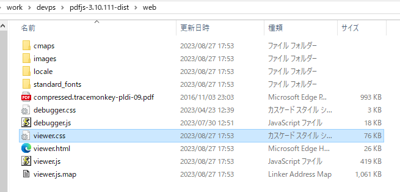

4.	サーバ上の適当な場所にpdfjsフォルダをアップロードします。

5.	Apacheのドキュメントルートにpdfjsフォルダを移動させます。
	
	Apacheのドキュメントルートの設定手順については [11-1. ファイルサーバ連携設定](#sec1101)を参照してください。

	```Text 
	sudo mv pdfjs /var/www/html/
	```

	本手順完了後はApacheの再起動は不要です。

<a id="sec1807"></a>

## 18-7. デプロイ後の確認

1.	http://&lt;サーバマシンのIPアドレス&gt;/plateau/ にアクセス

	下記のように表示されていればデプロイが正常に行われています。

	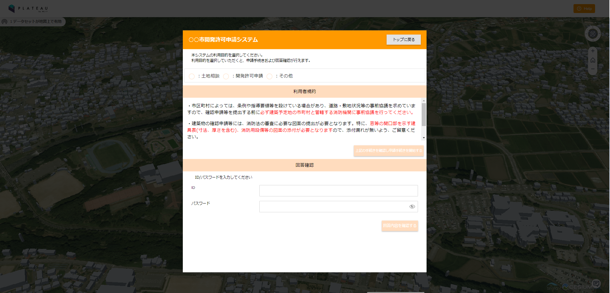

<a id="sec1900"></a>

# 19 アプリケーション設定ファイル更新(3DViewer)

3DViewerでは、以下3種類の設定ファイルを使用します。

搭載するデータに合わせて適切に設定を行ってください。

<table>
<colgroup>
<col style="width: 41%" />
<col style="width: 24%" />
<col style="width: 34%" />
</colgroup>
<thead>
<tr class="header">
<th><strong>ファイル名</strong></th>
<th><strong>パス</strong></th>
<th><strong>内容</strong></th>
</tr>
</thead>
<tbody>
<tr class="odd">
<td>config.json</td>
<td>/wwwroot</td>
<td><p>・初期ファイルとして参照するファイルの設定</p>
<p>・アプリケーション名</p>
<p>・ヘルプメニュー内容</p></td>
</tr>
<tr class="even">
<td><p>development_permission_init.json</p>
<p>（Initファイル）</p></td>
<td>/wwwroot/init</td>
<td><p>・初期表示位置</p>
<p>・搭載レイヤ</p></td>
</tr>
<tr class="odd">
<td>customconfig.json</td>
<td>/packages/terriajs</td>
<td><p>・GeoServerのURL</p>
<p>・地番レイヤ設定</p>
<p>・ランドマーク、建物データ設定</p></td>
</tr>
</tbody>
</table>


<a id="sec1901"></a>

## 19-1. config.json

本書ではカスタマイズが必要な箇所のみ記載します。

詳細なカスタマイズ手順はTerria公式サイトの以下ページを参照してください。

<https://docs.terria.io/guide/customizing/client-side-config/>

<table>
<colgroup>
<col style="width: 36%" />
<col style="width: 35%" />
<col style="width: 28%" />
</colgroup>
<thead>
<tr class="header">
<th><strong>プロパティ名</strong></th>
<th><strong>初期値</strong></th>
<th><strong>内容</strong></th>
</tr>
</thead>
<tbody>
<tr class="odd">
<td>initializationUrls</td>
<td>development_permission_init</td>
<td><p>・初期ファイルとして参照するInitファイル名。</p>
<p>Initファイルを変える場合、記載を変更。</p></td>
</tr>
</tbody>
</table>

<a id="sec1902"></a>

## 19-2. development\_permission\_init.json

本書ではカスタマイズが必要な箇所のみ記載します。

詳細なカスタマイズ手順はTerria公式サイトの以下ページを参照してください。

<https://docs.terria.io/guide/customizing/initialization-files/>

<https://docs.terria.io/guide/connecting-to-data/catalog-items/>

主なプロパティ一覧は下記になります。

<table>
<colgroup>
<col style="width: 36%" />
<col style="width: 63%" />
</colgroup>
<thead>
<tr class="header">
<th><strong>プロパティ名</strong></th>
<th><strong>内容</strong></th>
</tr>
</thead>
<tbody>
<tr class="odd">
<td>homeCamera</td>
<td>ホームボタン押下時に表示する範囲</td>
</tr>
<tr class="even">
<td>initialCamera</td>
<td>初期表示範囲とカメラ位置</td>
</tr>
<tr class="odd">
<td>baseMaps</td>
<td><p>ベースマップ（航空写真等の背景図）</p>
<p>Items：選択セット一覧を定義</p>
<p>enabledBaseMaps：利用可能背景図一覧</p></td>
</tr>
<tr class="even">
<td>catalog</td>
<td><p>レイヤ一覧</p>
<p>※建物モデル、ランドマーク、判定レイヤ等</p></td>
</tr>
<tr class="odd">
<td>workbench</td>
<td>初期表示するレイヤ一覧</td>
</tr>
</tbody>
</table>

以下に、各カスタマイズ箇所の設定手順を記載します。

1.	カメラ位置

	homeCameraと inititalCameraを修正し、表示させたい位置に合わせます。

	


2.	航空写真

	独自に航空写真と地形データを用意している場合、baseMapsのitemsを編集します。

	デフォルト設定を利用する場合、変更不要です。

	

	背景地図を追加した場合、

	baseMapsのenabledBaseMapsを編集します。

	<span style="color:red;">背景地図はenabledBaseMapsに指定した最初の要素が常に表示されます。※切替不可</span>

	

3.	建物モデル

	catalogのmembersの中の「//データセット/建物モデル」を編集します。

	

	workbenchを編集します。

	

4.	ランドマーク

	Catalogのmembersの中の「//データセット/ランドマーク」を編集します。

	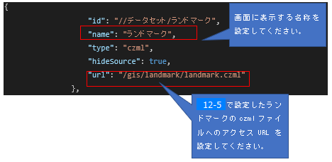

5.	判定レイヤ

	「//データセット/判定レイヤ」の下に各判定レイヤの設定を追加してください。

	

	※GeoServerのURLは以下のフォーマットとなります。

	http://\[WebサーバのIPアドレス\]/\[ワークスペース名\]/wms

	※GeoServerのレイヤ名は以下のフォーマットとなります。
	```Text 
	[ワークスペース名]:[レイヤタイトル]
	```
	GeoServerサイトの「レイヤプレビュー」の「ユーザ名」に表示される内容になります。

<a id="sec1903"></a>

## 19-3. customconfig.json

以下プロパティ一覧です。

環境に合わせて変更してください。

<table style="width:100%;">
<colgroup>
<col style="width: 15%" />
<col style="width: 25%" />
<col style="width: 30%" />
<col style="width: 30%" />
</colgroup>
<thead>
<tr class="header">
<th><strong>プロパティ①</strong></th>
<th><strong>プロパティ②</strong></th>
<th><strong>内容</strong></th>
<th><strong>初期値</strong></th>
</tr>
</thead>
<tbody>
<tr>
<td rowspan="17">config</td>
<td>apiUrl</td>
<td>APIのルートパス</td>
<td>/api</td>
</tr>
<tr>
<td>simulatorApiUrl</td>
<td>シミュレータAPIのルートパス</td>
<td>/simulatorapi</td>
</tr>
<tr>
<td>pdfViewerUrl</td>
<td>pdfjsのルートパス</td>
<td>/pdfjs</td>
</tr>
<tr>
<td>geoserverUrl</td>
<td>GeoServerのベースパス(wms)</td>
<td>/geoserver/devps/wms</td>
</tr>
<tr>
<td>geoserverWfsUrl</td>
<td>GeoServerのベースパス(wfs)</td>
<td>/geoserver/devps/ows</td>
</tr>
<tr>
<td>landmarkUrl</td>
<td>ランドマークデータのURL(czml)</td>
<td>/gis/landmark/landmark.czml</td>
</tr>
<tr>
<td>maxFileSize</td>
<td>アップロードファイル1つの最大サイズ(MB)</td>
<td>50</td>
</tr>
<tr>
<td>maxRequestFileSize</td>
<td>アップロードファイル全体の最大サイズ(MB)</td>
<td>100</td>
</tr>
<tr>
<td>answerReportName</td>
<td>回答レポートの出力ファイル名の接頭句</td>
<td>行政回答レポート</td>
</tr>
<tr>
<tr>
<td>applicationSearchResultFileName</td>
<td>申請情報検索結果の出力ファイル名</td>
<td>申請情報検索結果</td>
</tr>
<tr>
<td>inquirySearchResultFileName</td>
<td>問い合わせ情報検索結果の出力ファイル名</td>
<td>問い合わせ情報検索結果</td>
</tr>
<tr>
<td>governmentAddAnswerTitle</td>
<td>行政 事前協議 追加回答タイトル</td>
<td>その他</td>
</tr>
<tr>
<td>answerContentUpdatingInfoText</td>
<td>行政 事前協議 回答精査中表示文言</td>
<td>行政担当者で回答修正中</td>
</tr>
<tr>
<td>topButtonUrl</td>
<td>トップ画面URL</td>
<td>https://example.com</td>
</tr>
<tr>
<td>questionnaireUrlForBusiness</td>
<td>事業者向けアンケート画面のURL</td>
<td>https://path.to.questinnaire/for/business</td>
</tr>
<tr>
<td>questionnaireUrlForGoverment</td>
<td>行政向けアンケート画面のURL</td>
<td>
<p>https://path.to.questinnaire/for/government</p>

<p style="color: red;">/SRC/3dview/wwwroot/login/index.htmlの175行目のリンク（以下）もそろえて修正してください。</p>
<p>let url = "https://path.to.questinnaire/for/government";</p>
</td>
</tr>

<tr>
<td rowspan="22">layer</td>
<td>lotnumberSearchLayerNameForGoverment</td>
<td>地番検索結果（行政）のGeoServer上のレイヤ名</td>
<td>devps:地番検索結果（行政）</td>
</tr>
<tr>
<td>lotnumberSearchLayerDisplayNameForGoverment</td>
<td>地番検索結果（行政）レイヤの表示名称</td>
<td>地番検索結果（行政）</td>
</tr>
<tr>
<td>lotnumberSearchViewParamNameForGoverment</td>
<td>地番検索結果（行政）のGeoServer問い合わせクエリパラメータ</td>
<td>lot_numbers:</td>
</tr>
<tr>
<td>lotnumberSearchLayerNameForBusiness</td>
<td>地番検索結果（事業者）のGeoServer上のレイヤ名</td>
<td>devps:地番検索結果（事業者）</td>
</tr>
<tr>
<td>lotnumberSearchLayerDisplayNameForBusiness</td>
<td>地番検索結果（事業者）レイヤの表示名称</td>
<td>地番検索結果（事業者）</td>
</tr>
<tr>
<td>lotnumberSearchViewParamNameForBusiness</td>
<td>地番検索結果（事業者）のGeoServer問い合わせクエリパラメータ</td>
<td>lot_numbers:</td>
</tr>
<tr>
<td>lotnumberSearchLayerNameForSelected</td>
<td>選択中地番のGeoServer上のレイヤ名</td>
<td>devps:選択中地番</td>
</tr>
<tr>
<td>lotnumberSearchLayerDisplayNameForSelected</td>
<td>選択中地番レイヤの表示名称</td>
<td>選択中地番</td>
</tr>
<tr>
<td>lotnumberSearchViewParamNameForSelected</td>
<td>選択中地番のGeoServer問い合わせクエリパラメータ</td>
<td>lot_numbers:</td>
</tr>
<tr>
<td>lotnumberSearchLayerNameForApplicationTarget</td>
<td>申請対象地番のGeoServer上のレイヤ名</td>
<td>devps:申請対象地番</td>
</tr>
<tr>
<td>lotnumberSearchLayerDisplayNameForApplicationTarget</td>
<td>申請対象地番レイヤの表示名称</td>
<td>申請対象地番</td>
</tr>
<tr>
<td>lotnumberSearchViewParamNameForApplicationTarget</td>
<td>申請対象地番のGeoServer問い合わせクエリパラメータ</td>
<td>lot_numbers:</td>
</tr>
<tr>
<td>lotnumberSearchLayerNameForApplying</td>
<td>申請中地番のGeoServer上のレイヤ名</td>
<td>devps:申請中地番</td>
</tr>
<tr>
<td>lotnumberSearchLayerDisplayNameForApplying</td>
<td>申請中地番レイヤの表示名称</td>
<td>申請中地番</td>
</tr>
<tr>
<td>lotnumberSearchLayerNameForAll</td>
<td>申請中地番のGeoServer問い合わせクエリパラメータ</td>
<td>devps:全地番</td>
</tr>
<tr>
<td>lotnumberSearchLayerDisplayNameForAll</td>
<td>全地番レイヤの表示名称</td>
<td>筆界</td>
</tr>
<tr>
<td>lotnumberSearchLayerNameForApplicationSearchTarget</td>
<td>申請情報表示地番のGeoServer上のレイヤ名</td>
<td>devps:申請情報表示地番</td>
</tr>
<tr>
<td>lotnumberSearchLayerDisplayNameForApplicationSearchTarget</td>
<td>申請情報表示地番レイヤの表示名称</td>
<td>申請情報表示地番</td>
</tr>
<tr>
<td>lotnumberSearchViewParamNameForApplicationSearchTarget</td>
<td>申請情報表示地番のGeoServer問い合わせクエリパラメータ</td>
<td>lot_numbers:</td>
</tr>
<tr>
<td>lotnumberSearchLayerNameForSelectedFullFlag</td>
<td>全筆対象外地番のGeoServer上のレイヤ名</td>
<td>devps:全筆かからない筆選択地番</td>
</tr>
<tr>
<td>lotnumberSearchLayerDisplayNameForSelectedFullFlag</td>
<td>全筆対象外地番レイヤの表示名称</td>
<td>全筆かからない筆</td>
</tr>
<tr>
<td>lotnumberSearchViewParamNameForSelectedFullFlag</td>
<td>全筆対象外地番のGeoServer問い合わせクエリパラメータ</td>
<td>lot_numbers:</td>
</tr>

<tr>
<td rowspan="2">landMark</td>
<td>id</td>
<td><p>ランドマークレイヤのID</p>
<p>※<a href="#sec1902">19-2</a>の手順4で設定したIDになります。</p></td>
<td>//データセット/ランドマーク</td>
</tr>
<tr>
<td>displayName</td>
<td>申請地選択画面でのランドマークレイヤの表示名称</td>
<td>ランドマーク</td>
</tr>

<tr>
<td>buildingModel</td>
<td>id</td>
<td><p>3D建物モデルのID</p>
<p>※<a href="#sec1902">19-2</a>の手順3で設定したIDになります。</p>
<p>建物モデルを搭載しない場合、空文字としてください。</p></td>
<td>//データセット/建物モデル</td>
</tr>

<tr>
<td>buildingModelFor2d</td>
<td>id</td>
<td><p>2D建物モデルのID</p>
<p>※別途2D用の建物モデルを使用している場合使用ください（WMSやMVT等）</p>
<p>2D用の建物モデルを搭載しない場合、空文字としてください。</p></td>
<td>//データセット/2D建物モデル</td>
</tr>

<tr>
<td rowspan="3">wfs</td>
<td>identify_text</td>
<td>WFSレイヤの識別テキスト</td>
<td>@wfs</td>
</tr>
<tr>
<td>road_width_identify_text</td>
<td>道路幅員判定レイヤの識別テキスト</td>
<td>{widthText}</td>
</tr>
<tr>
<td>czmlTemplate</td>
<td><p>道路幅員ラベルのCZML表示設定</p>
<p>設定を変更する際は<a href="https://github.com/AnalyticalGraphicsInc/czml-writer/wiki/CZML-Guide">CZMLガイド</a>を参照。</p>
</td>
<td>"road_width": {(省略)}</td>
</tr>

<tr>
<td>NotDraggableItem</td>
<td>　</td>
<td>レイヤ一覧にドラッグ＆トラック不可のレイヤリスト</td>
<td><p>//ランドマーク</p>
	<p>//3D都市モデル</p></td>
</tr>

<tr>
<td rowspan="3">QuestionaryActived</td>
<td>UserAgreementView</td>
<td>利用規約画面からアンケート画面開くか否か</td>
<td>FALSE</td>
</tr>
<tr>
<td>GeneralConditionDiagnosisView</td>
<td>概要診断結果レポート出力画面からアンケート画面開くか否か</td>
<td>TRUE</td>
</tr>
<tr>
<td>ApplyCompletedView</td>
<td>申請完了画面からアンケート画面開くか否か</td>
<td>TRUE</td>
</tr>

<tr>
<td rowspan="8">focusCameraSettings</td>
<td>cesium.focusCameraDirectionX</td>
<td>3D自動フォーカス時のカメラ視線方向 （Cesium.Cartesian3.x）</td>
<td>0.6984744646088341</td>
</tr>
<tr>
<td>cesium.focusCameraDirectionY</td>
<td>3D自動フォーカス時のカメラ視線方向 （Cesium.Cartesian3.y）※固定変更幅あり（-1.0）</td>
<td>-0.6617056496661655</td>
</tr>
<tr>
<td>cesium.focusCameraDirectionZ</td>
<td>3D自動フォーカス時のカメラ視線方向 （Cesium.Cartesian3.z）</td>
<td>0.2725418417221117</td>
</tr>
<tr>
<td>cesium.focusCameraUpX</td>
<td>3D自動フォーカス時のカメラ上方向 （Cesium.Cartesian3.x）</td>
<td>-0.21791222301017105</td>
</tr>
<tr>
<td>cesium.focusCameraUpY</td>
<td>3D自動フォーカス時のカメラ上方向 （Cesium.Cartesian3.y）</td>
<td>0.1660947782238842</td>
</tr>
<tr>
<td>cesium.focusCameraUpZ</td>
<td>3D自動フォーカス時のカメラ上方向 （Cesium.Cartesian3.z）</td>
<td>0.9617311410729739</td>
</tr>
<tr>
<td>cesium.adjust.latitudeHeightAdjustmentFactor</td>
<td>最小・最大緯度差に基づくカメラ高さの補正値</td>
<td>400000</td>
</tr>
<tr>
<td>cesium.adjust.baseHeightOffset</td>
<td>カメラ高さのベース加算値</td>
<td>100</td>
</tr>

<tr>
<td rowspan="2">defaultViewermode</td>
<td>goverment</td>
<td>行政側初期表示Viewer</td>
<td>2d</td>
</tr>
<tr>
<td>business</td>
<td>事業者側初期表示Viewer</td>
<td>3d</td>
</tr>

<tr>
<td rowspan="2">persistViewerMode</td>
<td>goverment</td>
<td>行政側Viewerモードの永続化</td>
<td>FALSE</td>
</tr>
<tr>
<td>business</td>
<td>事業者側Viewerモードの永続化</td>
<td>TRUE</td>
</tr>

<tr>
<td>captureRequiredJudgement</td>
<td>　</td>
<td>
<p>
概況診断レポート キャプチャ必須の概況診断タイプ<br/>
<span style="color:red">
概況診断レポートでキャプチャ機能を使用する場合、<a href="#sec2100">21. シミュレータAPIのデプロイ（Spring Boot）</a> の構築作業が別途必要となります。
</span>
</p>
</td>
<td>0,1</td>
</tr>

<tr>
<td>notifications</td>
<td>　</td>
<td>地図画面下に表示する通知メッセージ</td>
<td>
<p>
以下の形式で指定可能

{

	"tag":"タグ",
	
	"title":"タイトル",
	
	"message":"メッセージ部分<br>メッセージ部分<br>メッセージ部分<br>メッセージ部分"

}
</p>
</td>
</tr>

</tbody>
</table>

<a id="sec2000"></a>

# 20 アプリケーション設定更新（テーマ色）

本システムでは、アプリケーションのテーマ色を自由に設定することが可能です。

テーマ色の設定を変更する際は以下の手順で変更を行ってください。

1. index.htmlを開き、スタイル「.bg 」のbackground-colorを設定します。

	※ソースコードコードパス（**/SRC/3dview/wwwroot/login/index.html**）

	

	行政ログイン画面のヘッダを設定した色で表示します。

	

2. variables.scssを開き、プロパティを設定します。

	※ソースコードパス（**/SRC/3dview/lib/Styles/variables.scss**）

	

	各プロパティ値と画面表示の対応は下表の通りです。
	
	<table style="width:100%;">
		<colgroup>
		<col style="width: 15%" />
		<col style="width: 25%" />
		<col style="width: 30%" />
		</colgroup>
		<thead>
		<tr class="header">
		<th><strong>プロパティ</strong></th>
		<th><strong>説明</strong></th>
		<th><strong>反映箇所</strong></th>
		</tr>
		</thead>
		<tbody>
		<tr class="odd">
		<td>$view-main-color</td>
		<td>プライマリーカラー</td>
		<td>選択状態のタブ、テーブルヘッダ、検索ボタン等</td>
		</tr>
		<tr class="even">
		<td>$view-main-pale-color</td>
		<td>プライマリーカラー（サブ）</td>
		<td>検索条件エリア、項目名等の背景色</td>
		</tr>
		<tr class="odd">
		<td>$view-gray-color</td>
		<td>グレーカラー</td>
		<td>未選択状態のタブ、クリアボタン等</td>
		</tr>
		</tbody>
		</table>
	
	以下が表示イメージです。

	

<!--シミュレータ構築手順-->
<a id="sec2100"></a>
# 21 シミュレータAPIのデプロイ（Spring Boot）

[19-3. customconfig.json](#sec1903) でキャプチャありの概況診断レポート出力を設定する場合シミュレータAPIの構築が別途必須となります。

仮想ブラウザをシミュレートして実行するため、多くのリソースを消費します。

<span style="color:red">必ず申請アプリとは別サーバ上で稼働させてください。</span>

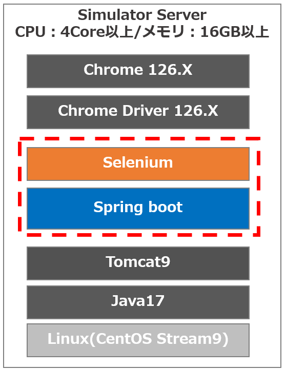

確認済みサーバ環境：CentOS Stream 9
-   必要なMW/SW：

	-	Chrome Version 126.x

	-	Chrome Driver Version 126.x

	-   Apache Tomcat Version 9.0.65

	-   Java Version 17.0.6

	※MWのインストール方法については[5 稼働環境構築（MW,SW）](#sec401) を参照してください。
	
	※Java Versionは17.0.6となりますので注意してください。

	※Chrome及びChrome Driverは<a href="https://developer.chrome.com/docs/chromedriver?hl=ja" target="_blank">Google公式</a>の導入方法を参照してください。

確認済み作業PC環境 ：Windows 10 Pro

<a id="sec2101"></a>

## 21-1. 必要ツールのインストール

※作業PC上にて行う

1.  Spring Tool Suite 4のインストールを行ってください。

	<https://spring.io/tools>

	※インストール方法の参考サイト：

	<https://qiita.com/t-shin0hara/items/d60116ab299a4dc8a9d0>

2.  lombokのインストールを行ってください。

	<https://projectlombok.org/download>

	※インストール方法の参考サイト：

	<https://qiita.com/r_saiki/items/82231ded1450f5ed5671>

<a id="sec2102"></a>

## 21-2. warの作成準備

※作業PC上にて行う

1.	**/SRC/simulator_api**からソースコードを入手し、適当な場所にworkspaceを作成してプロジェクトを配置してください。

	

2.	Spring Tool Suite 4を起動して、1. で作成したworkspaceをlaunchしてください。

	

3.	プロジェクトのインポートを行います。

	Import projects .. &gt; Maven &gt; Existing Maven Projectsを選択してください。

	

	Root Directoryにworkspace内に配置したproject folderを指定します。

	

4.	Mavenの更新を行います。

	プロジェクト右クリック&gt; Maven &gt; Update Projectを選択してください。

	

	更新画面でOKを選択すると、Mavenの更新が始まります。

	

5.	src/main/resources/application.propertiesの編集を行ってください。

	プロパティ一覧と、編集を行う箇所は次章を参照してください。

	変更が必要な設定箇所は以下になります。

	-	データベースとの接続情報 ※申請アプリと同様
	-	CORS許可オリジン ※申請アプリと同様
	-	JWTの秘密鍵 ※申請アプリと同様
	-	ChromeDriverのパス
	-	PLATEAU VIEWのURL

	<span style="color: red; ">
	※application.propertiesが文字化けする場合は、application.propertiesを右クリック&gt;properties&gt;Resource&gt;Text file encodingをUTF-8へ変更してください。
	</span>

	

<a id="sec2103"></a>

## 21-3. warの作成　

※作業PC上にて行う

1.	プロジェクト右クリック&gt; Run As &gt; Maven buildを選択してください。

	

2.	Goalsに「package」を入力し、Runボタンを押下します。

	

3.	targetフォルダにsimulatorapi-0.0.1-SNAPSHOT.warが作られていることを確認してください。

<a id="sec2104"></a>

## 21-4. warのデプロイ（シミュレータサーバ側）

1.	シミュレータサーバの適当な場所にsimulatorapi-0.0.1-SNAPSHOT.warをアップロードしてください。ここでは /home/upload/ に転送する事としています。

2.	tomcatに配備します。

	※配備の際、simulatorapi-0.0.1-SNAPSHOT.war から<span style="color: red; ">simulatorapi.war</span>に名前を変更してください。

	```Text
	cd /home/upload/

	sudo mv simulatorapi-0.0.1-SNAPSHOT.war /opt/apache-tomcat/webapps/simulatorapi.war
	```

	※配備後にapplication.propertiesを編集する場合は下記のように行います。編集後、保存して再起動を行ってください。
	```Text
	sudo vi /opt/apache-tomcat/webapps/simulatorapi/WEB-INF/classes/application.properties

	sudo systemctl restart tomcat
	```
## 21-5. application.properties

<table>
<colgroup>
<col style="width: 33%" />
<col style="width: 6%" />
<col style="width: 6%" />
<col style="width: 25%" />
<col style="width: 28%" />
</colgroup>
<thead>
<tr class="header">
<th rowspan="2"><strong>プロパティ名</strong></th>
<th colspan="2"><strong>環境設定</strong></th>
<th rowspan="2"><strong>内容</strong></th>
<th rowspan="2"><strong>設定値</strong></th>
</tr>
<tr>
<th><strong>必須</strong></th>
<th><strong>任意</strong></th>
</tr>
</thead>
<tbody>
<tr>
<td>spring.jpa.database</td>
<td>　</td>
<td>　</td>
<td>データベース種類</td>
<td>POSTGRESQL</td>
</tr>
<tr>
<td>spring.datasource.url</td>
<td>○</td>
<td>　</td>
<td>データベース接続情報</td>
<td>
<p>
jdbc:postgresql://[DBサーバのIPアドレス]:[DBサーバのポート番号]/[データベース名]

<span style="color: red; ">※申請アプリと同様</span>
</p>
</td>
</tr>
<tr>
<td>spring.datasource.username</td>
<td>○</td>
<td>　</td>
<td>データベースアクセスに使用するユーザ名</td>
<td>postgres</td>
</tr>
<tr>
<td>spring.datasource.password</td>
<td>○</td>
<td>　</td>
<td>データベースアクセスに使用するパスワード</td>
<td>（省略）</td>
</tr>
<tr>
<td>app.cors.allowed.origins</td>
<td>○</td>
<td></td>
<td>CORS許可オリジン</td>
<td>
<p><span style="color: red; ">本API実行を許可するoriginを指定</span>
<br>
例）https://example.com

<span style="color: red; ">※申請アプリと同様</span>
</p>
</td>
</tr>
<tr>
<td>app.filter.ignore</td>
<td>　</td>
<td>　</td>
<td>フィルタの例外パス</td>
<td>（省略）</td>
</tr>
<tr>
<td>app.filter.goverment</td>
<td>　</td>
<td>　</td>
<td>フィルタの行政のみ許可するパス</td>
<td>（省略）</td>
</tr>
<tr>
<td>app.filter.unable</td>
<td>　</td>
<td>　</td>
<td>アクセス不能パス</td>
<td>（省略）</td>
</tr>
<tr>
<td>app.jwt.token.secretkey</td>
<td>○</td>
<td></td>
<td><p>JWTの秘密鍵</p>
<p></p>
<p><span style="color: red; ">※tokenの検証や署名で使用</span></p></td>
<td>
<p>
[自治体固有のsecretKey]

<span style="color: red; ">※申請アプリと同様</span>
</p>
</td>
</tr>

<tr>
<td>app.simulation.task.limit</td>
<td></td>
<td></td>
<td>
<p>シミュレート実行の同時実行数上限</p>
</td>
<td>5</td>
</tr>
<tr>
<td>app.simulation.task.timeout.max.seconds</td>
<td></td>
<td></td>
<td>
<p>シミュレート実行の最大待ち時間(秒)</p>
</td>
<td>1200</td>
</tr>
<tr>
<td>logging.file.nam</td>
<td></td>
<td></td>
<td>
<p>ログ出力定義</p>
</td>
<td>/opt/apache-tomcat/logs/simulatorapi/simulatorapi.log</td>
</tr>
<tr>
<td>webdriver.chrome.driver</td>
<td>〇</td>
<td></td>
<td>
<p>ChromeDriverのパス</p>
</td>
<td>/opt/apache-tomcat/chrome/chromedriver</td>
</tr>
<tr>
<td>webdriver.chrome.driver.log</td>
<td></td>
<td></td>
<td>
<p>ChromeDriverのログパス</p>
</td>
<td>/opt/apache-tomcat/chrome/log/chromedriver.log</td>
</tr>
<tr>
<td>app.plateau.url</td>
<td>〇</td>
<td></td>
<td>
<p>PLATEAU VIEWのURL</p>
</td>
<td>
<p>
https://example.com/plateau

<span style="color: red; ">※3DViewerのURL</span>
</p>
</td>
</tr>
<td>tomcat.util.scan.StandardJarScanFilter.jarsToSkip</td>
<td>　</td>
<td>　</td>
<td>　</td>
<td>*-*.jar</td>
</tr>
<tr>
<td>spring.mvc.hiddenmethod.filter.enabled</td>
<td>　</td>
<td>　</td>
<td>　</td>
<td>TRUE</td>
</tr>
<tr>
<td>spring.webflux.hiddenmethod.filter.enabled</td>
<td>　</td>
<td>　</td>
<td>　</td>
<td>TRUE</td>
</tr>
<tr>
<td>spring.mvc.pathmatch.matching-strategy</td>
<td>　</td>
<td>　</td>
<td>　</td>
<td>ANT_PATH_MATCHER</td>
</tr>
<tr>
<td>logging.level.org.springframework.web</td>
<td>　</td>
<td>○</td>
<td>アプリケーションログ出力レベル設定</td>
<td>INFO</td>
</tr>
<tr>
<td>logging.level.developmentpermission</td>
<td>　</td>
<td>○</td>
<td>アプリケーションログ出力レベル設定</td>
<td>DEBUG</td>
</tr>
</tbody>
</table>

## 21-6. Apacheの設定(申請アプリ側)

1.	httpd.conf を編集します。

	```Text 
	sudo vi /etc/httpd/conf/httpd.conf
	```

	最終行に以下の内容を追記して保存します。

	```Text
	ProxyPass /simulatorapi http://<シミュレータサーバのIPアドレス>:8080/simulatorapi

	ProxyPassReverse /simulatorapi http://<シミュレータサーバのIPアドレス>:8080/simulatorapi
	```

2.	設定を反映する為、apacheの再起動を行います。

	```Text 
	sudo systemctl restart httpd
	```