# 1. システム全体像
本システムは、事業者からの開発許可にかかわる事前相談申請、申請に対して行政担当者からの回答を行うシステムであり、Webブラウザにて操作します。

# 2. システム起動
1. 起動URLは　*http://[servername]/plateau/*　で接続します。*[servername]* はシステム構築時に割り当てたURLです。
2. 起動後、利用者規約の同意ボタンをクリックします。
3. 行政担当者の回答を確認したい場合は、ID、パスワードを入力し、回答内容を確認するボタンをクリックします。
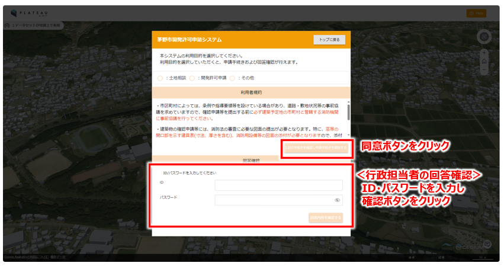

# 3. 地図画面説明
## 機能ボタン
事業者向け地図画面の機能ボタンは以下の通りです。
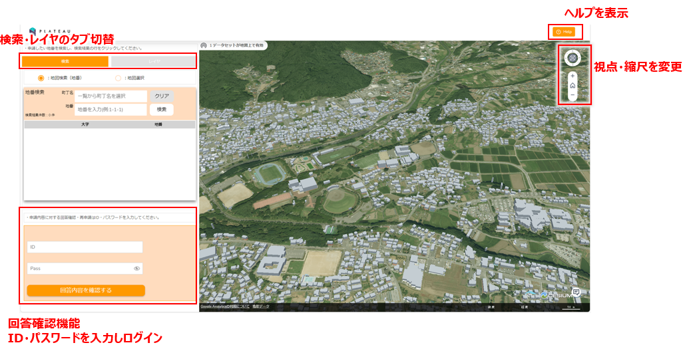

## レイヤ表示
以下の操作で開発許可事務で使用するデータを3D地図上に表示し、確認できます。
1. 「項目名」の▼ボタンをクリックすると各種データリストが展開されます。データ右の「□」ボタンをクリックすると、データが地図に表示されます。

# 4. 事業者による申請条件入力と概況把握
事業者がシステムを操作し、対話的に対象地と申請区分を指定します。申請区分は設定により複数の区分を指定できます。一例としては以下の流れとなります。なお、申請区分には一つだけ指定する単一項目選択と、複数を指定する複数項目選択があります。
対象地を指定し、申請区分の設定後、概況診断を行います。結果は画面上で確認できるほか、Excel形式のレポートとしてダウンロードすることができます。
1. 申請対象地の選択
2. 申請区分選択
3. 概況診断実行
4. 診断結果の表示
5. 概況診断レポート出力

対象地と申請区分を指定後、概況診断を行います。

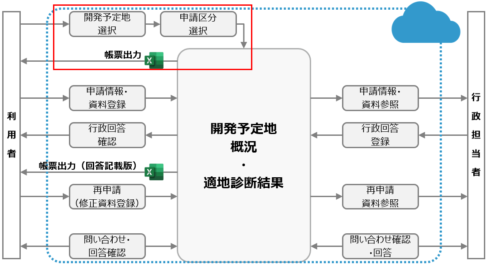

##  申請範囲選択
対象地を指定する方法として、地番から検索する方法と地図上から選択する方法があります。それぞれについて説明します。

## 申請範囲選択（地番文字情報から選択）
1. 「地図検索（地番）」をクリックします。
2. 町丁名をクリックすると、リストが表示されるので、対象の町名を選択します。リスト下部に「かな検索」ボタンがあり、クリックすると「かな」の仮想キーボードを表示されます。町名の先頭読みを入力すると、リストが絞り込まれます。
3. 町名を指定後、地番の指定があれば可能な範囲で入力し、「検索」ボタンをクリックします。
4. 町名と地番の先頭から一致する対象が、リストに表示されます。
5. リストのレコードをクリックすると、3D地図画面に該当地点を表示します。
6. 申請対象地のチェックボックスをチェックすると、申請地選択結果に追加されます。ここで、必要な地番をすべて追加します。追加した地番は、地図上でハイライト（黄色）表示されます。
7. 間違った地番を追加したら、申請地選択画面の該当地番右にある「ごみ箱」ボタンをクリックします。
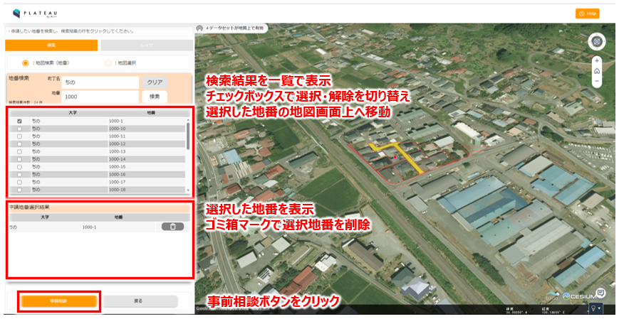
※ 地名・地域は実際の開発許可エリアではありません。操作例として表示しています。

## 申請範囲選択（地図から選択）
1. 申請地番画面の「地図選択」をクリックします。検索画面がグレーになります。
2. 地図画面上で以下の操作により、該当する地番が申請地番画面に追加されます。
	- 選択されていない地番をクリックすると、申請地番リストに追加し、ハイライト（黄色）表示します。選択されている地番をクリックすると、申請地番リストから削除します。
	- キーボードの「Alt」キーを押したまま地図上でドラッグ操作を行うと、囲んだ範囲を一括して選択し、申請地番リストに追加します。
3. 申請地番画面の「地図検索（地番）」ボタンをクリックすると、町名から指定する検索操作に戻ります。
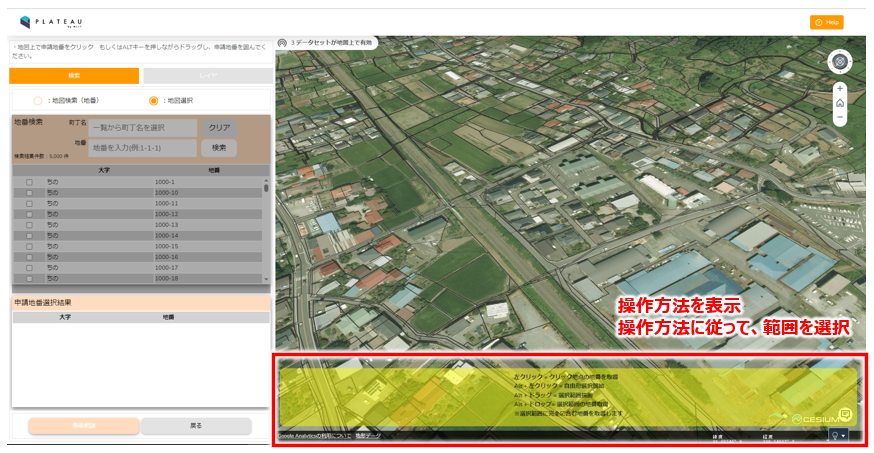
※ 地名・地域は実際の開発許可エリアではありません。操作例として表示しています。

##  申請区分選択
申請区分を設定する際の単一選択時、複数選択時の操作について説明します。
## 申請区分（単一項目）選択
申請区分（単一項目）選択では、ドロップダウンから該当する項目を選択して、画面下の「次へ」ボタンをクリックします。
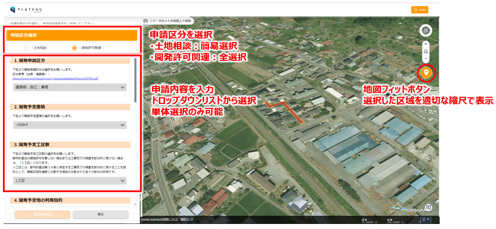

## 申請区分（複数項目）選択
申請区分（複数項目）選択では、左側の選択肢から該当する項目にチェックを入れます。誤って選択した場合は、チェックボックスを再度クリックしてチェックを外します。

## 概況診断実行
申請地番画面の「概況診断」ボタンをクリックすると、設定した条件で診断が行われます。

## 診断結果表示
概況診断を実行後、概況診断結果が概況診断結果画面に表示されます。

## 各条項の詳細表示
概況診断結果画面には、以下の情報を表示します。
|表示項目|内容|
|---|---|
|対象|判定した規制情報を表示|
|判定結果|事前相談の要否、担当部署を表示|
|距離|対象地と規制情報の位置関係を表示|
各行にマウスを重ねると、詳細な説明文をポップアップ表示します。また、行をクリックすると判定に用いたGISデータを3D地図画面の表示します。

※ 地名・地域は実際の開発許可エリアではありません。操作例として表示しています。

## 道路判定結果の表示
1. 概況診断結果画面で、「周辺道路の幅院について」の表示がある項目をクリックすると、道路判定結果が表示されます。

※ 地名・地域は実際の開発許可エリアではありません。操作例として表示しています。

## 帳票出力
1. 概況診断結果画面で、「出力」ボタンをクリックします。
2. 画面上部に「現在マップで表示されている領域に申請地が全て含まれるようにしてください。このままレポートの出力を開始しますか？」と確認が表示されます。
3. 画面表示位置を確認し、「はい」を選択します。
4. 出力処理中、画面には次のメッセージとともに進捗率を表示します。「処理中です。暫く画面はこのままでお待ちください。」

※ 地名・地域は実際の開発許可エリアではありません。操作例として表示しています。

# 5. 事業者による申請
事業者は概況診断を実行後、概況診断結果画面の「申請」ボタンをクリックすることで、申請手続きへ進みます。
1. 申請者情報の入力
2. 申請ファイルのアップロード
3. 申請内容の確認
4. 申請時の概況診断帳票生成
5. 申請完了とメール通知

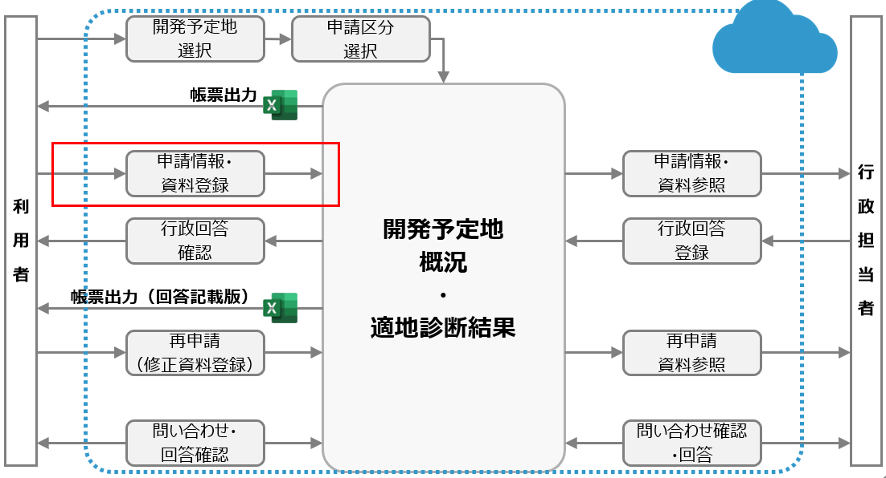

## 申請者情報の入力
以下の情報を入力し、画面下の「次へ」ボタンをクリックします。
- 氏名
- メールアドレス
- 電話番号（任意）
- 住所（任意）

※必須項目、任意項目については、システム導入時の設定による。

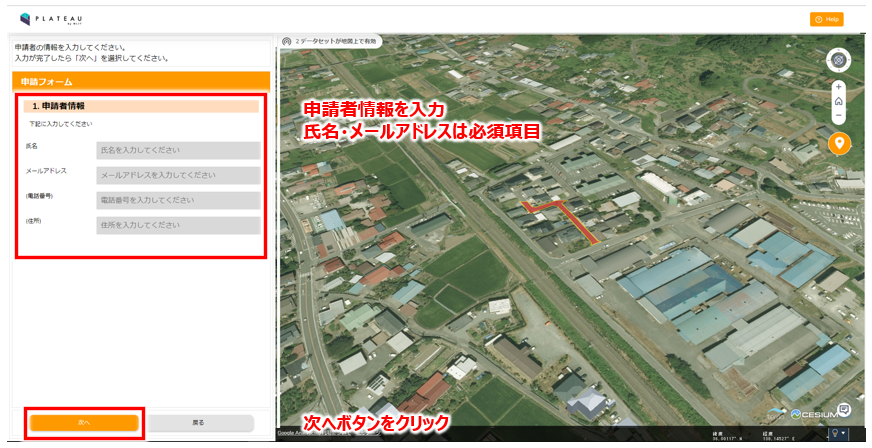
※ 地名・地域は実際の開発許可エリアではありません。操作例として表示しています。

## 申請ファイルのアップロード
判定により必要な資料の項目が表示されます。事業者は、各項目の「登録」ボタンにて該当する資料のファイルを指定してください。複数ファイルを指定することもできます。すべて指定したら、画面下の「次へ」ボタンをクリックします。
※ 地名・地域は実際の開発許可エリアではありません。操作例として表示しています。

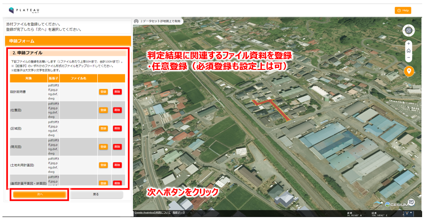
※ 地名・地域は実際の開発許可エリアではありません。操作例として表示しています。

## 申請内容の確認
申請区分、申請地、申請者情報、添付ファイルについて、表示します。確認して修正がある場合は「戻る」ボタン、申請する場合は「申請」ボタンをクリックします。

※ 地名・地域は実際の開発許可エリアではありません。操作例として表示しています。

## 申請時の概況診断レポート生成
1. 申請にあたり、概況診断レポートを作成します。これは、概況診断時にレポート出力するものと同様ですが、出力していても再度実行します。
2. レポート作成時に「申請に必要なレポートの生成を行います。現在マップで表示されている領域に申請地がすべて含まれるようにしてください。このまま申請を開始しますか？」とメッセージが表示されます。
3. 画面表示位置を確認し、「はい」を選択します。
4. 出力処理中、画面には次のメッセージとともに進捗率を表示します。「処理中です。暫く画面はこのままでお待ちください。」

※ 地名・地域は実際の開発許可エリアではありません。操作例として表示しています。

## 申請完了とメール通知
申請処理が完了すると、画面に「申請完了」とともに、回答を確認する際に必要となる「ログインID」「パスワード」を表示します。この画面のテキストは、選択してコピー可能です。

※ 地名・地域は実際の開発許可エリアではありません。操作例として表示しています。

ログイン情報は、申請者（事業者）へメールでも通知します。また、行政の関係課へも申請があった旨、メールで通知されます。

# 6. 行政担当者による申請情報検索・参照
事業者の申請を受け、行政担当者は申請情報を確認します。行政担当者は担当課ごとのアカウントを用いてログインする必要があります。
1. 行政担当者ログイン
2. 申請情報検索
3. 検索結果表示

## 行政担当者ログイン
## ログイン
行政担当者は、以下の認証画面から担当課ごとに設定されているアカウント情報（IDとパスワード）を用いてログインすることで、行政担当者向け機能を利用できます。
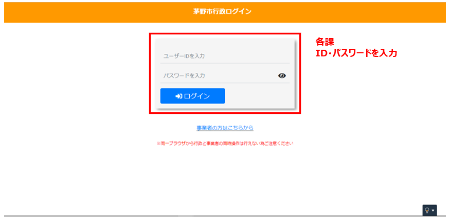

## 地図画面
行政担当者向け地図画面の機能ボタンは以下の通りです。

※ 地名・地域は実際の開発許可エリアではありません。操作例として表示しています。

## 申請参照
3D地図上には、これまでに申請された区域がハイライト（赤色）表示されます。この区域をクリックすると、該当する申請情報を参照することができます。この申請情報詳細画面は、「検索結果表示」で説明します。

※ 地名・地域は実際の開発許可エリアではありません。操作例として表示しています。

## 申請情報検索
地図画面の「申請情報検索」ボタンから申請情報検索画面を表示します。検索条件として、以下を指定できます。そして「検索」ボタンで設定条件で申請を検索すると、画面下部に結果をリスト表示されます。なお、「クリア」ボタンでは設定している検索条件をすべて消去します。
|分類|検索項目|備考|
|---|---|---|
|申請者情報|氏名|入力した文字を含む申請を検索する。|
||メールアドレス|入力した文字を含む申請を検索する。|
||電話番号|入力した文字を含む申請を検索する。|
||住所|入力した文字を含む申請を検索する。|
|ステータス|ステータス|申請中、回答中（未回答課あり）、回答完了、通知済み、通知済み（要再申請）から選択|
|担当課|担当課|リストから一つ選択|
|申請区分|条件1|申請区分で設定した項目から選択する。|
||条件2|申請区分で設定した項目から選択する。|
||条件3|申請区分で設定した項目から選択する。|

※ 地名・地域は実際の開発許可エリアではありません。操作例として表示しています。

## 検索結果表示
1. 申請情報検索画面の検索結果リスト各行をクリックすると3D地図画面が申請対象地へ移動します。また、検索結果リスト各行の「詳細」ボタンをクリックすると、申請情報詳細画面が表示されます。

※ 地名・地域は実際の開発許可エリアではありません。操作例として表示しています。

2. 申請情報詳細画面では、申請情報の詳細、添付ファイルの一覧を表示します。添付ファイル左の「ダウンロード」ボタンをクリックすると、申請時にアップロードされたファイルおよび概況診断結果レポートをダウンロードすることができます。

※ 地名・地域は実際の開発許可エリアではありません。操作例として表示しています。

# 7. 行政担当者による回答入力
行政担当者は、回答対象の申請に対して内容を確認し、回答を入力します。
1. 回答入力
2. 全部署の回答が完了

## 回答入力
1. 申請情報詳細画面の「回答登録」ボタンをクリックします。回答入力画面が表示されます。

※ 地名・地域は実際の開発許可エリアではありません。操作例として表示しています。

2. 回答入力画面では、対象と判定結果が表示され、ログインしたアカウントにより回答可能な対象について、回答を入力できます。回答内容については、回答テンプレートより定型文を選択することが出来ます。

※ 地名・地域は実際の開発許可エリアではありません。操作例として表示しています。

3. 回答入力画面下部の「添付ファイル一覧」にある「追加」ボタンをクリックし、回答に関連する資料を指定します。
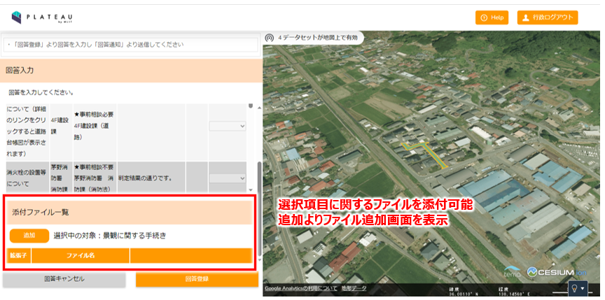
※ 地名・地域は実際の開発許可エリアではありません。操作例として表示しています。

4. 「ファイル選択」ボタンをクリックし、添付する資料を指定します。申請ファイルを引用する場合は、申請ファイルの一覧の右側にある「引用」ボタンをクリックします。PDFファイル選択時のみ、編集ページ選択画面へ遷移します。

※ 地名・地域は実際の開発許可エリアではありません。操作例として表示しています。

5. PDFファイルを引用した場合、編集ページ選択画面が開きます。上部にある「表示ページを編集」ボタンをクリックすると、編集画面が開きます。

※ 地名・地域は実際の開発許可エリアではありません。操作例として表示しています。

6. JPG・PNGファイル等を引用する場合は編集ページが開きます。各ボタンの説明は以下となります。

※ 地名・地域は実際の開発許可エリアではありません。操作例として表示しています。

7. 回答の入力及び資料ファイルを指定したら、「回答登録」ボタンをクリックします。回答完了画面が表示されます。

※ 地名・地域は実際の開発許可エリアではありません。操作例として表示しています。

## 全部署の回答が完了
すべての部署が回答を登録すると、システムは管理者へメールを送信します。
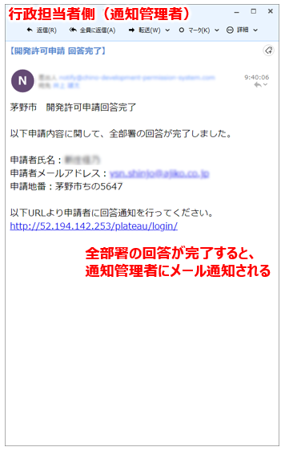

# 8. 行政担当者（管理者）による通知
管理者は、すべての回答が揃っている申請に対して、事業者へ回答完了している旨を通知します。
1. すべての課が回答完了している申請の検索
2. 事業者への通知

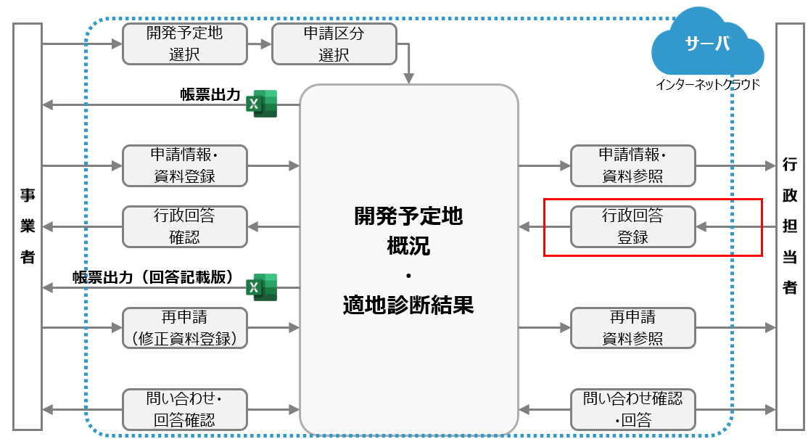

## すべての課が回答完了している申請の検索
すべての回答が完了している申請は、申請情報検索画面で「ステータス」に回答完了を指定することで検索できます。事業者へ回答完了したことを通知するには、まず、検索結果の該当する申請に対して「詳細」ボタンをクリックします。申請情報詳細画面が表示されます。
なお、事業者への通知は、すべての回答が完了していなくても、通知は可能です。
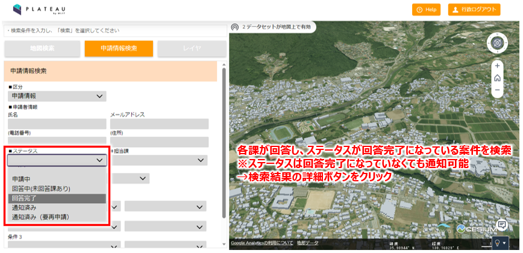
※ 地名・地域は実際の開発許可エリアではありません。操作例として表示しています。

## 事業者への通知
1. 申請情報詳細画面の「回答通知」ボタンをクリックします。この操作は、権限を持つアカウントでのみ可能です。
2. 回答通知メールを送信した旨、表示されます。

※ 地名・地域は実際の開発許可エリアではありません。操作例として表示しています。

2. 事業者に届くメール通知内容は以下のとおりです。
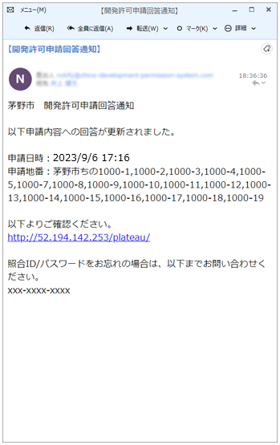

# 9. 事業者による申請内容への回答確認
行政担当者（管理者）から回答完了のメールを受信した事業者は、システムにログインして内容を確認します。
1. 申請時のID/パスワード認証
2. 回答確認

## 申請時のID/パスワード認証
1. 地図画面の「回答確認」ボタンをクリックします。申請・回答内容確認画面が表示されます。
2. 申請・回答内容確認画面に、申請時に画面表示及びメール送付されたID・パスワードを入力する回答内容画面が表示されます。

## 回答確認
1. 事業者は、回答内容画面から対象ごとの回答内容を確認します。
2. 対象ごとに回答に添付された資料ファイルを確認できます。左の「ダウンロード」ボタンからダウンロードします。

3. 「回答レポート出力」ボタンをクリックすると、行政回答レポートが印字された概況診断結果が出力されます。
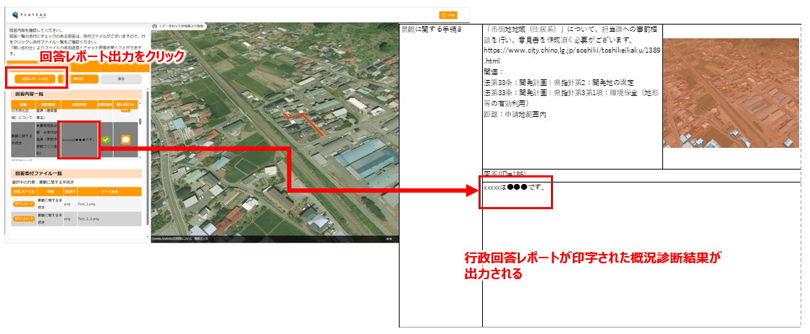

# 10. 事業者による再申請
事業者は、行政担当者からの回答後、再申請が必要な場合は再申請を行います。
1. 再申請画面を開く
2. 再申請対象ファイルをアップロード

## 再申請
1. 「再申請」ボタンクリックし、ファイルアップロード画面を開きます。

## 再申請対象ファイルのアップロード
1. 要再申請に必要な資料の項目が表示されます。事業者は、各項目の「追加」ボタンにて該当する資料のファイルを指定してください。複数ファイルを指定することもできます。すべて指定したら、画面下の「次へ」ボタンをクリックします。

※ 地名・地域は実際の開発許可エリアではありません。操作例として表示しています。

2. 申請内容を確認します。「申請ボタン」ボタンをクリックし、再申請を行います。

# 11. 行政担当者による再回答
行政担当者は、事業者からの再申請後、再回答が必要な場合は再回答を行います。
1. 再回答画面を開く
2. 回答を入力

## 再回答
1. 「詳細」ボタンをクリックし、回答画面を開く
2. 回答を入力します。※回答入力の操作は、「7.行政担当者による回答入力」を参照。

# 12. 事業者による問い合わせ
事業者は、行政担当者へ問い合わせを行うことが出来ます。
1. 問い合わせチャットを開く
2. 問い合わせ内容を入力

## 問い合わせチャットを開く
1. 「吹き出し」ボタンクリックし、問い合わせチャット画面を開きます。
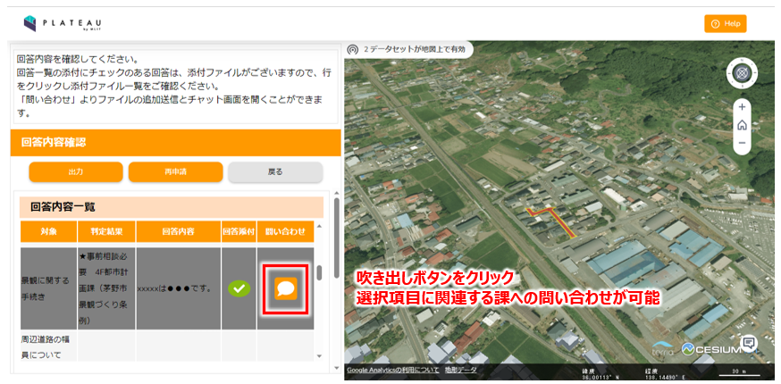

## 問い合わせ内容を入力
1. メッセージ入力欄にメッセージを入力し、「矢印」ボタンをクリックするとメッセージを送信します。
2. ファイルを添付したい場合は、「クリップ」ボタンをクリックしファイルを添付します。

# 13. 行政担当者による問い合わせ確認・回答
行政担当者は、事業者からの問い合わせの確認、回答を行うことが出来ます。
1. 問い合わせ詳細画面を開く
2. 問い合わせ内容を確認
3. チャットの宛先を設定
4. 回答を入力し、送信

## 問い合わせ詳細画面を開く
1. 「詳細」ボタンクリックし、問い合わせ詳細画面を開きます。
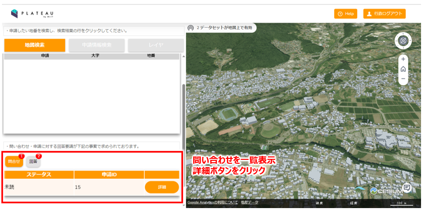

## 問い合わせ内容確認
1. 「チャット」画面を開き、問い合わせの内容を確認します。

## チャットの宛先を設定
1. 「送信先」ボタンクリックし、チャットの送信先を設定します。※行政担当者の連絡は事業者には通知されません。

## 回答を入力・送信
1. 回答メッセージを入力後、「矢印」ボタンをクリックし、回答メッセージを送信する。
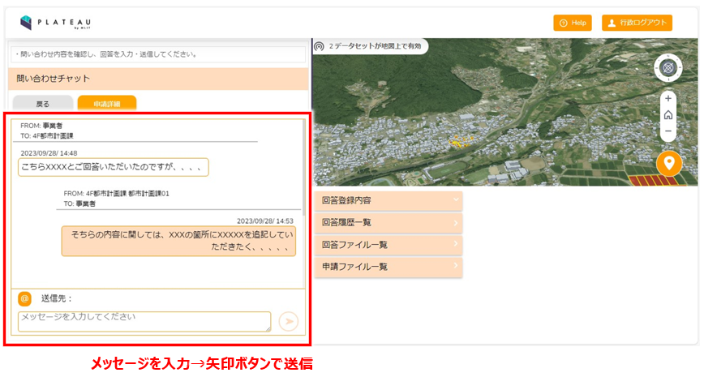

