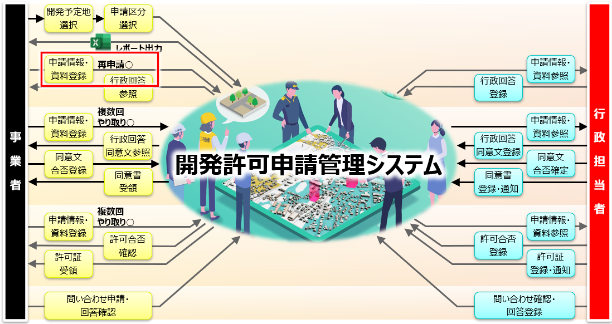

# 1. 概要・基本操作
## 1-1.概要

 

## 1-2.システム起動
### ■起動URL：https://kisarazu-development-permission-system.com/viewer/　  

 

## 1-3.地図画面説明
### ■機能ボタン

  

※地名・地域は実際の開発許可エリアではありません。操作例として表示しています。

### ■建物モデル・判定レイヤ表示

※地名・地域は実際の開発許可エリアではありません。操作例として表示しています。

 

# 2.事業者による申請地選択→概況判定
## 2-1.概要図の位置づけ

 

## 2-2.申請対象地番選択
### ■検索画面

### ■地図検索（地番）
  

※地名・地域は実際の開発許可エリアではありません。操作例として表示しています。

  

### ■地図選択

 

## 2-3.申請区分選択
### ■申請区分選択（単体選択）
  

※地名・地域は実際の開発許可エリアではありません。操作例として表示しています。

### ■申請区分選択（複数選択）
  

 

## 2-4.概況診断結果実施
### ■概況診断結果表示

### ■概況診断結果表示(都市計画判定結果複数時)

### ■概況診断結果表示(レポート出力)

  

# 3.事業者による申請作業
## 3-1.概要図の位置づけ

  

## 3-2.申請情報入力
### ■申請者情報入力
  

 

## 3-3.申請対象ファイルアップロード
### ■申請対象ファイルアップロード

 

## 3-4.申請内容確認
### ■申請内容確認

 

## 3-5.申請完了画面・概況診断レポート生成
### ■申請完了画面・概況診断レポート生成状況表示

### ■回答が記載されていないレポートキャプチャ

  

# 4.行政担当者による申請情報検索・参照
## 4-1.概要図の位置づけ

 

## 4-2.行政担当者画面ログイン
### ■起動URL https://kisarazu-development-permission-system.com/viewer/login/

 

## 4-3.行政担当者地図画面
### ■行政担当者地図画面
  

※地名・地域は実際の開発許可エリアではありません。操作例として表示しています。

 

## 4-4.申請情報検索
### ■地図上での申請情報参照

### ■申請情報検索
  

### ■申請情報詳細
  

  

# 5.行政担当者による回答入力
## 5-1.概要図の位置づけ

 

## 5-2.回答登録
### ■回答登録（文字情報）
  
  

### ■回答登録（関連資料）

### ■回答登録（関連資料：編集）

### ■回答登録（関連資料：編集/TIFF・JPG・PNG文書ファイル）各アイコン機能一覧

 

## 5-3.回答登録完了
### ■回答登録完了

  

# 6.行政担当者（管理者）による通知作業
## 6-1.概要図の位置づけ

 

## 6-2.申請情報検索
### ■ステータス等で回答状況検索

 

## 6-3.内容確認・回答通知・完了画面
### ■回答通知・完了
  
  

  

# 7.事業者による申請内容への回答確認作業
## 7-1.概要図の位置づけ

 

## 7-2.申請のID/パスワード認証
### ■申請時のID/パスワード入力

 

## 7-3.回答内容確認
### ■回答内容確認（文字情報）

### ■回答が記載された帳票キャプチャ

  

# 8.事業者による問い合わせ作業
## 8-1.概要図の位置づけ

 

## 8-2.問い合わせ（事業者）
### ■問い合わせ

### ■問い合わせチャット

  

# 9.行政担当者による問い合わせ確認・回答作業
## 9-1.概要図の位置づけ

 

## 9-2.問い合わせ（行政担当者）
### ■問い合わせ

### ■問い合わせチャット

### ■送信先選択

### ■問い合わせチャット

  

# 10.事業者による再申請作業（事前相談→事前相談）
## 10-1.概要図の位置づけ
### ■問い合わせチャット

 

## 10-2.再申請
### ■再申請開始

### ■申請区分再選択

※地名・地域は実際の開発許可エリアではありません。操作例として表示しています。

### ■再申請時の概況診断結果表示

### ■申請項目入力

### ■ファイル再アップロード

### ■再申請内容確認・再申請完了

  

# 11.事業者による再申請作業（事前相談→事前協議）
## 11-1.概況図の位置づけ

 

## 11-2.再申請
### ■再申請開始

※地名・地域は実際の開発許可エリアではありません。操作例として表示しています。

### ■申請区分再選択

### ■再申請時の概況診断結果表示

### ■再申請時の申請項目入力

### ■ファイル再アップロード

### ■再申請内容確認・再申請完了

### ■再申請

  

# 12.行政担当者による事前協議回答（各担当課へ通知）
## 12-1.概要図の位置づけ

 

## 12-2.申請情報検索
### 該当物件の絞り込み

※地名・地域は実際の開発許可エリアではありません。操作例として表示しています。

### 絞り込み結果＞詳細画面表示

 

## 12-3.対応者への通知
### ■申請内容の確認・関係各課への回答依頼（統括部署→担当課）

### ■通知宛先設定

### ■回答通知

  

# 13.行政担当者による事前協議回答（各担当課回答登録）
## 13-1.概要図の位置づけ

 

## 13-2.対象物件選択・回答画面表示
### ■再申請

### ■回答画面表示

### ■回答する申請種別選択

 

## 13-3.回答登録
### ■担当者による回答登録

### ■回答登録（回答ファイルの選択）

### ■回答登録（事業者提出ファイルを引用した修正指示）

### ■追加条件登録

### ■条件の削除

### ■回答登録→担当課管理者に対し、回答内容が正しいか確認依頼

  

# 14.行政担当者による事前協議回答（各課管理者通知）
## 14-1.概要図の位置づけ

 

## 14-2.担当課管理者から統括部署へ回答通知依頼
### ■通知内容選択画面表示

### ■通知内容選択

### ■統括部署へ通知

  

# 15.行政担当者による事前協議回答（統括部署回答通知）
## 15-1.概要図の位置づけ

 

## 15-2.行政担当者から事業者へ通知
### ■通知担当課選択画面表示

### ■通知担当課選択

### ■事業者へ通知

  

# 16.事業者による事前協議回答（行政回答確認）
## 16-1.概要図の位置づけ

 

## 16-2.行政回答参照
### ■該当案件表示

### ■行政回答の参照

 

## 16-3.行政回答に対する合意登録
### ■行政回答に対し、合意登録・市への問い合わせ

### ■行政担当者へ回答登録・通知

  

# 17.行政担当者による事前協議回答（各担当課回答登録）
## 17-1.概要図の位置づけ

 

## 17-2.申請情報検索
### ■申請情報を検索

 

## 17-3.行政確定登録
### ■行政確定登録
  
  

  

# 18.行政担当者による事前協議回答（各課管理者）
## 18-1.概要図の位置づけ

 

## 18-2.申請情報検索
### ■申請情報検索

 

## 18-3.回答登録（課の行政確定登録）
### ■回答登録（課の行政確定登録）
  
  

 

## 18-4.回答通知（課の行政確定通知）
### ■回答通知（管理者から統括部署へ通知）
  

  

# 19.行政担当者による事前協議回答（統括部署）
## 19-1.概要図の位置づけ

 

## 19-2.申請情報検索
### ■申請情報検索

 

## 19-3.事業者への回答通知
### ■回答通知

### ■回答通知（統括部署から事業者へ通知）
  

  

# 20.行政担当者による同意書 登録・通知（統括部署）
## 20-1.概要図の位置づけ

 

## 20-2.協議書・同意書登録
### ■協議書・同意書ダウンロード

### ■協議書・同意書登録
  

### ■協議書・同意書登録完了

 

## 20-3.協議書・同意書通知
### ■協議書・同意書通知
  

  

# 21.事業者による協議書・同意書受領
## 21-1.概要図の位置づけ

 

## 21-2.協議書・同意書受領
### ■ID/パスワードでログイン

### ■協議書・同意書受領

  

# 22.事業者による再申請作業（事前協議→許可判定）
## 22-1.概要図の位置づけ

 

## 22-2.再申請（事前協議→許可判定）
### ■再申請

### ■申請追加情報入力

### ■申請ファイル登録

### ■申請情報確認

### ■再申請完了

  

# 23.行政担当者による許可判定回答（都市政策課担当者）
# 23-1.概要図の位置づけ

 

# 23-2.申請情報検索
### ■申請情報検索

 

## 23-3.許可判定回答登録
### ■回答登録
  

### ■回答登録（判定結果/再申請要否）

### ■回答登録完了

  

# 24.行政担当者による許可判定回答（統括部署回答通知）
## 24-1.概要図の位置づけ

 

## 24-2.申請情報検索
### ■申請情報検索

 

## 24-3.事業者へ回答通知
### ■申請情報検索

### ■回答通知確認

### ■回答通知完了

  

# 25.行政担当者による許可通知書（統括部署）
## 25-1.概要図の位置づけ

 

## 25-2.許可通知書登録
### ■許可通知書登録
  
  
  

 

## 25-3.許可通知書通知
### ■許可通知書通知
  

 

## 25-4.最終提出物一式
### ■最終提出物一式

  

# 26.事業者による許可通知書受領
## 26-1.概要図の位置づけ

 

## 26-2.許可通知書受領
### ■許可通知書受領

